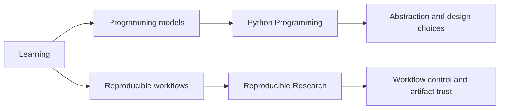

# Learning

## What This Branch Covers

The learning branch lives in `bijux-masterclass`, where system
engineering practice is taught through sequenced programs; it belongs in
the same repository family because it turns architecture and workflow
judgment into reusable instruction, it inherits the shared documentation
shell and standards checks from `bijux-std`, and it keeps ownership
boundaries explicit by leaving shared shell behavior in the standards
layer while learning curriculum and pacing stay in Masterclass.

## Learning Map

## Program Families

| Program | Who it is for | What it teaches | What artifact proves it | Destination |
| --- | --- | --- | --- | --- |
| Reproducible Research | engineers and researchers who need reliable scientific workflows | workflow systems, automation discipline, build truth, and scientific execution habits | capstone workflow outputs that can be re-run and reviewed | [Program docs](https://bijux.io/bijux-masterclass/reproducible-research/) |
| Python Programming | learners advancing from syntax fluency to design judgment | language depth, runtime judgment, software design tradeoffs, and long-form programming instruction | capstone implementations and runnable exercises that show design decisions in code | [Program docs](https://bijux.io/bijux-masterclass/python-programming/) |
