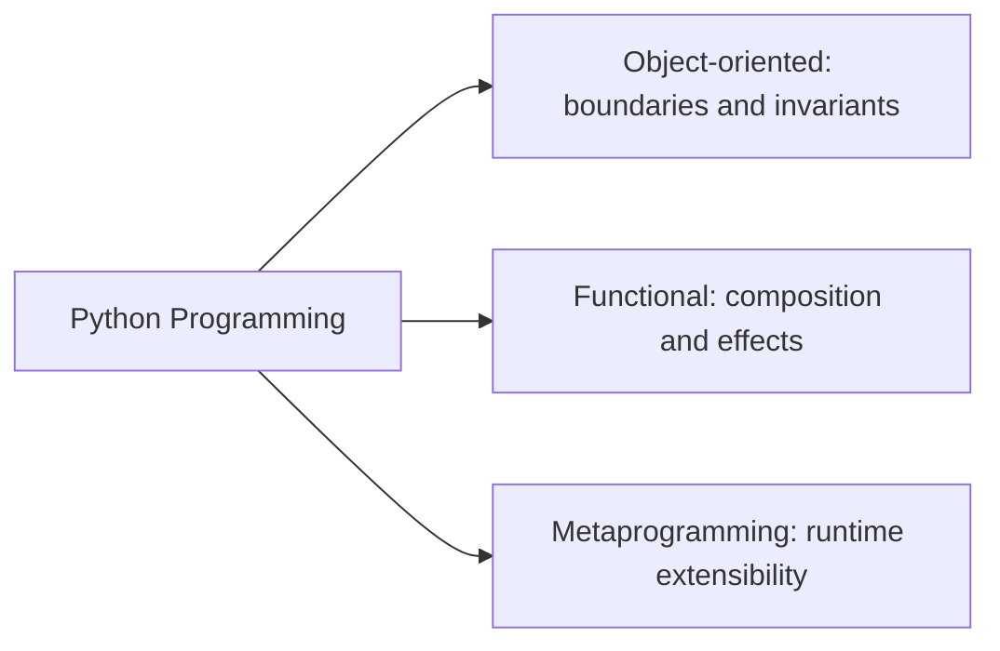

# Python Programming

The Python programming program helps people design maintainable software
systems: clearer interfaces, safer extension points, and more deliberate
tradeoffs between object-oriented, functional, and metaprogramming
approaches.

Its public docs surface follows the shared documentation shell and
standards checks inherited from `bijux-std`.

## Audience, Level, And Assumptions

- audience: engineers, advanced learners, and working developers who want stronger design judgment in Python.
- level: intermediate to advanced.
- assumptions: comfort with core Python syntax, functions, classes, modules, and basic testing workflow.

## Family Shape

This family organizes Python learning by design pressure: object
boundaries, functional composition, and runtime extensibility.

## What You Can Verify Quickly

| Surface | Why it matters |
| --- | --- |
| three-track split | shows the program is organized around design pressure, not random topic accumulation |
| links into Masterclass destinations | shows the material is published as maintained documentation, not a loose note set |
| repository examples in Core, Canon, and Atlas | shows that the teaching vocabulary maps back to real system design decisions |

## Track Map

<a class="md-button md-button--primary" href="https://bijux.io/bijux-masterclass/python-programming/">View Family Docs</a>
<a class="md-button" href="https://bijux.io/bijux-masterclass/python-programming/python-object-oriented-programming/">View Python Object-Oriented Programming</a>
<a class="md-button" href="https://bijux.io/bijux-masterclass/python-programming/python-functional-programming/">View Python Functional Programming</a>
<a class="md-button" href="https://bijux.io/bijux-masterclass/python-programming/python-meta-programming/">View Python Metaprogramming</a>

## How This Thinking Appears In Bijux Repositories

| Repository | Concept carried from this program | Visible example |
| --- | --- | --- |
| `bijux-core` | abstraction boundaries and runtime extensibility discipline | CLI/runtime split, DAG components, and evidence-oriented command surfaces |
| `bijux-canon` | ownership and composition decisions in package design | ingest, indexing, reasoning, and runtime packages kept as explicit responsibility slices |
| `bijux-atlas` | API and delivery-interface clarity | API/reporting surfaces documented as stable delivery contracts instead of hidden internal coupling |

## What Lives Here

- language-level thinking that goes deeper than framework familiarity
- the ability to explain design tradeoffs, abstractions, and programming styles clearly
- capstone-backed learning paths for object design, functional design, and runtime judgment
- explicit treatment of decorators, descriptors, metaclasses, and runtime customization as first-class design topics
- a teaching surface that stays technical rather than introductory

## Why This Matters In Production Systems

- API design: explicit abstraction models reduce accidental coupling and make interface changes safer to review.
- plugin systems: clear composition and ownership rules prevent extension points from becoming unbounded side effects.
- maintainability: deliberate OOP and FP choices keep modules understandable as teams and requirements change.
- runtime safety: inspected metaprogramming patterns make decorators, descriptors, and hooks traceable under failure conditions.

## Where To Begin

| If you want to start with... | Start with |
| --- | --- |
| object-design judgment | [Python Object-Oriented Programming](https://bijux.io/bijux-masterclass/python-programming/python-object-oriented-programming/) and its focus on invariants, roles, persistence, and runtime pressure |
| functional design maturity | [Python Functional Programming](https://bijux.io/bijux-masterclass/python-programming/python-functional-programming/) and its emphasis on purity, effects, async coordination, and composable systems |
| runtime and framework honesty | [Python Metaprogramming](https://bijux.io/bijux-masterclass/python-programming/python-meta-programming/) and its focus on introspection, decorators, descriptors, metaclasses, and runtime hooks |

## What This Program Refuses To Do

- not syntax-first: syntax is used as a tool, not as the endpoint.
- not framework-first: frameworks are discussed through design tradeoffs, not treated as the curriculum core.
- not interview-trick-first: examples are chosen for long-lived system judgment, not puzzle-style novelty.

This program uses Python to teach design judgment for long-lived
systems: abstraction, extensibility, and maintainability under change.
