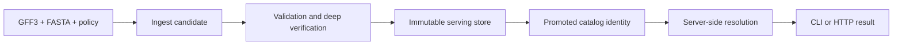
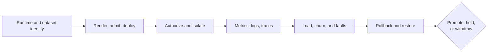
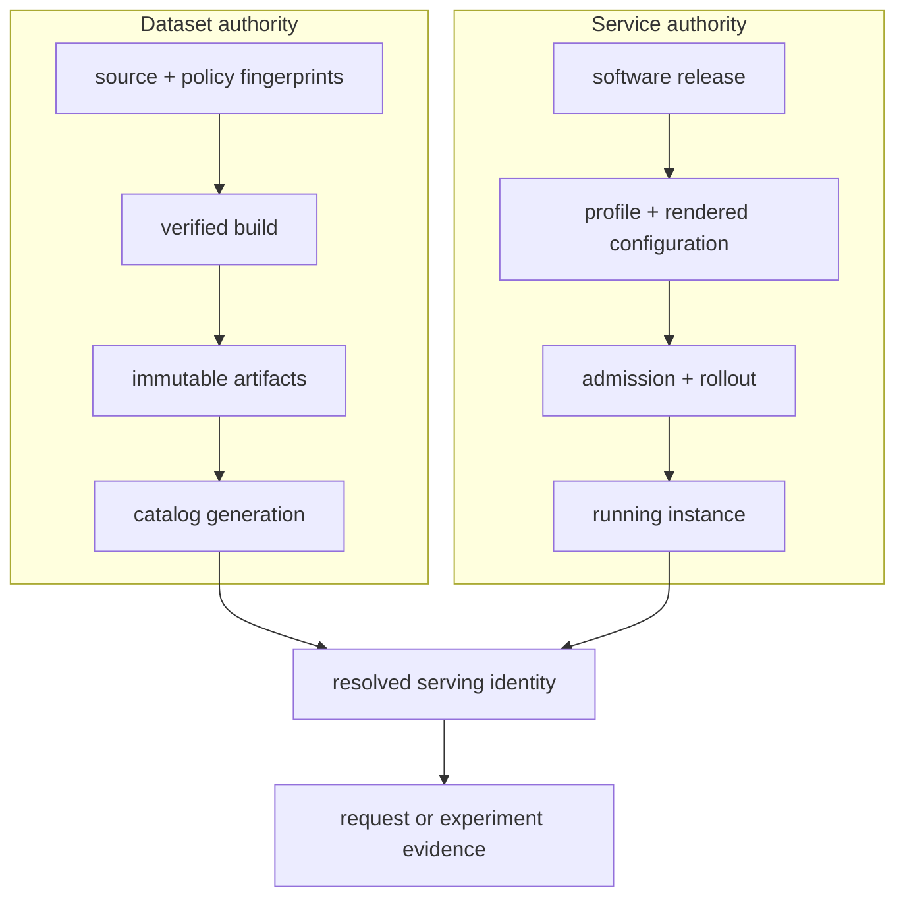
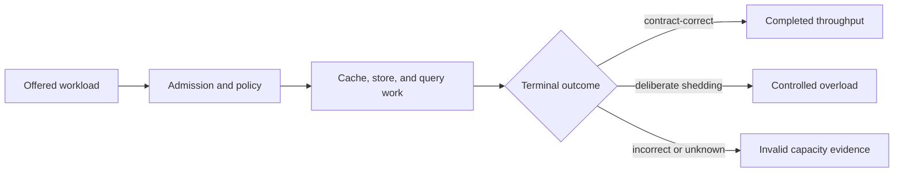
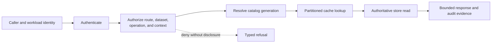
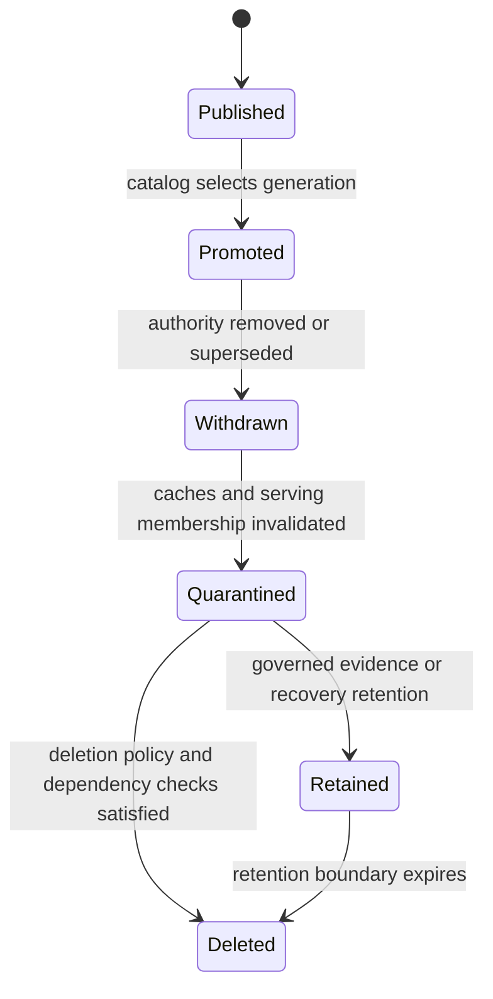

# Bijux Atlas

Bijux Atlas is a Rust platform for turning governed GFF3 and FASTA inputs into
immutable genomic dataset releases, queryable APIs, and reviewable operational
evidence.

Atlas separates dataset construction, publication, serving, and operational
qualification. That separation lets a reader determine which inputs produced a
dataset, which bytes were published, which identity answered a query, and what
evidence supports operating the service.

<a class="md-button md-button--primary" href="https://bijux.io/bijux-atlas/bijux-atlas/">Read the product handbook</a>
<a class="md-button" href="https://bijux.io/bijux-atlas/bijux-atlas-ops/">Read the operations handbook</a>
<a class="md-button" href="https://github.com/bijux/bijux-atlas">Inspect the repository</a>

## Follow A Dataset To A Query

The tuple `release/species/assembly` is the logical identity carried from
publication into catalog discovery and query provenance. Source, build, and
artifact fingerprints bind that tuple to exact inputs, policy, and bytes.

| Boundary | What it establishes | What does not establish it |
| --- | --- | --- |
| build | a candidate exists for governed source and policy inputs | output files alone |
| verify | structure, integrity, and selected deep checks pass | zero exit from ingest alone |
| publish | immutable artifacts exist in the serving store | files left in a build directory |
| promote | the catalog names that published dataset generation | payload availability without catalog authority |
| resolve | the server opened the selected catalog and artifacts | client-supplied labels alone |
| query | an interface returned a result with dataset and software provenance | readiness at one moment |

A later success cannot repair a skipped earlier authority transfer.

## Product Boundaries

Atlas owns distinct packages for genomic identity, ingest, store publication,
query semantics, runtime ports, server composition, wire contracts, operator
commands, and reusable operational models. The CLI and server are composition
roots; no central “runtime service” silently owns every action.

Eleven public crates carry these boundaries through crates.io, docs.rs, GitHub
releases, and GHCR artifacts. Repository-only development tooling validates the
workspace and prepares releases without becoming a public runtime dependency.

## Operations Are A Product Capability

Atlas operations cover more than deployment manifests:

### Stack authority

The serving store and catalog are authoritative for dataset availability and
identity. Redis-backed dataset and response caches accelerate reads; they do
not become an alternate source of truth. Local Redis and MinIO composition is a
development fixture, not evidence of durable production persistence.

### Deployment and security

Deployment profiles pass through render and admission contracts before
rollout. Security spans caller authentication, route authorization, workload
identity, network policy, secrets handling, and dependency credentials. A
ready pod proves traffic eligibility, not that every administrative route is
classified or every production exception is justified.

### Observation and incident response

Health, readiness, metrics, logs, traces, dashboards, and evidence reports have
different owners. Incident handling separates mitigation from evidence
custody, so restoring service does not erase the identities and observations
needed for diagnosis.

### Load and resilience

Load scenarios name workload, target, rate, duration, thresholds, and evidence
destination. Failure experiments additionally need an explicit blast radius
and abort condition. A checked-in scenario proves the experiment is defined;
only an executed, identity-bound result supports a performance or resilience
claim.

### Recovery and distribution

Dataset pointer rollback, release reconstruction, consumer verification, and
distribution-channel evidence are separate concerns. A reversible pointer is
not a complete backup system, and a tarred OCI bundle is not proof of a
runnable container image.

## Bind Dataset And Service Identity

Atlas has two independent lifecycles that meet only when the server resolves a
catalog entry. Treating deployment health as dataset identity, or dataset
publication as deployment fitness, hides the most consequential classes of
operational error.

A useful operational record therefore binds all three identity groups:

| Identity group | Minimum fields | Failure it makes visible |
| --- | --- | --- |
| dataset | logical tuple, catalog generation, manifest, artifact fingerprints | wrong, stale, or unpromoted data |
| service | software release, configuration and chart identity, profile, target | configuration or deployment drift |
| observation | request or scenario, time window, thresholds, result location | unattributable health, load, or recovery claims |

If any group is absent, narrow the conclusion to the identities actually
recorded. A latency report without a catalog generation is not evidence about
a named dataset; a restore report without the resulting service identity is
not evidence that clients can use the restored state.

## Read Operational Evidence As A Ladder

Operational artifacts establish progressively stronger claims:

1. a **contract** defines allowed configuration, topology, or experiment
   shape;
2. a **render or plan** shows intended target-specific state;
3. an **admission result** shows that intended state passed the selected
   policy boundary;
4. an **effective-state observation** shows what the target actually exposed;
5. an **experiment result** measures behavior under named conditions; and
6. a **decision record** explains promotion, hold, rollback, or withdrawal.

Higher rungs depend on the lower identities but do not retroactively supply
them. An executed load test cannot prove that its deployment passed the
documented admission policy unless that admission result is joined to the same
service identity.

## Define Capacity As An Operating Envelope

## Keep Pagination And Retries On One Dataset Identity

A multi-page query can cross a catalog promotion unless the continuation token
binds dataset generation, query semantics, ordering, filters, and expiry.
Combining pages from different generations can yield duplicates, omissions, or
a result population that never existed.

| Client behavior | Service contract needed |
| --- | --- |
| continue a page | opaque token bound to generation, query, ordering, and expiration |
| retry a read | stable request identity or semantics showing repetition is safe |
| retry a mutation | explicit idempotency identity and committed-state lookup |
| follow a redirect | preserved authorization and method semantics without credential leakage |
| handle overload | bounded backoff and refusal signals that do not create retry amplification |

Capacity evidence should include client retries and abandoned work. Offered
requests, server attempts, and completed logical operations are different
denominators; counting retry amplification as useful throughput overstates the
operating envelope.

Atlas capacity is not the largest offered request rate observed before a run
ended. It is the lowest repeatable boundary at which the named traffic mix
finishes with correct responses, declared latency and error budgets, bounded
resource use, and controlled overload behavior.

| Dimension | Record with the result | Why it changes the conclusion |
| --- | --- | --- |
| dataset | tuple, catalog generation, size and shape | query cost and working set change with data |
| traffic | route mix, query pack, offered rate, concurrency, duration | a cheap-route result cannot qualify heavy queries |
| cache | cold or warm state, occupancy, invalidation rule, hit and miss behavior | caching can move load away from the serving store |
| service | software, profile, resources, replicas, placement, autoscaling policy | capacity belongs to a deployed configuration |
| dependencies | store, Redis, catalog, network and credential condition | a downstream bottleneck can resemble application saturation |
| generator | location, resources, clock and achieved offer | a saturated client can cap the observed throughput |
| terminal outcomes | correct completion, deliberate rejection, timeout, failure | accepted or offered work is not completed throughput |

Autoscaling does not erase this accounting. Scheduling delay, readiness lag,
cache warming, redistribution, and post-scale stabilization are part of the
observed envelope. More replicas can amplify store, connection, or cache-miss
pressure; replica count alone is not evidence of added usable capacity.

## Keep Cache Acceleration Subordinate To Authority

A cached response is acceptable only when it can be attributed to the intended
dataset generation and cache policy. Under a store outage or cached-only
profile, the service may deliberately serve verified retained content and
refuse uncached work. A fast response with stale, partial, cross-dataset, or
unverifiable content is an integrity failure, not graceful degradation.

Dataset correction therefore crosses more than the serving store. Promotion or
withdrawal changes the authoritative catalog relationship; caches, endpoint
membership, and observations derived from the superseded generation must be
invalidated or explicitly bounded. Recovery evidence should demonstrate both
that the authoritative generation is selected and that stale cache state no
longer produces an ordinary success.

## Treat Isolation As Query Correctness

Authentication establishes caller identity; authorization decides whether that
identity may discover, read, change, or administer a dataset surface. A query
that returns scientifically correct bytes to the wrong caller is still an
incorrect service result.

| Isolation boundary | Evidence to exercise |
| --- | --- |
| route | public, read, write, and administrative routes have explicit caller classes and deny behavior |
| dataset | authorization binds the exact logical tuple and catalog generation, not only a broad endpoint |
| cache | key, namespace, invalidation, and hit behavior preserve dataset and authorization context |
| error | denied and absent states do not reveal protected existence, metadata, credentials, or internal topology |
| telemetry | logs, metrics, and traces retain attribution without copying tokens, sensitive query content, or unrestricted payloads |
| operator action | promotion, withdrawal, cache control, and recovery require a named administrative identity and decision record |

Positive access evidence cannot establish isolation. Qualification needs
cross-identity and negative-path exercises, including cache hits, stale
entries, dependency failure, and administrative routes. The result remains
bounded to the identities, routes, datasets, and deployment profile exercised.

## Retire A Dataset Across Every Serving Layer

Withdrawal stops ordinary authority; retention and deletion govern physical
custody. Those are separate decisions, and neither should be inferred from a
catalog pointer change.

A retirement record should identify the catalog transition, affected clients,
cache invalidation, serving-store disposition, retained manifests and audit
evidence, replicas or backups still in scope, and verification that ordinary
queries no longer return the generation. “Not discoverable” does not mean
deleted, and “deleted from the primary store” does not prove absence from
caches, replicas, backups, or consumer exports.

## Current Qualification Boundaries

The operations handbook keeps important gaps public:

- the production profile is represented in the deployment matrix, but no
  complete production lifecycle scenario is checked in;
- specialized production overlays still contain fixture identities and cannot
  prove a real deployed release;
- administrative-route classification does not yet cover every route exposed
  by the OpenAPI surface;
- rollout-under-load and rollback-under-load registrations point to runners
  that are not present, while the existing load script does not control a
  rollout;
- the repository defines backup and reconstruction contracts but does not
  provide a production backup schedule, retention policy, restore runner, or
  completed restore result.

These limits narrow the evidence. They do not erase the implemented dataset,
API, or operational contracts.

## Match Evidence To The Claim

| Claim | Evidence that can support it | Insufficient substitute |
| --- | --- | --- |
| a dataset is publishable | validation, deep verification, manifest, and hashes | successful ingest |
| a dataset is discoverable | publication record and promoted catalog entry | files in a directory |
| an interface is compatible | owning contract and compatibility evidence | one successful request |
| a deployment is admissible | rendered identity, admission result, and effective-state checks | schema-valid values |
| a performance budget holds | governed workload, baseline, measurements, and thresholds | scenario definition |
| recovery works | executed restore with coherent dataset and catalog state | rollback documentation |
| a release is distributable | artifacts, checksums, provenance, and consumer verification | internally consistent untrusted files |

Atlas establishes provenance and system behavior for accepted inputs. It does
not establish the biological correctness of upstream genomic source data.

## Reader Routes

| Question | Destination |
| --- | --- |
| build, publish, discover, and query a dataset | [Product handbook](https://bijux.io/bijux-atlas/bijux-atlas/) |
| integrate CLI, HTTP, OpenAPI, or Rust interfaces | [Interfaces](https://bijux.io/bijux-atlas/bijux-atlas/interfaces/) |
| understand dependency authority and caching | [Stack operations](https://bijux.io/bijux-atlas/bijux-atlas-ops/stack/cache-and-store-operations/) |
| inspect security and production qualification | [Security operations](https://bijux.io/bijux-atlas/bijux-atlas-ops/kubernetes/security-operations/) |
| inspect load, faults, and rollout evidence | [Load operations](https://bijux.io/bijux-atlas/bijux-atlas-ops/load/) |
| inspect incident evidence and recovery | [Incident response](https://bijux.io/bijux-atlas/bijux-atlas-ops/observability/incident-response/) |
| inspect backup and reconstruction boundaries | [Backup and recovery](https://bijux.io/bijux-atlas/bijux-atlas-ops/release/backup-and-recovery/) |
