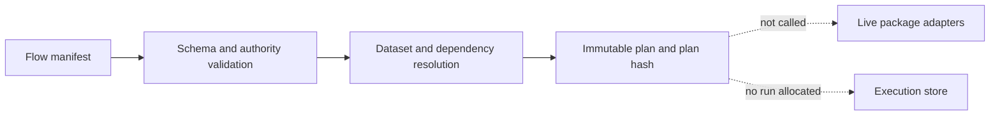

# Bijux Canon

Bijux Canon turns documents and datasets into evidence-bearing, inspectable
knowledge runs. Five canonical Python packages separate preparation,
retrieval, reasoning, orchestration, and runtime authority so a reviewer can
identify who made each decision and which artifact supports it.

Determinism does not make a source correct or a conclusion true. It makes the
conditions, transformations, decisions, and retained evidence available for
review.

<a class="md-button md-button--primary" href="https://bijux.io/bijux-canon/">Open Canon Documentation</a>
<a class="md-button" href="https://bijux.io/bijux-canon/01-bijux-canon/foundation/evidence-map/">Trace Claims To Evidence</a>
<a class="md-button" href="https://bijux.io/bijux-canon/08-compat-packages/">Inspect Compatibility</a>
<a class="md-button" href="https://github.com/bijux/bijux-canon">View Source</a>

## Five Decision Authorities

The sequence is an ownership model, not a promise that one installed command
currently composes every package. Each package can be used at its documented
boundary; end-to-end composition requires explicit adapters and its own
integration evidence.

| Package | Decision it owns | Evidence it produces | Failure it keeps visible |
| --- | --- | --- | --- |
| `bijux-canon-ingest` | how source material is cleaned, chunked, and prepared | normalized records, chunk identity, configuration, typed observations and failures | parse, validation, safeguard, or transformation error |
| `bijux-canon-index` | how a declared retrieval or vector request executes | capability resolution, execution artifact, ranked result, provenance, and cost | unsupported capability or backend failure |
| `bijux-canon-reason` | how evidence supports, contradicts, or refuses a claim | evidence spans, checks, claim status, manifest, reasoning trace, and replay record | insufficient or unverifiable evidence |
| `bijux-canon-agent` | how role-specific work is ordered and stopped | ordered calls, lifecycle transitions, convergence, termination, and complete trace | provider, orchestration, convergence, or trace failure |
| `bijux-canon-runtime` | whether a whole run may be accepted, stored, resumed, or replayed | immutable plan, policy verdict, stored projection, causal trace, replay and diff result | authority, budget, policy, identity, or replay mismatch |

## Trust Model

Canon narrows every claim to the retained evidence.

| Claim | Required evidence | What remains unproven |
| --- | --- | --- |
| preparation is repeatable | input identity, effective configuration, normalized records, chunks, and typed failures | that the source content is correct |
| retrieval is reproducible | request, backend capability, index identity, ranked result, and provenance | that the best evidence exists in the corpus |
| a claim is supported | exact spans, content digests, checks, status, and reasoning trace | truth beyond the registered evidence and rules |
| agent work is auditable | ordered calls, convergence decision, terminal state, and complete trace | deterministic provider behavior |
| a run is replayable | manifest, dataset and plan identities, policy, entropy record, finalized trace, and replay envelope | equivalence outside the declared comparison boundary |

Missing evidence produces a narrower result or an explicit refusal. It is not
reconstructed from a plausible final answer.

## Start With The Owning Package

Canon packages are independent distributions, not installation tiers.

| Question | Start with | Retain first |
| --- | --- | --- |
| How did source bytes become retrieval-ready material? | [Ingest](https://bijux.io/bijux-canon/02-bijux-canon-ingest/) | source record, effective configuration, cleaned record, chunks, and rejections |
| Why did retrieval select, rank, refuse, or diverge? | [Index](https://bijux.io/bijux-canon/03-bijux-canon-index/) | capability profile, request, artifact, provenance, and cost |
| Which evidence supports this claim? | [Reason](https://bijux.io/bijux-canon/04-bijux-canon-reason/) | support spans, content hashes, checks, trace, and verification report |
| Why did the workflow stop? | [Agent](https://bijux.io/bijux-canon/05-bijux-canon-agent/) | definition, ordered calls, convergence decision, termination, and trace |
| May this run become durable? | [Runtime](https://bijux.io/bijux-canon/06-bijux-canon-runtime/) | manifest, authority, policy, trace, store identity, and replay verdict |

Beginning with the decision under review keeps evidence custody intact. A host
application that composes multiple packages also owns proof that its adapters
preserved those identities at every handoff.

## A Safe Whole-Repository Proof

Runtime plan mode resolves a checked-in manifest into an immutable execution
contract without invoking live package adapters or allocating a stored run.

This proves that the declaration, authority, data identity, dependency order,
entropy policy, replay envelope, and environment fingerprint resolve into a
reviewable plan. It does not prove step execution, trace finalization, storage,
or live cross-package composition.

## Composition Status

The package architecture is more complete than the current turnkey
integration. Canon documents that distinction directly.

| Surface | Current trustworthy claim |
| --- | --- |
| package-local ingest, index, reason, and agent interfaces | each can be evaluated against its own implemented and tested contract |
| runtime planning | a manifest can resolve into an immutable plan without lower-package execution |
| runtime live composition | intended owners are named, but the canonical package roots do not yet expose the complete adapter set expected by runtime |
| runtime HTTP run and replay | schemas describe the intended interface; the routes currently return `501 Not Implemented` |
| compatibility packages | preserved names map to canonical implementations; aliases do not supply missing adapters |

This honesty protects real package achievements from being overstated as an
end-to-end product claim.

## Compatibility Is Explicit

Canon publishes five canonical product packages and six compatibility
distributions. Compatibility packages preserve existing installation, import,
or command names while canonical ownership stays with the `bijux-canon-*`
packages.

An alias is not a second implementation and not a hidden migration promise.
Its evidence should establish alias identity, exported surface parity, and the
canonical destination. New integrations should use the owning canonical
package unless they deliberately require a preserved name.

## Artifact And Security Boundaries

Schemas, fingerprints, and typed loaders establish structure and identity
within their documented scope. They do not authenticate an artifact or its
producer.

- Index loaders validate schema, backend discrimination, chunk identity, and
  representation, but callers must impose external size and trust controls on
  untrusted payloads.
- Trace validation checks declared lifecycle and compatibility fields; producer
  identity and tamper resistance require an external authenticated envelope.
- Replay comparisons cover named fields. A reported match must not be expanded
  to runtime version, model, prompt, convergence, or fingerprint equality when
  those fields were not compared.
- HTTP schema presence does not prove that a route is implemented, authorized,
  or suitable for public exposure.

## Canon's Boundary In The Family

Canon owns knowledge-processing contracts and evidence custody. It does not
own Core's command and DAG semantics, Atlas service authorization, a scientific
repository's interpretation, or family-wide standards. A domain repository
may use Canon capabilities while retaining full authority over source
selection, curation, and scientific meaning.

Continue with [Applied Domains](../../01-platform/applied-domains/index.md) to
see how knowledge infrastructure supports domain evidence without inheriting
domain authority, or [Security Model](../../01-platform/security-model/index.md)
to compare artifact validation with authentication and service controls.
