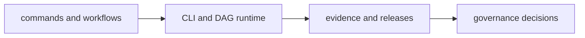
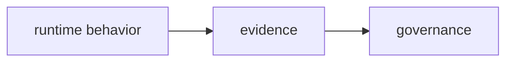

# Bijux Core

`bijux-core` runs the CLI and DAG runtime backbone for the Bijux
repository family. It also carries the governance and release rules
that keep that backbone stable over time.

Canon, Atlas, Telecom, Genomics, Proteomics, and Pollenomics all
benefit from the same shared runtime layer rather than each carrying
their own separate CLI and workflow foundation.

Core exposes four concrete surfaces:

- CLI runtime
- DAG execution
- governance and control routes
- evidence and release rules

Relation to shared standards: Core consumes shared docs shell and
cross-repository checks from `bijux-std`, but does not define those
standards.

<a class="md-button md-button--primary" href="https://bijux.io/bijux-core/">View Published Docs</a>
<a class="md-button" href="https://github.com/bijux/bijux-core">View GitHub Repository</a>

## Repository Shape

`bijux-core` is where runtime and governance stop being abstract. The
repository owns the command runtime and DAG execution backbone that
other repositories depend on, while keeping governance, evidence, and
release discipline in the same public surface.
This map summarizes the main flow inside Core.

The split keeps command semantics, workflow semantics, and repository
governance separate instead of blending them into one opaque layer.

## What You Can Verify Quickly

| Surface | Why it matters |
| --- | --- |
| CLI and DAG split | shows that command behavior and workflow behavior are separate responsibilities |
| release and evidence language | shows that governance is part of the repository surface, not an afterthought |
| published docs and source layout | shows that runtime authority is documented in public |

## Runtime And Governance

Runtime authority defines how commands and workflows execute: what can
run, in what order, and with which execution semantics. Governance
authority defines how those runtime surfaces are controlled over time:
release rules, evidence expectations, and repository-level policy
boundaries. Keeping them distinct prevents execution behavior from being
silently changed by policy concerns, and prevents policy controls from
being hidden inside runtime code paths.

## What Core Does Not Own

Core does not own domain-specific scientific workflows, project-specific
delivery interfaces, or shared cross-repository standards ownership.
Those responsibilities belong to domain repositories, delivery
repositories, and `bijux-std`.

## What Lives Here And Why

- `bijux-cli` and `bijux-dag` live here under one governance backbone so runtime behavior and release control stay aligned
- command/runtime semantics and DAG execution semantics stay out of scripts
- governance, evidence, and release surfaces stay first-class repository ownership, not side notes
- anchors include CLI command surfaces, DAG workflow routes, release evidence, and governance documentation

## Where To Begin

| If you are looking for... | Start with this part of Core |
| --- | --- |
| runtime authority | the CLI and DAG handbooks, plus the crate split across runtime, artifacts, and app layers |
| shared project backbone | how one runtime layer supports Canon, Atlas, Telecom, Genomics, Proteomics, and Pollenomics without flattening their ownership |
| repository discipline | release flows, evidence surfaces, and maintainer control-plane material |
| product boundaries | the fact that `bijux-cli` and `bijux-dag` are separate products under one governance backbone |
| traceability | public docs, tagged releases, and repository-owned operating rules that align with the code layout |

## When This Page Is Most Useful

- the question is about CLI behavior, DAG execution, runtime control, or release discipline
- you want a direct route into platform engineering structure
- you care whether governance and release posture are implied or documented

## In The Larger Picture

Core keeps the rest of the repository family grounded in runtime and
governance machinery. The backbone is named, public, and stable enough
to support the higher layers around it.

Bijux Core is the layer where runtime truth, deterministic execution,
and repository control must remain least ambiguous. Beyond the tools
themselves, it keeps authority boundaries and workflow semantics clear
under long-term change.
