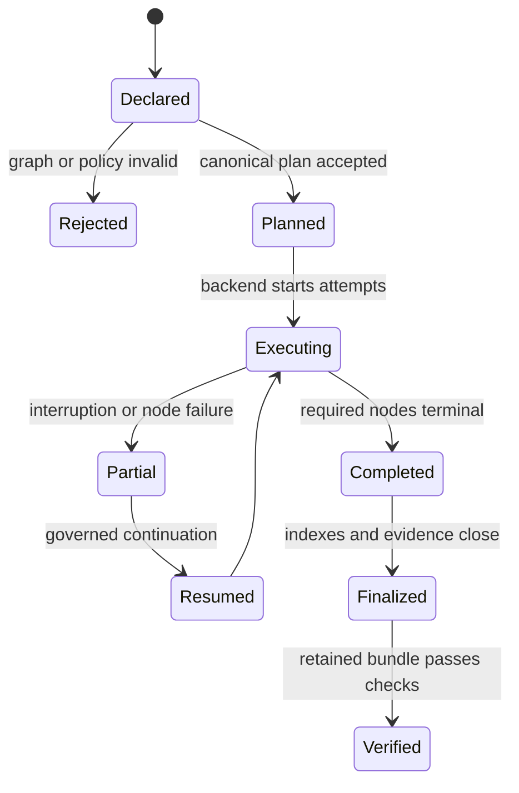
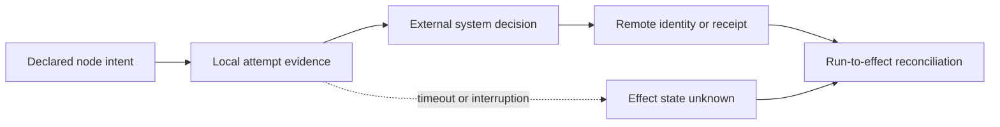

# Bijux Core

Bijux Core is the execution foundation for two separate public commands:
`bijux`, a command runtime for applications and plugins, and `bijux-dag`, a
local-first workflow runtime for validated graphs, retained evidence, replay,
comparison, and verification.

They share repository governance and release evidence. They do not share one
executable or one installation contract.

<div class="bijux-quicklinks">
<a class="md-button md-button--primary" href="https://bijux.io/bijux-core/">Open Core Documentation</a>
<a class="md-button" href="https://bijux.io/bijux-core/bijux-cli/">Open The CLI Handbook</a>
<a class="md-button" href="https://bijux.io/bijux-core/bijux-dag/">Open The DAG Handbook</a>
<a class="md-button" href="https://github.com/bijux/bijux-core">View Source</a>
</div>

## Choose The Product First

| Product | Use it for | Distribution boundary | Start here |
| --- | --- | --- | --- |
| `bijux` | mounted apps, plugins, layered configuration, diagnostics, history, memory, and REPL workflows | Rust crate and Python distribution; it does not install `bijux-dag` | [CLI handbook](https://bijux.io/bijux-core/bijux-cli/) |
| `bijux-dag` | graph validation, planning, execution, evidence retention, cache explanation, replay, comparison, and verification | Rust crate family and command; it does not provide the `bijux` plugin or REPL runtime | [DAG handbook](https://bijux.io/bijux-core/bijux-dag/) |

The private `bijux-dev` control plane generates and checks repository evidence.
It is maintainer tooling, not a third public runtime.

## Execution Evidence Is A Product Surface

`bijux-dag` does not reduce a workflow to a final exit code. A finalized run
retains the identities and observations needed to ask what was authored,
planned, executed, consumed, produced, cached, or promoted.

```mermaid
flowchart LR
    graph["Authored graph"] --> validate["Validate and canonicalize"]
    validate --> plan["Lowered execution plan"]
    plan --> execute["Backend execution"]
    execute --> nodes["Node traces and attempts"]
    nodes --> artifacts["Verified artifacts and lineage"]
    artifacts --> run["Finalized run bundle"]
    run --> replay["Replay, compare, and verify"]
```

The evidence has a trust order. Manifests and graph snapshots establish run
and structure identity. Node traces, attempt records, and input/output indexes
establish execution behavior. Digests and producer fingerprints establish
artifact identity. Summaries and visualizations help investigation but do not
replace the underlying records.

## Identity Is Deliberately Plural

No single fingerprint proves that two workflow runs are equivalent.

| Identity | Question it answers | What still needs separate evidence |
| --- | --- | --- |
| graph fingerprint | is canonical authored structure equal? | plan, environment, inputs, and output |
| planner fingerprint | did graph lowering produce the same executable plan? | runtime policy and external state |
| execution fingerprint | is execution-relevant work equal? | undeclared ambient state and external side effects |
| declared-environment fingerprint | is the declared node environment equal? | the complete host environment |
| cache identity | is one node result eligible for exact reuse? | retained payload integrity and business equivalence |
| artifact digest and producer identity | are retained output bytes and producer equal? | scientific or business meaning |

This separation prevents “same DAG” from being used as a shortcut for “same
run” or “same result.”

## Read A Run As A State Machine

A workflow is not simply running or successful. Planning, attempts, artifact
verification, and finalization create distinct evidence states.



| State | Strongest justified claim | Evidence still required for the next state |
| --- | --- | --- |
| declared | authored graph exists | canonical validation and policy decision |
| planned | executable structure and identities resolved | backend attempt evidence |
| partial | some attempts and artifacts exist | terminal node population, continuation decision, and completeness checks |
| completed | required work reached terminal states | finalized manifests, indexes, lineage, and integrity |
| finalized | the run bundle is closed for review | independent bundle verification or comparison |
| verified | retained evidence satisfies the selected verification contract | domain acceptance, if the workflow supports a scientific or business claim |

A process exit cannot skip finalization. Partial artifacts remain useful for
diagnosis, but they do not become outputs of a completed run until the owning
indexes and terminal-state rules accept them.

## Explain Retry, Resume, Cache, And Replay Separately

These mechanisms all avoid repeating some work, but their trust contracts are
different.

| Mechanism | Reuses | Required identity and decision |
| --- | --- | --- |
| retry | the same node intent after an unsuccessful attempt | attempt ordering, retry policy, prior failure, and new terminal state |
| resume | retained state from an incomplete run | source run, eligible node population, continuation policy, and preserved history |
| cache | a previously completed node result | exact cache key, producer fingerprint, payload integrity, and cache decision reason |
| replay | retained evidence or declared execution under a comparison contract | source bundle, replay mode, protected source evidence, compared fields, and verdict |

A retry must not erase the failed attempt. Resume must not present old work as
newly executed. A cache hit is not proof that two whole workflows are
equivalent. Replay “match” means only that the registered comparison fields
agree; environment, external effects, or domain meaning remain separate unless
the replay contract names them.

## Keep External Effects Outside Reproducibility Claims

A run can reproduce its retained files while an external side effect differs.
Messages, remote API mutations, database writes, notifications, and actions in
an operator-controlled system have identities and commit semantics outside the
run directory.

| Effect question | Evidence required | Unsafe inference |
| --- | --- | --- |
| was the effect declared? | authored effect contract and policy decision | declaration proves the process obeyed it |
| was an attempt made? | node attempt, request identity, target, and timing | attempt proves the remote system committed it |
| was it accepted remotely? | remote receipt, transaction, object, or idempotency identity | acceptance proves downstream business completion |
| may a retry repeat it? | operation-specific idempotency or deduplication contract | identical node inputs make repetition harmless |
| did resume inherit it? | source attempt state and explicit continuation decision | missing local output means no external effect occurred |
| can replay reproduce it? | replay mode and a deliberately controlled effect adapter | matching retained evidence recreates remote history |



An interrupted call may have committed remotely before the local receipt was
persisted. The safe terminal state is then unknown until the external identity
is reconciled. Core's declared-effect policy can deny or shape known effects,
but it cannot make an arbitrary external operation atomic with run
finalization. Workflow authors must choose effect-specific idempotency,
compensation, or human reconciliation where the domain requires it.

## Distinguish Staging From Promotion

Run-local outputs, verified artifacts, and promoted artifacts are different
states. Atomic writes protect governed records from partial filesystem content;
they do not authorize an output for downstream use. Promotion needs the source
digest, destination, policy decision, and resulting destination digest. A
failed promotion leaves the verified run evidence intact and the delivery
claim incomplete.

## Runtime Layers

| Layer | Responsibility |
| --- | --- |
| DAG core | parsing, validation, canonicalization, planning, and semantic graph identity |
| DAG runtime | execution, retries, policy, cache decisions, replay, and diagnostics |
| DAG artifacts | storage layout, integrity, retention, lineage, and evidence identity |
| DAG application | orchestration and response shaping for user workflows |
| DAG command | the installable `bijux-dag` interface |
| command runtime | the independent `bijux` application, plugin, configuration, and REPL surface |

The split makes ownership reviewable. Artifact integrity does not belong inside
command rendering; graph semantics do not belong inside a backend adapter;
maintainer release policy does not become a hidden public runtime dependency.

## Execution Security Boundary

`bijux-dag` provides policy gates, rooted evidence storage, validated output
paths, environment shaping, and backend-specific controls. It is not a
general-purpose host sandbox.

- The shell backend is for code already inside the host trust boundary. It
  does not firewall sockets, virtualize time, or block arbitrary host reads.
- Docker and Podman execution can enforce validated mounts and no-network mode
  through the selected container engine. This is not a virtual-machine
  boundary.
- Replay sandboxing protects retained source evidence from writes. It does not
  isolate the process being replayed.
- Effect policy fails closed on declared effects; it cannot detect a dishonest
  or incomplete declaration after process launch.

Read [Execution Security And Isolation](https://bijux.io/bijux-core/bijux-dag/operations/security-isolation-truth/)
before using a backend as a security control.

## Release Claims Stay In Lanes

Core distinguishes what is stable from what is callable, simulated,
maintainer-only, or not released.

| Lane | Meaning |
| --- | --- |
| stable | documented commands and explicitly supported execution contracts |
| experimental | callable behavior outside the compatibility promise |
| simulated | modeled namespaces that require an explicit feature gate |
| internal | maintainer routes unavailable as public product behavior |
| unreleased | future service, worker, federation, or broad scheduler claims not present in the product contract |

The machine-readable release truth table in the Core repository is the
authority. Future-direction material describes promotion criteria; it does not
silently widen the current product.

## Verify A Core Claim

| Claim | Evidence route |
| --- | --- |
| a command is public | visible help, owning handbook, package boundary, and release artifact |
| a graph is valid | canonical validation result and graph identity |
| a run completed | finalized manifest, node terminal states, and required evidence layout |
| an output belongs to a run | node and root output indexes, digest, producer identity, and lineage |
| a cache hit is safe to reuse | exact cache identity plus retained payload verification |
| a replay matches | the documented replay comparison fields plus separately inspected environment and artifact evidence |
| a backend is isolated | the backend-specific enforcement matrix, selected controls, and unprotected surfaces |

## Diagnose A Surprising Output

Work backward from the output digest and producer identity to the node attempt,
execution fingerprint, lowered plan, and authored graph. Then inspect cache or
resume decisions and the declared environment before rerunning. This order
distinguishes an unexpected byte sequence from an unexpected producer,
execution path, input, or graph interpretation.

```mermaid
flowchart RL
    output["Output digest"] --> producer["Producer node + attempt"]
    producer --> execution["Execution fingerprint"]
    execution --> plan["Planner fingerprint"]
    plan --> graph["Graph fingerprint"]
    producer --> reuse["Cache, resume, or retry decision"]
    execution --> environment["Declared environment + backend"]
```

Do not start by comparing rendered summaries. They intentionally omit parts of
the evidence bundle and cannot establish lineage or reuse eligibility.

## Core's Boundary In The Family

Core owns execution semantics and evidence mechanics. It does not decide what
a protein claim means, which pollen records belong in a curated database, how
an Atlas API authorizes a consumer, or which shared workflow is canonical
across every repository. Those authorities remain with domain repositories,
service owners, and `bijux-std`.

Continue with [Operational Assurance](../../01-platform/operational-assurance/index.md)
to compare execution evidence with service and publication evidence, or
[Security Model](../../01-platform/security-model/index.md) to place Core's
isolation guarantees in the wider trust model.
