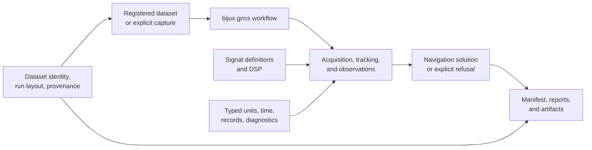

# Bijux GNSS

`bijux-gnss` is a Rust workspace for turning GNSS samples and navigation
products into reviewable receiver and positioning evidence. It provides the
`bijux gnss` command, focused libraries, reproducible datasets, and persisted
run records.

<a class="md-button md-button--primary" href="https://bijux.io/bijux-gnss/">Read the GNSS handbook</a>
<a class="md-button" href="https://github.com/bijux/bijux-gnss">Inspect the repository</a>

## From Samples To Evidence

The diagram is an ownership map, not a promise that every command reaches every
stage. Acquisition may stop before tracking, a receiver run may omit
navigation, and validation may inspect existing evidence without replaying the
pipeline. Refusal and degraded states are part of the result contract.

## Package Responsibilities

| Package | Public responsibility |
| --- | --- |
| `bijux-gnss-core` | identities, units, time, observations, diagnostics, and artifact envelopes |
| `bijux-gnss-signal` | signal catalogs, codes, raw samples, replicas, and DSP primitives |
| `bijux-gnss-nav` | navigation products, corrections, positioning, RTK, PPP, and integrity |
| `bijux-gnss-receiver` | acquisition, tracking, observations, lifecycle diagnostics, and receiver artifacts |
| `bijux-gnss-infra` | datasets, provenance, run layout, overrides, and experiment infrastructure |
| `bijux-gnss` | facade library and installable command surface |

Repository-only packages own development commands, policies, and independent
test support; they are not presented as public GNSS libraries.

## Match Evidence To The Claim

| Claim | Evidence to prefer | Insufficient by itself |
| --- | --- | --- |
| a command behaves as documented | integration test and structured operator output | helper unit test |
| a persisted run is reconstructable | manifest, provenance, validation status, and referenced files | directory presence |
| receiver state is operationally valid | per-stage lifecycle evidence, diagnostics, and bounded errors | final position alone |
| an algorithm is scientifically correct | independent reference, truth budget, and failure diagnostics | self-generated fixture |
| a signal implementation is coherent | reference vectors, properties, and continuity checks | plausible waveform plot |

## Reproducible Run Identity

The run manifest connects input identity, configuration, reports, diagnostics,
and generated artifacts. It should be read before a presentation report,
because it establishes which execution the report describes.

Synthetic captures are useful for deterministic ingest and injected-truth
tests. They are not live-sky evidence and do not establish real-world
positioning accuracy. Recorded data adds realism, but still requires source,
redistribution, receiver, antenna, timing, and environment context.

## Failure Semantics

A GNSS workflow can produce a complete evidence record without producing a
position. Useful terminal states include:

- input rejection with a typed reason;
- acquisition with no acceptable candidate;
- tracking loss or insufficient observations;
- navigation inputs that cannot support a solution;
- a solution rejected by integrity criteria;
- a validation mismatch with preserved diagnostics.

Keeping these states explicit prevents a missing or unreliable result from
being rendered as successful-looking output.

## Published Surfaces

The workspace prepares six public crates under one workspace version and also
publishes governed GitHub and GHCR release artifacts. The release contract is
the authority for package order and exclusions; the handbook and docs.rs carry
human and API documentation respectively.

Use the [GNSS handbook](https://bijux.io/bijux-gnss/) to choose the package that
owns a disputed decision, then follow its contract, implementation, tests, and
run evidence.
