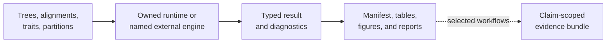
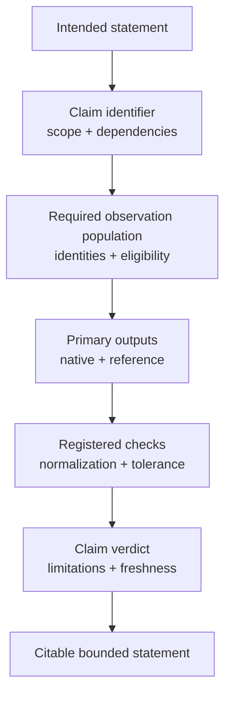
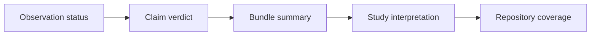
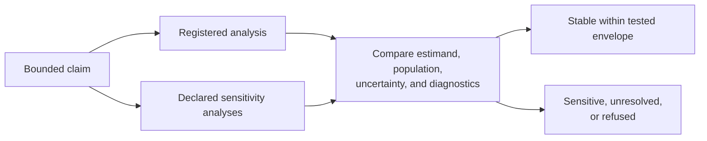
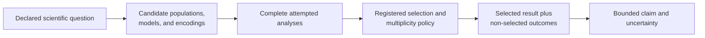

# Bijux Phylogenetics

`bijux-phylogenetics` connects an executable phylogenetics runtime,
reproducibility records, parity work, and claim-scoped scientific evidence.
Runtime capability is broad; Evidence Book support is deliberately specific to
the claim and study that was governed.

<a class="md-button md-button--primary" href="https://bijux.io/bijux-phylogenetics/">Read the phylogenetics handbook</a>
<a class="md-button" href="https://github.com/bijux/bijux-phylogenetics">Inspect the repository</a>

## From Input To Claim

The dotted edge is important. A reproducible runtime result does not
automatically become evidence for a public scientific statement.

## Four Independent Depths

| Depth | Question | Owning record |
| --- | --- | --- |
| capability | Which scientific object and operation are supported? | domain contract with assumptions, inputs, outputs, and refusal conditions |
| execution | Who computed the result, and did it terminate acceptably? | native or external-engine result with diagnostics |
| reproducibility | Can the exact run and outputs be reconstructed? | manifest, environment, configuration, attempts, checksums, and inventory |
| evidence | Which bounded statement is supported now? | claim-indexed bundle with observations, checks, verdict, limitations, and freshness |

These depths may differ legitimately. Capability can be complete while parity
is unresolved. An external execution can be reproducible while a numerical
comparison is unavailable. A claim can remain useful as `not_comparable` when
its missing observations are explicit.

## What The Evidence Book Does

The Evidence Book is not a gallery of successful results. Each governed claim
connects:

- the exact statement under review;
- source and input provenance;
- the method and observation denominator;
- primary structured outputs;
- checks and correspondence evidence;
- a verdict, limitations, and freshness state.

Evidence does not transfer between neighboring claims. Support for one
phylogenetic comparative model cannot be used to imply that another model,
dataset, lineage, or biological mechanism has been validated.

## Read Evidence From Claim To Observation

Begin with the statement being evaluated, not the most favorable table or
figure. A reviewable chain moves from the claim contract down to its complete
observation population and back up through the registered aggregation rule.

| Record | Establishes | Does not establish |
| --- | --- | --- |
| bundle manifest | study and bundle identity, claim roster, summary state, and limitations | that every registered claim has the same verdict |
| claim record | exact statement, scope, dependencies, and aggregation contract | the availability of required primary outputs |
| input manifest | source and derived analytical object identity | suitability of an input merely because it is present |
| result inventory and ledger | primary outputs, observation identities, missing rows, exclusions, and failures | a favorable claim verdict without its registered rule |
| checks and verdict | comparison mode, tolerance, denominator, outcome, and limitations | transfer of support to a neighboring claim |
| freshness index | whether governed dependencies still match the reviewed state | scientific correctness by itself |

A missing required observation remains in the denominator. Excluding it is a
scientific decision that needs an eligibility rule, not a way to make the
remaining rows appear complete.

## Keep Verdict Levels Separate

Evidence is summarized at several levels, and a favorable lower-level status
must not be lifted upward without the owning aggregation rule:

An exact observation can coexist with a claim that is `not_comparable` because
another required observation is absent. A matched claim can coexist with a
mixed bundle. Repository coverage reports how much governed evidence exists;
it is not a package-wide scientific-validation score.

## Separate Reproduction From Robustness

Reproducing a registered result asks whether the identified computation can be
recovered and compared under aligned conventions. Robustness asks whether the
scientific interpretation survives reasonable changes to assumptions,
population, model, and numerical strategy. One does not imply the other.

| Variation | Evidence to retain | Question it tests |
| --- | --- | --- |
| taxon or row eligibility | complete original and varied populations with exclusion reasons | is the result driven by a narrow inclusion decision? |
| tree identity or uncertainty | tree source, rooting, branch lengths, sample or alternative tree, and node mapping | does phylogenetic uncertainty change the estimand or conclusion? |
| response or predictor encoding | transformation, units, factor levels, contrasts, and missingness policy | is the result stable to the declared data representation? |
| evolutionary or covariance model | candidate set, parameterization, likelihood convention, failures, and selection rule | does the interpretation depend on one dependence model? |
| numerical strategy | starts or chains, seeds, bounds, convergence, and warnings | is the result an optimizer or sampler artifact? |
| diagnostic or tolerance rule | statistic, scale, threshold, and complete denominator | does a favorable verdict depend on an unexamined acceptance rule? |

A sensitivity result must retain the failed and non-comparable variants, not
only alternatives that support the baseline. “Stable” is always bounded by the
tested variation set. It does not authorize a universal robustness statement
over models, trees, transformations, or populations that were not evaluated.

## Separate Tree Uncertainty From Model Adequacy

Alternative trees ask whether plausible ancestry changes the result. Model
adequacy asks whether the stochastic assumptions can reproduce relevant
features of the observations at all. Agreement across several trees does not
repair a systematically inadequate trait or substitution model.

| Evidence question | Required record |
| --- | --- |
| which trees are plausible? | source or inference method, rooting, branch lengths, support, filtering, and retained sample or set |
| how are taxa mapped? | stable taxon identity, duplicate or unmatched handling, pruning, and changed claim population |
| how is tree uncertainty propagated? | per-tree fits or justified integration, weighting, failures, and between-tree variation |
| is the model adequate? | discrepancy measures, simulated or predictive reference, observed statistic, calibration, and refusal rule |
| where do conclusions fail? | trees, parameters, diagnostics, or observed structures that contradict the accepted interpretation |

Tree selection, model selection, and adequacy checking are different decision
stages and should not reuse one favorable score as universal approval. When no
candidate model reproduces a consequential feature, the result can remain
computationally valid while the scientific claim is narrowed or refused.

## Interpret Support On Its Own Scale

Bootstrap proportions, posterior probabilities, likelihood comparisons,
information criteria, and concordance measures answer different questions
under different resampling, prior, model, and population assumptions. Their
numerical values are not interchangeable confidence scores.

| Support evidence | Interpretation boundary to retain |
| --- | --- |
| bootstrap or resampling support | resampling unit, replicate generation, estimator, search behavior, failures, and summary rule |
| posterior probability | prior, likelihood, tree and parameter space, chain behavior, convergence, and model adequacy |
| likelihood-ratio evidence | nested-model conditions, boundary behavior, reference distribution, and multiplicity |
| information criterion | candidate model set, parameter count convention, sample unit, and relative—not absolute—fit |
| concordance or quartet measure | eligible genes, sites, taxa, missingness, conflict, and estimation uncertainty |

Calibration asks how often similarly supported statements are borne out under
a defensible truth or simulation process; repeatability asks whether the same
procedure returns the same support. Neither alone establishes biological
truth. A threshold should be justified for the decision it governs and tested
for sensitivity rather than inherited from an unrelated evidence class.

## Account For Analytical Search

A reported phylogenetic result may be selected from many traits, taxon sets,
trees, transformations, evolutionary models, starting conditions, diagnostic
rules, and response definitions. Reproducibility of the selected path does not
expose the search process that made it appear favorable.

| Search dimension | Evidence to retain |
| --- | --- |
| traits and contrasts | complete tested family, directionality, transformations, and multiplicity treatment |
| taxa and missingness | every eligibility rule, dropped row, alternative population, and changed denominator |
| trees | primary and alternative tree identities, mapping, branch-length treatment, and failed variants |
| models | candidate set, parameterization, selection criterion, diagnostics, and non-converged fits |
| thresholds | preregistered or selected rule, scale, sensitivity, and consequence of moving it |
| exploratory follow-up | distinction from confirmatory analysis and the independent evidence needed for confirmation |

If the complete search family cannot be reconstructed, the claim should state
that limitation rather than presenting the selected p-value, information
criterion, posterior summary, or parity result as though it came from one
predeclared comparison.

## Keep Association, History, And Mechanism Separate

Phylogenetic structure changes how observations are related; it does not turn
an association into a causal mechanism or a reconstructed history into an
observed event.

| Result | Strongest direct interpretation | Additional burden for a stronger claim |
| --- | --- | --- |
| phylogenetically adjusted association | traits covary under the declared population, tree, and model | temporal direction, confounding analysis, intervention or mechanistic evidence |
| ancestral-state reconstruction | model-based distribution over historical states | sensitivity to tree and transition model plus independent historical or biological evidence |
| rate or regime shift | the declared model places change on named branches or regimes | robust alternative models, event timing, external covariates, and mechanism-specific evidence |
| convergence or repeated association | similar states or changes appear in declared lineages | independence of events, opportunity set, null process, and functional validation |
| parity with an external tool | implementations agree under aligned conventions | scientific validity of the estimand, model, and biological interpretation |

The Evidence Book can support a precise comparative statement while refusing
the neighboring mechanistic story. That refusal is a successful evidence
outcome when the required observations do not exist.

## Invalidate Claims By Dependency

Evidence freshness is a dependency question. A source correction, changed
taxon mapping, tree revision, model convention, runtime result, comparison
rule, or tolerance can stale the claims that consume it even when the rendered
page and bundle bytes have not changed.

The claim index should make that propagation selective: identify affected
observations, recompute their checks, aggregate the owning claim again, and
then reassess bundle and study summaries. Unaffected claims retain their own
evidence history. A new repository release alone neither invalidates every old
claim nor makes an old claim current; the governed dependency relationship
decides.

## Runtime And External Tools

The runtime preserves who owns the computation. Native methods and named
external engines do not become scientifically identical merely because they
share a command facade. External execution records retain engine identity,
command, native outputs, parser state, normalized result, and diagnostics.

Parity requires aligned estimands, populations, conventions, tolerances, and a
complete denominator. Similar headline values or plots are not sufficient.

## Honest Terminal States

A workflow can stop usefully at:

- rejected or excluded input;
- a refused model with diagnostic state;
- an accepted result without reference correspondence;
- a reproducible external execution whose observations are not comparable;
- a current evidence claim with a qualified verdict;
- a stale bundle that must not support a current statement.

Preserving the stopping state is more trustworthy than forcing every path into
a success label.

## Reader Routes

| Decision | Destination |
| --- | --- |
| choose Python, CLI, adapter, or artifact interfaces | [Product handbook](https://bijux.io/bijux-phylogenetics/01-bijux-phylogenetics/) |
| inspect objects, assumptions, methods, and refusal conditions | [Scientific domains](https://bijux.io/bijux-phylogenetics/02-bijux-phylogenetics-domains/) |
| review a public scientific claim | [Evidence Book](https://bijux.io/bijux-phylogenetics/03-bijux-phylogenetics-evidence-book/) |
| inspect correspondence with established tools | [Parities](https://bijux.io/bijux-phylogenetics/04-bijux-phylogenetics-parities/) |

Begin with the decision that must survive review, then choose the runtime
surface. A convenient command or attractive report should never become the
accidental evidence standard.
