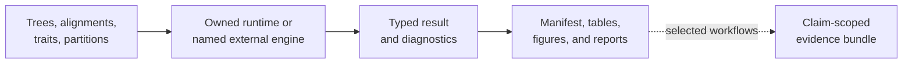

# Bijux Phylogenetics

`bijux-phylogenetics` connects an executable phylogenetics runtime,
reproducibility records, parity work, and claim-scoped scientific evidence.
Runtime capability is broad; Evidence Book support is deliberately specific to
the claim and study that was governed.

<a class="md-button md-button--primary" href="https://bijux.io/bijux-phylogenetics/">Read the phylogenetics handbook</a>
<a class="md-button" href="https://github.com/bijux/bijux-phylogenetics">Inspect the repository</a>

## From Input To Claim

The dotted edge is important. A reproducible runtime result does not
automatically become evidence for a public scientific statement.

## Four Independent Depths

| Depth | Question | Owning record |
| --- | --- | --- |
| capability | Which scientific object and operation are supported? | domain contract with assumptions, inputs, outputs, and refusal conditions |
| execution | Who computed the result, and did it terminate acceptably? | native or external-engine result with diagnostics |
| reproducibility | Can the exact run and outputs be reconstructed? | manifest, environment, configuration, attempts, checksums, and inventory |
| evidence | Which bounded statement is supported now? | claim-indexed bundle with observations, checks, verdict, limitations, and freshness |

These depths may differ legitimately. Capability can be complete while parity
is unresolved. An external execution can be reproducible while a numerical
comparison is unavailable. A claim can remain useful as `not_comparable` when
its missing observations are explicit.

## What The Evidence Book Does

The Evidence Book is not a gallery of successful results. Each governed claim
connects:

- the exact statement under review;
- source and input provenance;
- the method and observation denominator;
- primary structured outputs;
- checks and correspondence evidence;
- a verdict, limitations, and freshness state.

Evidence does not transfer between neighboring claims. Support for one
phylogenetic comparative model cannot be used to imply that another model,
dataset, lineage, or biological mechanism has been validated.

## Runtime And External Tools

The runtime preserves who owns the computation. Native methods and named
external engines do not become scientifically identical merely because they
share a command facade. External execution records retain engine identity,
command, native outputs, parser state, normalized result, and diagnostics.

Parity requires aligned estimands, populations, conventions, tolerances, and a
complete denominator. Similar headline values or plots are not sufficient.

## Honest Terminal States

A workflow can stop usefully at:

- rejected or excluded input;
- a refused model with diagnostic state;
- an accepted result without reference correspondence;
- a reproducible external execution whose observations are not comparable;
- a current evidence claim with a qualified verdict;
- a stale bundle that must not support a current statement.

Preserving the stopping state is more trustworthy than forcing every path into
a success label.

## Reader Routes

| Decision | Destination |
| --- | --- |
| choose Python, CLI, adapter, or artifact interfaces | [Product handbook](https://bijux.io/bijux-phylogenetics/01-bijux-phylogenetics/) |
| inspect objects, assumptions, methods, and refusal conditions | [Scientific domains](https://bijux.io/bijux-phylogenetics/02-bijux-phylogenetics-domains/) |
| review a public scientific claim | [Evidence Book](https://bijux.io/bijux-phylogenetics/03-bijux-phylogenetics-evidence-book/) |
| inspect correspondence with established tools | [Parities](https://bijux.io/bijux-phylogenetics/04-bijux-phylogenetics-parities/) |

Begin with the decision that must survive review, then choose the runtime
surface. A convenient command or attractive report should never become the
accidental evidence standard.
