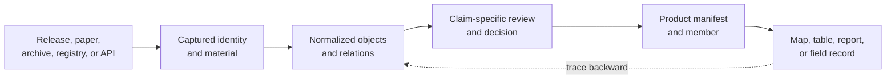

# Bijux Pollenomics

`bijux-pollenomics` connects curated evidence to public maps and reports about
pollen, palaeoenvironmental context, archaeology, hydrography, fieldwork, and
ancient DNA. Its database preserves source identity, preparation, scientific
decisions, publication membership, and gaps that prevent stronger claims.

<a class="md-button md-button--primary" href="https://bijux.io/bijux-pollenomics/public/pollenomics/">Read the product guide</a>
<a class="md-button" href="https://bijux.io/bijux-pollenomics/public/pollenomics-data/">Inspect the data system</a>
<a class="md-button" href="https://bijux.io/bijux-pollenomics/report/">Open the report portal</a>
<a class="md-button" href="https://github.com/bijux/bijux-pollenomics">Inspect the repository</a>

## From Source To Public Claim

The chain is reversible. A reader can move backward from a visible member to
its admission decision, governed evidence, captured material, and upstream
identity. A source correction moves forward through affected objects,
decisions, manifests, and views.

## Database Preparation Is Scientific Work

The tracked data system separates lifecycle stages because each stage has a
different authority.

| Stage | Decides | Must preserve |
| --- | --- | --- |
| capture | what source material entered the repository | source family, release, locator, access context, and digest |
| normalization | how source-native records become typed objects | native identity, transformations, units, missingness, and loss |
| curation | which facts, relations, conflicts, and qualifications are accepted | decision owner, proposed use, evidence, reason, and recovery condition |
| review | whether an object is fit for a named claim or product | claim dimension, population, precision, conflicts, and exclusions |
| manifestation | which reviewed objects belong to a public product | manifest identity, member ID, role, geography, caveat, and revision |
| rendering | how product members appear in a map, table, or report | stable member identity and trace back to governed state |

A normalized record is not automatically publication-ready. A map marker
proves product membership, not every scientific statement shown beside it.

## Evidence Graph

Pollenomics needs several evidence dimensions that cannot substitute for one
another:

- **identity** — which source, project, sample, site, taxon, lake, or product
  member is under discussion;
- **locality and coordinates** — what place is supported, by which geometry,
  method, precision, and conflict resolution;
- **chronology** — which source expression, interval, evidence class, and
  comparability posture are available;
- **taxonomy** — which accepted name, synonym, identification context, and
  uncertainty apply;
- **lineage** — how projects, samples, sites, sources, and products connect;
- **curation** — why evidence was admitted, qualified, excluded, or refused for
  a particular use.

Spatial proximity does not establish association, contemporaneity, or
causation. Matching labels do not establish identity. A contextual period does
not become a numeric temporal comparison without a shared basis and precision.

## Count The Right Population

Captured rows, normalized objects, reviewed claims, eligible candidates,
published members, map features, and display aggregates are different
populations.

Before reusing a count, retain:

- observation unit and stable identity namespace;
- source, database, and product revision;
- geographic, temporal, taxonomic, and publication scope;
- eligibility, exclusion, unresolved, and missingness rules;
- the manifest or review surface that owns the denominator.

The repository preserves negative evidence when a visible product member lacks
one accountability dimension. Removing the member would hide collected
evidence; presenting it as fully supported would overstate the record.

## Current Product Boundary

The implemented runtime is an atlas builder and evidence-publication system.
It supports named source collection, source-preserving preparation, governed
objects and decisions, declared ranking models, sensitivity outputs, and
manifested regional and fieldwork products.

It is not yet a general cross-domain harmonization or causal-inference engine.
Unlike observation units are not automatically reconciled, and product
membership does not authorize workflow-wide scientific interpretation.

## Public Surfaces

| Surface | Answers | Does not answer |
| --- | --- | --- |
| source families | what entered, under which identity and access conditions | record-level publication fitness |
| evidence database | objects, relations, fact ownership, revisions, and coherent state | whether every object belongs in a product |
| curation records | conflicts, decisions, recovery, admission, and refusal | new source-native facts |
| product manifests | versioned scope, members, non-members, roles, and caveats | stronger evidence than the database contains |
| Nordic atlas | role-aware spatial comparison and traceability | causation or contemporaneity from proximity |
| fieldwork records | dated visits, locations, media, and bounded observations | lake-wide conditions or sampling readiness |

## Current Scientific Limits

The public products remain deliberately smaller than the collected evidence:

- animal sample, locality, chronology, coordinate, and source-recovery gaps can
  remain qualified, excluded, or release-blocking;
- SEAD supports inventory and spatial context, not general numeric temporal
  comparison;
- RAÄ coverage is Sweden-specific and does not provide an equivalent Nordic
  registry;
- modern administrative boundaries frame publication scope without adding
  scientific weight;
- lake rankings express evidence richness and decision support, not field
  readiness or coring-site selection;
- field visits document bounded observations without validating nearby data
  layers.

These limits are product facts and remain attached to the relevant evidence
and report surfaces.

## Reproduce Or Challenge A Result

1. Name the product manifest and stable member.
2. Recover the admission decision and governed evidence identities.
3. Inspect source, locality, coordinate, chronology, taxonomy, role, and caveat.
4. Confirm database, runtime, and product revisions.
5. Recompute only through the owner of the disputed transition.
6. Compare identities, semantics, decisions, populations, and manifested
   descendants—not only files or rendered appearance.

Continue with the [data guide](https://bijux.io/bijux-pollenomics/public/pollenomics-data/)
for source and curation authority, the [database model](https://bijux.io/bijux-pollenomics/public/pollenomics-data/database/)
for coherent evidence state, or the [report portal](https://bijux.io/bijux-pollenomics/report/)
for checked-in publication products.
