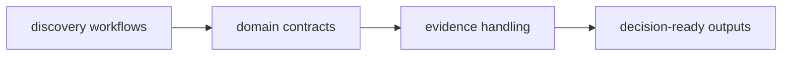
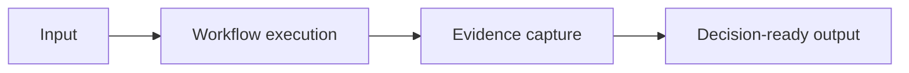

# Bijux Proteomics

`bijux-proteomics` turns proteomics discovery into a maintained
software surface with named workflow contracts, repeatable runtime
behavior, and evidence lineage.

It follows the shared shell and quality standards from `bijux-std` and
builds on the common CLI and runtime layer from `bijux-core`, while
keeping scientific workflow ownership in the repository itself.

<a class="md-button md-button--primary" href="https://bijux.io/bijux-proteomics/">View Published Docs</a>
<a class="md-button" href="https://github.com/bijux/bijux-proteomics">View GitHub Repository</a>

## Repository Shape

`bijux-proteomics` treats protein discovery as a software system rather
than a single pipeline. Runtime execution, domain contracts, evidence
governance, decision logic, and lab planning stay in named package
boundaries so scientific change does not blur responsibility.
This map summarizes the core flow in the repository.

The repository keeps scientific workflow concerns in reviewable
packages instead of burying them in ad hoc glue.

## Why Scientific Product Systems Require Different Structure

| Concern | Scientific product structure |
| --- | --- |
| domain contracts | stay reviewable while scientific assumptions evolve |
| evidence handling | treated as a core output, not a side result |
| runtime behavior | optimized for reproducibility and review, not only convenience |
| package boundaries | kept coherent under engineering and domain pressure |

## What This Repository Covers

- evidence governance as a maintained system concern
- runtime design that stays legible across domain workflows
- package boundaries that preserve responsibility and reviewability
- domain contracts that can evolve without hidden coupling

## What Lives Here

- a contract-first package family for scientific product work
- domain models, decision logic, evidence handling, and lab planning kept separate
- reproducibility and reviewability treated as part of the product, not a later cleanup step
- public scientific software with clear package ownership

## One Repository Flow

This is the practical path in the repository: ingest input, run the
workflow, preserve evidence lineage, and publish outputs that can be
reviewed and reused.

## Where To Begin

| If you are looking for... | Start with this part of Proteomics |
| --- | --- |
| shared runtime consumption | how proteomics uses the common CLI/runtime layer while keeping domain ownership local |
| domain decomposition | the split across runtime, foundation, core, intelligence, knowledge, and lab packages |
| governed product behavior | the repository’s emphasis on contracts, release discipline, and package-owned responsibilities |
| scientific workflow maturity | the fact that lab planning and evidence resolution are first-class parts of the system model |
| published entry points | the package handbooks and release surfaces for the six published packages |

## When This Page Is Most Useful

- the work is specifically about proteomics, discovery, or lab-facing workflows
- you want to see how engineering structure adapts to scientific product work
- you care whether domain software is treated with the same rigor as platform software
