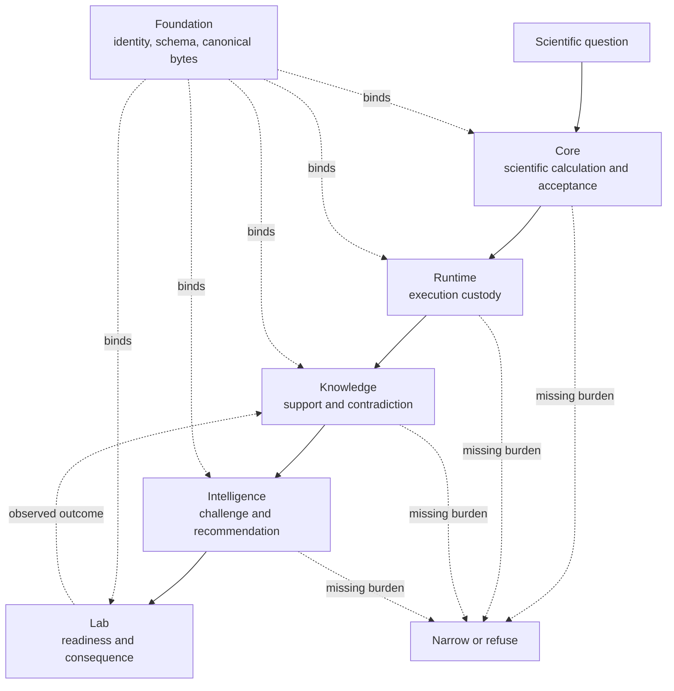
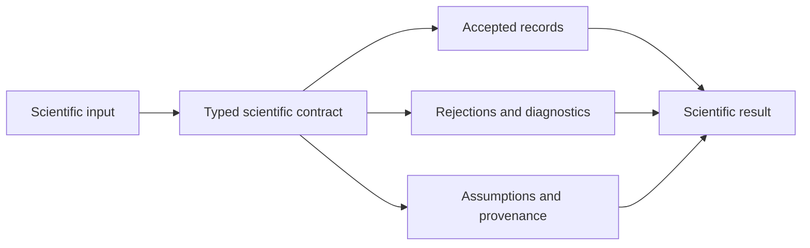
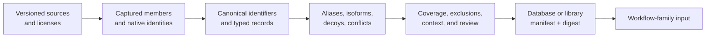
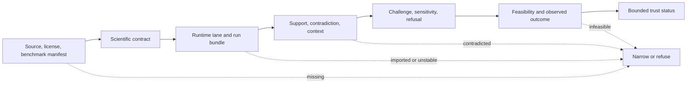
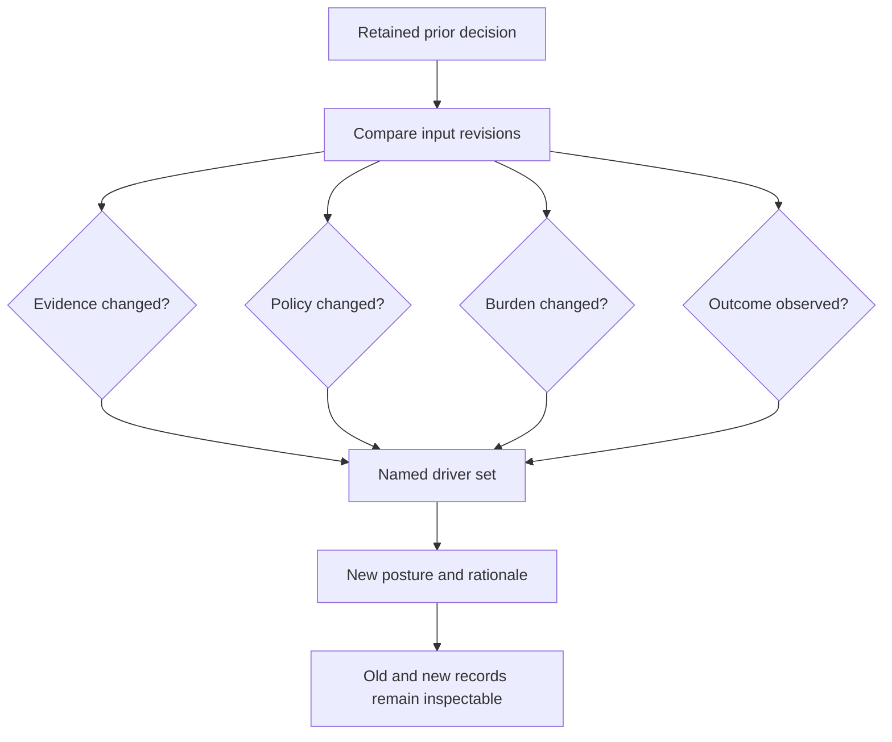
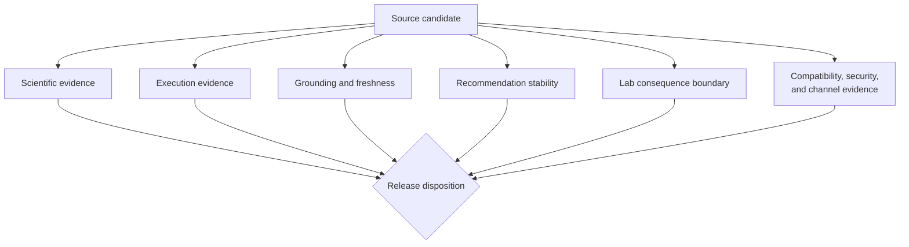

# Bijux Proteomics

Bijux Proteomics is a composable Python platform for proteomics analysis,
reproducible execution, evidence-aware interpretation, decision support, and
laboratory follow-up. It is designed so a reviewer can trace a result from
accepted and rejected scientific inputs through execution, grounding,
recommendation, and observed consequence.

No layer receives authority over all the others. A completed run does not prove
scientific acceptance. Grounded evidence does not authorize an action. A
recommendation does not establish laboratory value.

<a class="md-button md-button--primary" href="https://bijux.io/bijux-proteomics/">Open Proteomics Documentation</a>
<a class="md-button" href="https://bijux.io/bijux-proteomics/01-bijux-proteomics/foundation/scientist-journey/">Follow The Scientist Journey</a>
<a class="md-button" href="https://bijux.io/bijux-proteomics/01-bijux-proteomics/foundation/current-capability-limits/">Inspect Capability Limits</a>
<a class="md-button" href="https://github.com/bijux/bijux-proteomics">View Source</a>

## Six Accountable Layers

| Layer | Question it owns | Durable record |
| --- | --- | --- |
| Foundation | how is a subject, schema, and serialized record identified? | canonical representation, digest, producer, compatibility, and typed disposition |
| Core | what scientific computation ran and what did it accept or reject? | inputs, assumptions, QC, result, rejection, benchmark lineage, and limitation |
| Runtime | what executed, under which state and environment? | request, selected capability, events, artifacts, terminal state, comparison, and replay evidence |
| Knowledge | which evidence supports or contradicts the claim? | source identity, context, support, contradiction, freshness, and unresolved gaps |
| Intelligence | why was an action ranked, downgraded, or refused? | candidate universe, policy, alternatives, sensitivity, confidence posture, and refusal conditions |
| Lab | what follow-up was feasible and what happened? | readiness, controls, custody, deviation, observation, consequence, and feedback |

The stable join between layers is a typed identity or artifact reference. A
filename, display label, dashboard color, or prose summary is not enough to
join scientific records across packages or revisions.

## Scientific Inputs Preserve Rejection

Proteomics input APIs return reports rather than silently filtering to a list
of accepted values. A partially valid FASTA document, search result, or
quantification table can therefore retain both the records used and the
records excluded.

The rejected portion is evidence about the population actually analyzed. It
must travel with downstream QC and interpretation because hidden exclusions
can change the conclusion.

## Database Preparation Is Part Of The Result

Protein databases, spectral libraries, identifier maps, literature collections,
and benchmark corpora are analytical inputs with their own scientific
decisions. Their construction must remain visible beside downstream results.

| Preparation decision | Evidence to retain | Scientific consequence if hidden |
| --- | --- | --- |
| source and release selection | accession, release, retrieval context, license, and digest | silent database drift or biased coverage |
| identifier normalization | native ID, canonical ID, organism, isoform, and mapping rule | distinct entities collapse or one entity fragments |
| sequence and record admission | accepted and rejected members with diagnostics | analyzed population cannot be reconstructed |
| target/decoy construction | producer, rule, seed or determinism record, and manifest role | error-control assumptions become unverifiable |
| spectral or assay library transfer | source context, instrument and workflow compatibility, calibration and exclusions | library presence is mistaken for transfer validity |
| literature and ontology grounding | source version, claim relationship, context, contradiction, and freshness | citation count is mistaken for support |
| benchmark preparation | truth source, population, leakage controls, expected metrics, and limitations | performance is evaluated against self-confirming evidence |

A database digest identifies bytes, not suitability. Suitability belongs to
the workflow-family contract and intended use. The same database may be
adequate for exploratory identification and inadequate for transferable
quantification or an experimental recommendation.

## Evidence Ladder

A workflow family earns only the strongest language supported by every
required layer.

A later success cannot promote an earlier weak record. A complete run bundle
cannot compensate for an unclear scientific acceptance policy. A grounded
claim cannot compensate for a decision that reverses under small policy
changes. A recommendation cannot compensate for infeasible follow-up.

## Workflow Families Have Independent Ceilings

Evidence is assessed separately for DDA, DIA, LFQ, multiplex, PTM, and targeted
workflows. Scientific assumptions and execution modes differ, so strength in
one family cannot be borrowed by another.

| Family | Current documented posture | Essential limit |
| --- | --- | --- |
| DDA | `review_grade_bounded` | primary evidence begins with external search-engine results; repository-owned raw search execution is not claimed |
| DIA | `outsider_auditable_bounded` | checked-report execution does not establish chromatogram-native or universal library transfer |
| LFQ | `outsider_auditable_bounded` | repeatability does not establish cross-cohort transfer or external quantitative truth |
| multiplex | `internal_support_only` | companion transfer remains fragile and outsider consequence closure is incomplete |
| PTM | `outsider_auditable_bounded` | localization does not establish occupancy, function, causality, or regulation |
| targeted | `outsider_auditable_bounded` | vendor parity, calibration transfer, interference, and assay burden remain bounded |

These tokens are claim ceilings, not general maturity grades. The
[workflow-family guide](https://bijux.io/bijux-proteomics/01-bijux-proteomics/foundation/workflow-families/)
is the authority for current evidence and blockers.

## Read The Status Vocabulary Literally

| Status | What it permits | What it does not permit |
| --- | --- | --- |
| `internal_support_only` | useful implementation inside a restricted authority boundary | public recommendation or outsider consequence claims |
| `review_grade_bounded` | scientific review under named limits | raw execution parity, general transfer, or authority to act |
| `outsider_auditable_bounded` | external inspection and rerun of the declared bounded chain | clinical, universal, or decision-grade authority |
| release-ready | all required repository-wide categories pass for one source candidate | universal scientific validity |

The exact status belongs in machine-readable evidence and public prose.
Replacing it with a friendlier but stronger phrase creates an unreviewed claim.

## Recommendation Records Preserve Counterfactuals

A defensible recommendation records why it would change. Comparator removal,
literature removal, policy changes, laboratory burden, and observed outcomes
are tested as separate drivers.

If removing one evidence axis or increasing downstream burden collapses the
recommendation, that weaker posture is part of the truthful product surface.
An observed outcome changes the next decision; it does not rewrite the prior
record.

## Operate Without Losing Scientific Meaning

Runtime scale and service behavior matter only if the evidence-bearing
population remains equivalent. Optimizations that discard ambiguity,
contradictions, provenance, rejections, or rare failure classes change the
scientific operation even when throughput improves.

| Operational pressure | Preserve | Unsafe shortcut |
| --- | --- | --- |
| batched ingestion | source manifest, deterministic member identity, rejection population, and cross-batch integrity | treating batches as independent when identities or conflicts cross them |
| indexed identifier resolution | every candidate, evidence tier, organism and alias context | first-match collapse of ambiguity |
| partitioned evidence graph | stable partition key, cross-partition edges, conflicts, and final integrity audit | ignoring relationships outside the selected shard |
| parallel workflow execution | request and environment identity, event order where meaningful, artifacts, failures, and terminal state | aggregating only successful worker outputs |
| large recommendation universe | complete candidate population, pruning policy, alternatives, sensitivity, and burden | ranking only preselected favorable candidates |
| retained laboratory evidence | custody, controls, deviations, observations, and link to the prior decision | replacing analytical history with the eventual outcome |

The repository exposes performance and behavioral evidence but does not turn
that into a universal service-level objective. Capacity claims require the
named workload, environment, dataset, evidence-completeness checks, and
observation window. A faster result that changes ambiguity or conflict counts
is not the same scientific result.

## Release Authority Is Multi-Dimensional

A candidate may publish only when the required scientific, runtime,
knowledge, recommendation, laboratory, compatibility, security, and channel
owners agree for that revision. This is an intersection, not a majority vote.

One blocking owner narrows or refuses the affected claim even when every other
lane is green. The disposition must retain blocker codes, affected workflow
families and claims, evidence identities, and the condition that would permit
reconsideration.

## Verify A Proteomics Claim

| Claim | Evidence route |
| --- | --- |
| a record entered the calculation | canonical identity, accepted/rejected report, schema, and provenance |
| a scientific workflow supports a result | family contract, benchmark lineage, QC, comparison, and claim ceiling |
| the result can be rerun | runtime request, environment, state, artifact ledger, and comparison record |
| a claim is grounded | cited context, supporting and contradicting evidence, freshness, and gaps |
| a recommendation is proportionate | alternatives, ranking policy, sensitivity, burden, confidence, and refusal behavior |
| a follow-up changed the evidence | readiness, custody, controls, deviation, observation, and linked consequence record |
| a repository candidate may publish | revision-specific readiness matrix, blocker codes, governed outputs, and channel decision |

Readiness does not use majority voting. A green runtime result cannot erase a
benchmark blocker, and a strong benchmark cannot erase an unreviewable
laboratory consequence path.

## Scope And Non-Claims

The repository implements sequence, peptide, spectrum, confidence, protein
inference, quantification, DIA, LFQ, PTM, targeted, evidence-grounding,
recommendation, and laboratory-follow-up surfaces. Coverage is not a blanket
accuracy claim.

The platform does not claim universal transfer across cohorts, instruments,
search engines, acquisition modes, or experimental designs. It does not
convert execution success into biological truth, or advisory output into
clinical or autonomous authority.

Continue with [Applied Domains](../../01-platform/applied-domains/index.md) for
the wider scientific evidence model or [Operational Assurance](../../01-platform/operational-assurance/index.md)
to compare run evidence with delivery and recovery qualification.
