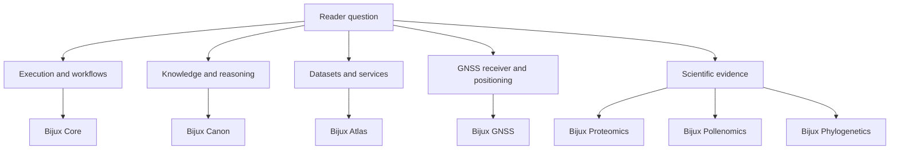
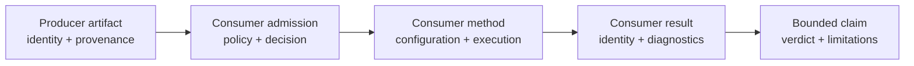
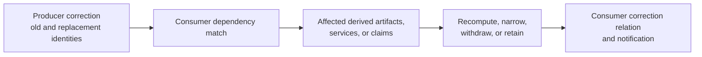
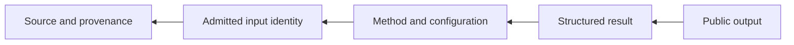

# Projects

Bijux projects own distinct computational, operational, and scientific
questions. Choose a project by the decision you need to make, then continue to
its repository-owned handbook for contracts and evidence.

Governance and shared standards are foundations rather than projects:
[Bijux Infrastructure-as-Code](../02-bijux-iac/index.md) controls repository
admission, and [Bijux Standards](../03-bijux-std/index.md) supplies canonical
shared infrastructure.

## Project Map

The branches describe primary responsibility, not isolation. A scientific
repository may consume execution, knowledge, or delivery patterns while
retaining authority over its interpretation.

## Choose By Decision

| You need to decide | Project | Strongest first evidence |
| --- | --- | --- |
| how a command or DAG executes and records evidence | [Bijux Core](bijux-core/index.md) | runtime contracts, execution semantics, and release evidence |
| how sources become indexed, queryable, and reasoning-ready | [Bijux Canon](bijux-canon/index.md) | ingest, index, reason, orchestration, and runtime contracts |
| how a versioned dataset is delivered | [Bijux Atlas](bijux-atlas/index.md) | identity, API contracts, profiles, and qualification evidence |
| how GNSS samples become positioning evidence | [Bijux GNSS](bijux-gnss/index.md) | run manifest, typed records, diagnostics, and references |
| how protein evidence supports discovery workflows | [Bijux Proteomics](bijux-proteomics/index.md) | prepared databases, entity lineage, package contracts, and analysis evidence |
| how pollen supports spatial interpretation | [Bijux Pollenomics](bijux-pollenomics/index.md) | curated records, provenance, methods, maps, and reports |
| how a phylogenetic claim is supported | [Bijux Phylogenetics](bijux-phylogenetics/index.md) | typed result, manifest, parity record, or claim bundle |

## Choose By Output

| Output | Owning project | Identity to preserve |
| --- | --- | --- |
| command or workflow result | Core | inputs, execution semantics, status, artifacts, and evidence |
| indexed knowledge or reasoning result | Canon | source, normalization, index, model, and acceptance state |
| dataset, API response, or operational report | Atlas | dataset key, build fingerprint, publication state, request contract, and profile |
| receiver or positioning result | GNSS | dataset, configuration, stage state, navigation inputs, diagnostics, and run manifest |
| protein database or analysis result | Proteomics | source accessions, curation, transformations, parameters, and evidence lineage |
| pollen map or report | Pollenomics | source record, taxonomy, geography, curation decision, method, and uncertainty |
| phylogenetic result or evidence claim | Phylogenetics | taxa, tree/alignment/trait identity, model, diagnostics, manifest, and claim verdict |

## Compare The Proof Classes

The projects do not use one interchangeable definition of “evidence.” The
object under review determines the proof needed and the authority that can
accept it.

| Project boundary | Primary object under review | Decisive proof class | Typical acceptance question |
| --- | --- | --- | --- |
| Core | command or workflow execution | deterministic execution record | did the declared work reach the expected terminal state with attributable outputs? |
| Canon | normalized and indexed knowledge | source-to-index lineage plus query or reasoning acceptance | can the result be traced through admission, normalization, indexing, and reasoning policy? |
| Atlas | published dataset and serving system | immutable dataset identity plus operational qualification | did this dataset generation answer through an admitted, observed, and qualified deployment? |
| GNSS | receiver and positioning run | staged computation with navigation and diagnostic identity | can the solution be reconstructed from observations, configuration, navigation inputs, and stage outcomes? |
| Proteomics | prepared protein evidence and analysis | entity lineage plus method evidence | which curated entities and transformations support the analysis result? |
| Pollenomics | curated occurrence and derived interpretation | record-level provenance plus curation and method decisions | which source observations survived curation, and how do they support the map or report? |
| Phylogenetics | comparative result or bounded claim | typed result plus parity, diagnostics, and claim verdict | did the model run correctly, agree where parity is required, and support the stated biological claim? |

These proof classes can compose without becoming substitutes. For example, a
Core execution record can show that an Atlas build ran, but Atlas publication
and catalog evidence must still establish dataset authority. A successful
Phylogenetics computation can establish a model result, while a public claim
still needs its bounded evidence verdict and limitations.

## Compare Results At The Correct Unit Of Inference

The projects expose different observation units and dependence structures.
Counts, error rates, or successful outputs cannot be compared across them
without first identifying what one row or terminal result represents.

| Project | Possible unit of observation | Dependence that must remain visible |
| --- | --- | --- |
| Core | node attempt, command, artifact, or finalized run | retries, graph ancestry, reuse, and shared external effects |
| Canon | source object, chunk, retrieval result, evidence span, or accepted run | shared source, index generation, query, model, and policy context |
| Atlas | request, dataset member, scenario, or observation window | dataset generation, cache, client, route, topology, and repeated traffic |
| GNSS | sample, epoch, satellite observation, solution, segment, or capture | receiver clock, satellite, geometry, environment, and temporal sequence |
| Proteomics | peptide, protein, sample, assay, batch, subject, or study | shared spectra, accession mapping, repeated measures, batch, and inference hierarchy |
| Pollenomics | source record, occurrence, site, time interval, taxon, or publication | duplicate evidence, collection effort, source, spatial precision, and chronology |
| Phylogenetics | taxon, branch, site, gene, tree, fit, or claim observation | shared ancestry, alignment, model search, tree uncertainty, and repeated traits |

The owning analysis defines the actual unit; this table is a diagnostic map,
not a universal schema. Report denominators and uncertainty at the level where
the decision is made, while retaining lower-level failures and exclusions that
can change that decision.

## Follow Cross-Project Handoffs

When one project consumes another, preserve the producer's identity and add
the consumer's own decision record. Do not collapse the two into a single
“successful pipeline” label.

This handoff pattern makes disagreement diagnosable: a reader can distinguish
a changed producer artifact from a changed admission rule, method, or claim
threshold.

## Evidence Depth

Project pages distinguish four levels that are often blurred:

1. **capability** — a contract says the operation or object is supported;
2. **execution** — an owned method reached a typed terminal state;
3. **reproducibility** — inputs, configuration, environment, outputs, and
   attempts can be reconstructed;
4. **claim evidence** — a bounded public statement has a current evidence
   record and limitations.

Not every project output needs all four levels. The required depth depends on
the decision. A CLI capability demo can be complete without becoming
scientific validation; a scientific claim cannot rely on capability alone.

## Choose By Failure Boundary

Start with the first record that does not explain the observed result, not the
repository whose name appears most often in the pipeline.

| Observed failure | Owning project route | First records to inspect |
| --- | --- | --- |
| graph, attempt, cache, resume, replay, or output lineage is surprising | [Core](bijux-core/index.md) | graph and planner fingerprints, node attempts, reuse decision, artifact index, and finalized run |
| source preparation, retrieval, claim support, orchestration, or run acceptance is surprising | [Canon](bijux-canon/index.md) | source and chunk identities, request and index, evidence spans, trace, authority, and policy verdict |
| dataset, catalog, API, deployment, load, or recovery identity is surprising | [Atlas](bijux-atlas/index.md) | dataset generation, service configuration, request or scenario, signals, and decision record |
| acquisition, tracking, observation, navigation, or integrity population is surprising | [GNSS](bijux-gnss/index.md) | capture, configuration, stage ledger, navigation inputs, reference denominator, and manifest |
| protein input, scientific result, grounding, recommendation, or consequence is surprising | [Proteomics](bijux-proteomics/index.md) | prepared database, acceptance report, workflow-family evidence, runtime bundle, knowledge and decision records |
| curated record, spatial member, count, ranking, or report is surprising | [Pollenomics](bijux-pollenomics/index.md) | producer, evidence and product revisions, curation decision, manifest population, source lineage, and caveat |
| comparative estimate, parity result, or public biological statement is surprising | [Phylogenetics](bijux-phylogenetics/index.md) | typed result, primary outputs, complete comparison population, checks, claim verdict, and freshness |

Cross-project integrations retain both sides of the handoff. If Core executed a
Pollenomics publication workflow, Core owns the execution record while
Pollenomics owns evidence eligibility and product membership. Neither record
subsumes the other.

## Compare Lifecycle Authority

| Lifecycle decision | Runtime projects | Service and data projects | Scientific projects |
| --- | --- | --- | --- |
| admit | validate graph, manifest, request, policy, or source shape | validate candidate data and deployment configuration | capture sources and record curation eligibility |
| execute | record plan, attempts, traces, reuse, and terminal state | build, publish, resolve, serve, and observe named identities | run the declared method with accepted and rejected populations |
| accept | finalize and verify a run under its contract | promote a dataset or qualify an operating envelope | aggregate observations into a bounded verdict or recommendation |
| correct | preserve failed attempts and create a new governed result | supersede or withdraw catalog, release, deployment, or product identity | reopen dependencies, retain prior verdicts, and publish correction relations |
| recover | resume, replay, or reconstruct under explicit comparison | roll back, restore, reconstruct, and verify effective state | reconstruct evidence without claiming unchanged interpretation automatically |

This matrix explains why one generic status vocabulary is unsafe. “Success” at
execution, publication, operation, and scientific acceptance names four
different authorities.

## Propagate Corrections Across Project Boundaries

A producer correction changes a consumer only when the affected identity
crossed the handoff. The consumer owns the impact decision for its derived
result; the producer owns the corrected object and explanation.

| Corrected boundary | Producer owns | Consumer must decide |
| --- | --- | --- |
| Core execution or artifact | corrected run, attempt, artifact, or comparison identity | whether the product result depended on that execution and must be rerun |
| Canon source, index, or reasoning evidence | source correction, rebuilt index lineage, or revised acceptance | which queries, grounded claims, or downstream decisions are stale |
| Atlas dataset or service generation | supersession, withdrawal, catalog state, and effective serving identity | which analyses, caches, or citations used the affected generation |
| GNSS navigation input or run | corrected input, stage result, denominator, or manifest | which positioning conclusions and comparisons require reassessment |
| scientific database, method, or verdict | correction relation, affected evidence population, and revised limitation | which reports, recommendations, maps, or claims remain supportable |

Absence of an exact dependency record is itself an impact limitation. Search
by the strongest surviving identities, publish the unresolved scope, and avoid
claiming that downstream products are unaffected merely because no automated
match was found.

## Delivery Status

The governed inventory records published documentation and packages for Core,
Canon, Atlas, GNSS, Proteomics, Pollenomics, and Phylogenetics. Bijux Genomics
is governed with documentation and packages marked **planned**, so this catalog
does not present a public Genomics product route as already delivered.

## Follow A Complete Record

Regardless of project, a trustworthy investigation moves backward from the
surprising output:

Start from the page for the owning project. Use [Delivery Surfaces](../01-platform/delivery-surfaces/index.md)
when the question concerns custody or publication, and [Applied Domains](../01-platform/applied-domains/index.md)
when the question concerns scientific curation or interpretation.
