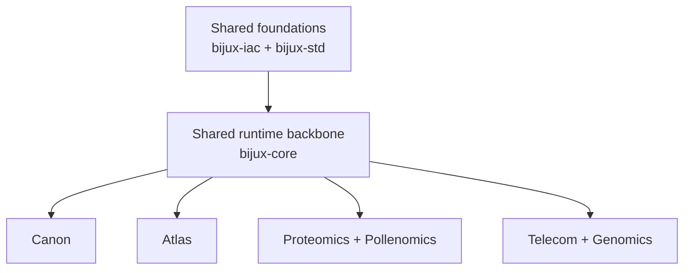

# Projects

This is the fastest way to understand what each public Bijux repository
does. The projects stay separate in ownership, but they still share a
common runtime language and a common standards layer.

Open this after Platform when you want the fastest sense of where each
repository belongs.

If your question is still about governance or shared standards, open
[Bijux Infrastructure-as-Code](../02-bijux-iac/index.md) or
[Bijux Standards](../03-bijux-std/index.md) first. Projects begin where
those two shared layers stop and repository-owned runtime, delivery,
knowledge, or domain work takes over.

## Primary Responsibility Clusters

| Capability cluster | Repositories |
| --- | --- |
| runtime authority and execution governance | [Bijux Core](bijux-core/index.md) |
| knowledge-system orchestration and reasoning boundaries | [Bijux Canon](bijux-canon/index.md) |
| public delivery interfaces and service publication | [Bijux Atlas](bijux-atlas/index.md) |
| proteomics scientific product workflows | [Bijux Proteomics](bijux-proteomics/index.md) |
| evidence-mapping product workflows | [Bijux Pollenomics](bijux-pollenomics/index.md) |

Learning is a top-level branch reference, not a peer project repository:
[Learning catalog](../05-learning/index.md).

The foundations that support all of these are:

- [`bijux-iac`](../02-bijux-iac/index.md) for GitHub governance as code
- [`bijux-std`](../03-bijux-std/index.md) for shared standards

The shared runtime backbone for the project family is:

- `bijux-core` for CLI, DAG, evidence, and release discipline reused across projects

The public hub for the family is:

- `bijux.github.io` for documentation and movement across the family

  <article class="bijux-showcase-card">
    
runtime and governance backbone

    <h2>Bijux Core</h2>
    
The runtime authority repository for CLI and DAG execution.

    
It keeps execution behavior and governance boundaries stable under long-term change.

    
<a href="bijux-core/index.md">Open Bijux Core</a>

  </article>
  <article class="bijux-showcase-card">
    
governed knowledge system

    <h2>Bijux Canon</h2>
    
The knowledge-system orchestration repository.

    
It separates ingest, indexing, reasoning, orchestration, and runtime control into durable interfaces.

    
<a href="bijux-canon/index.md">Open Bijux Canon</a>

  </article>
  <article class="bijux-showcase-card">
    
data and service delivery

    <h2>Bijux Atlas</h2>
    
The public delivery-interface repository for APIs, datasets, and publication routes.

    
It treats service delivery as a maintained product surface.

    
<a href="bijux-atlas/index.md">Open Bijux Atlas</a>

  </article>
  <article class="bijux-showcase-card">
    
applied scientific products

    <h2>Bijux Proteomics</h2>
    
The proteomics scientific product repository.

    
It applies platform discipline to evidence-heavy discovery workflows.

    
<a href="bijux-proteomics/index.md">Open Bijux Proteomics</a>

  </article>
  <article class="bijux-showcase-card">
    
evidence and site selection

    <h2>Bijux Pollenomics</h2>
    
The evidence-mapping scientific product repository.

    
It keeps archaeology/eDNA/aDNA interpretation outputs traceable and reproducible.

    
<a href="bijux-pollenomics/index.md">Open Bijux Pollenomics</a>

  </article>

## Primary Responsibility By Repository

| Repository | Primary job | What you can inspect quickly |
| --- | --- | --- |
| [Bijux Core](bijux-core/index.md) | runtime authority and execution governance | CLI/DAG split, evidence routes, release discipline |
| [Bijux Canon](bijux-canon/index.md) | governed knowledge-system decomposition | ingest/index/reason/orchestrate/runtime layer split |
| [Bijux Atlas](bijux-atlas/index.md) | data-service delivery and operated publication | API, datasets, OpenAPI, reporting, control plane |
| [Bijux Proteomics](bijux-proteomics/index.md) | proteomics scientific product engineering | workflow contracts, evidence posture, lab-facing outputs |
| [Bijux Pollenomics](bijux-pollenomics/index.md) | evidence-mapping scientific product engineering | mapped outputs, report bundles, reproducible evidence handling |

## Reading Guide

| If you care most about... | Start here |
| --- | --- |
| shared governance and repo-wide review controls | [Bijux Infrastructure-as-Code](../02-bijux-iac/index.md) |
| shared standards and cross-repository continuity | [Bijux Standards](../03-bijux-std/index.md) |
| platform and runtime engineering | [Bijux Core](bijux-core/index.md) |
| governed AI and knowledge systems | [Bijux Canon](bijux-canon/index.md) |
| data delivery and service architecture | [Bijux Atlas](bijux-atlas/index.md) |
| bioinformatics and scientific product work | [Bijux Proteomics](bijux-proteomics/index.md) |
| evidence mapping and field-oriented domain systems | [Bijux Pollenomics](bijux-pollenomics/index.md) |
| teaching and engineering communication | [Learning catalog](../05-learning/index.md) |

## Reading Rule

Use the cards for quick orientation, then open the project pages for
repository-owned details.
