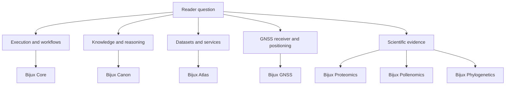
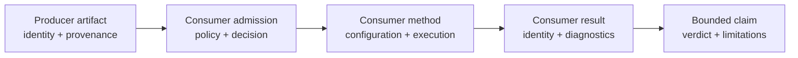
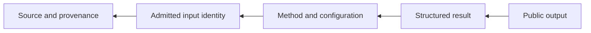

# Projects

Bijux projects own distinct computational, operational, and scientific
questions. Choose a project by the decision you need to make, then continue to
its repository-owned handbook for contracts and evidence.

Governance and shared standards are foundations rather than projects:
[Bijux Infrastructure-as-Code](../02-bijux-iac/index.md) controls repository
admission, and [Bijux Standards](../03-bijux-std/index.md) supplies canonical
shared infrastructure.

## Project Map

The branches describe primary responsibility, not isolation. A scientific
repository may consume execution, knowledge, or delivery patterns while
retaining authority over its interpretation.

## Choose By Decision

| You need to decide | Project | Strongest first evidence |
| --- | --- | --- |
| how a command or DAG executes and records evidence | [Bijux Core](bijux-core/index.md) | runtime contracts, execution semantics, and release evidence |
| how sources become indexed, queryable, and reasoning-ready | [Bijux Canon](bijux-canon/index.md) | ingest, index, reason, orchestration, and runtime contracts |
| how a versioned dataset is delivered | [Bijux Atlas](bijux-atlas/index.md) | identity, API contracts, profiles, and qualification evidence |
| how GNSS samples become positioning evidence | [Bijux GNSS](bijux-gnss/index.md) | run manifest, typed records, diagnostics, and references |
| how protein evidence supports discovery workflows | [Bijux Proteomics](bijux-proteomics/index.md) | prepared databases, entity lineage, package contracts, and analysis evidence |
| how pollen supports spatial interpretation | [Bijux Pollenomics](bijux-pollenomics/index.md) | curated records, provenance, methods, maps, and reports |
| how a phylogenetic claim is supported | [Bijux Phylogenetics](bijux-phylogenetics/index.md) | typed result, manifest, parity record, or claim bundle |

## Choose By Output

| Output | Owning project | Identity to preserve |
| --- | --- | --- |
| command or workflow result | Core | inputs, execution semantics, status, artifacts, and evidence |
| indexed knowledge or reasoning result | Canon | source, normalization, index, model, and acceptance state |
| dataset, API response, or operational report | Atlas | dataset key, build fingerprint, publication state, request contract, and profile |
| receiver or positioning result | GNSS | dataset, configuration, stage state, navigation inputs, diagnostics, and run manifest |
| protein database or analysis result | Proteomics | source accessions, curation, transformations, parameters, and evidence lineage |
| pollen map or report | Pollenomics | source record, taxonomy, geography, curation decision, method, and uncertainty |
| phylogenetic result or evidence claim | Phylogenetics | taxa, tree/alignment/trait identity, model, diagnostics, manifest, and claim verdict |

## Compare The Proof Classes

The projects do not use one interchangeable definition of “evidence.” The
object under review determines the proof needed and the authority that can
accept it.

| Project boundary | Primary object under review | Decisive proof class | Typical acceptance question |
| --- | --- | --- | --- |
| Core | command or workflow execution | deterministic execution record | did the declared work reach the expected terminal state with attributable outputs? |
| Canon | normalized and indexed knowledge | source-to-index lineage plus query or reasoning acceptance | can the result be traced through admission, normalization, indexing, and reasoning policy? |
| Atlas | published dataset and serving system | immutable dataset identity plus operational qualification | did this dataset generation answer through an admitted, observed, and qualified deployment? |
| GNSS | receiver and positioning run | staged computation with navigation and diagnostic identity | can the solution be reconstructed from observations, configuration, navigation inputs, and stage outcomes? |
| Proteomics | prepared protein evidence and analysis | entity lineage plus method evidence | which curated entities and transformations support the analysis result? |
| Pollenomics | curated occurrence and derived interpretation | record-level provenance plus curation and method decisions | which source observations survived curation, and how do they support the map or report? |
| Phylogenetics | comparative result or bounded claim | typed result plus parity, diagnostics, and claim verdict | did the model run correctly, agree where parity is required, and support the stated biological claim? |

These proof classes can compose without becoming substitutes. For example, a
Core execution record can show that an Atlas build ran, but Atlas publication
and catalog evidence must still establish dataset authority. A successful
Phylogenetics computation can establish a model result, while a public claim
still needs its bounded evidence verdict and limitations.

## Follow Cross-Project Handoffs

When one project consumes another, preserve the producer's identity and add
the consumer's own decision record. Do not collapse the two into a single
“successful pipeline” label.

This handoff pattern makes disagreement diagnosable: a reader can distinguish
a changed producer artifact from a changed admission rule, method, or claim
threshold.

## Evidence Depth

Project pages distinguish four levels that are often blurred:

1. **capability** — a contract says the operation or object is supported;
2. **execution** — an owned method reached a typed terminal state;
3. **reproducibility** — inputs, configuration, environment, outputs, and
   attempts can be reconstructed;
4. **claim evidence** — a bounded public statement has a current evidence
   record and limitations.

Not every project output needs all four levels. The required depth depends on
the decision. A CLI capability demo can be complete without becoming
scientific validation; a scientific claim cannot rely on capability alone.

## Delivery Status

The governed inventory records published documentation and packages for Core,
Canon, Atlas, GNSS, Proteomics, Pollenomics, and Phylogenetics. Bijux Genomics
is governed with documentation and packages marked **planned**, so this catalog
does not present a public Genomics product route as already delivered.

## Follow A Complete Record

Regardless of project, a trustworthy investigation moves backward from the
surprising output:

Start from the page for the owning project. Use [Delivery Surfaces](../01-platform/delivery-surfaces/index.md)
when the question concerns custody or publication, and [Applied Domains](../01-platform/applied-domains/index.md)
when the question concerns scientific curation or interpretation.
