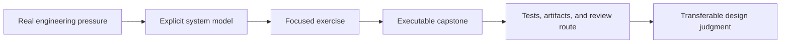
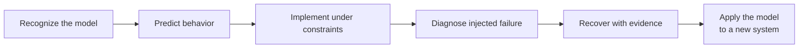

# Learning

Bijux Masterclass teaches engineering judgment through long-form programs,
executable exercises, and capstone systems. The catalog is organized by the
pressure a learner needs to resolve—not by a loose collection of tools or
language features.

<a class="md-button md-button--primary" href="https://bijux.io/bijux-masterclass/">Open The Masterclass Catalog</a>
<a class="md-button" href="reproducible-research/">Choose A Reproducibility Program</a>
<a class="md-button" href="python-programming/">Choose A Python Program</a>
<a class="md-button" href="https://github.com/bijux/bijux-masterclass">View Source</a>

## Choose By System Pressure

| Pressure | Program family | What changes in your judgment | Proof surface |
| --- | --- | --- | --- |
| dependencies lie about rebuilds, workflow state drifts, or publication cannot be reconstructed | [Reproducible Research](reproducible-research/index.md) | model build graphs, workflow contracts, data identity, promotion, and recovery explicitly | Make, Snakemake, and DVC capstones with focused verification routes |
| object boundaries, effects, or runtime hooks make Python systems hard to reason about | [Python Programming](python-programming/index.md) | choose object, functional, and metaprogramming mechanisms by the contract they protect | three evolving Python capstones with tests, proof ladders, and review guides |

## Learning Contract

The capstone corroborates the model; it is not a substitute for explanation.
A course is successful when the learner can predict behavior, identify the
owning boundary, choose proportionate evidence, and explain where a tool should
stop owning the system.

## Progress From Recognition To Transfer

Reading and reproducing an example are early evidence states, not completion.
The programs ask learners to move through progressively stronger demonstrations.

| Evidence state | Learner can demonstrate | Insufficient substitute |
| --- | --- | --- |
| recognition | explain the vocabulary and locate the relevant boundary | repeating a definition without a concrete system |
| prediction | state expected behavior before running the example | explaining the result only after seeing it |
| implementation | preserve the contract while changing the system | copying the reference output |
| diagnosis | localize a failure from retained evidence | trial-and-error edits until checks turn green |
| operation | publish, roll back, recover, or migrate without losing identity | one clean-path execution |
| transfer | apply the judgment to unfamiliar constraints and defend tradeoffs | reproducing the capstone unchanged |

Course completion should identify the strongest state actually demonstrated.
A passing capstone can establish implementation and operation for its declared
scenario; it does not automatically establish transfer to every production or
research context.

## Build A Reviewable Evidence Packet

An inspectable learning result retains:

- the starting revision and declared problem;
- the learner's model and pre-execution predictions;
- commands, configuration, environment, and input identity;
- passing and failing observations, including injected failures;
- generated artifacts and their verification route;
- the recovery, migration, or design decision and its rationale; and
- limitations plus one transfer question not answered by the capstone.

The packet is not a surveillance record or a score by volume. It exists so a
reviewer can distinguish correct reasoning from accidental success and so the
learner can revisit the decision after the system changes.

## Assess The Decision, Not The Activity Trail

Assessment is credible only when the exercise, evidence, and conclusion refer
to the same capability. A command log can establish that an action occurred;
it cannot establish why the learner chose it or whether the choice transfers
to a changed system.

| Assessment claim | Required observation | Common invalid shortcut |
| --- | --- | --- |
| understands the model | predicts behavior and explains the owning boundary | scores vocabulary recall as design understanding |
| can implement the contract | changes the system while preserving stated invariants | accepts output equality without inspecting the boundary |
| can diagnose failure | localizes an injected fault from retained evidence | awards credit for eventually reaching a passing state |
| can operate and recover | restores service or state while preserving identity and recording consequences | tests only the clean path |
| can transfer judgment | solves a materially changed case and defends tradeoffs | repeats the reference capstone with renamed inputs |

Comparable assessment also needs a declared rubric, the same evidence burden
for equivalent claims, and an escalation route for ambiguous cases. Reviewer
agreement should be checked on representative submissions; a precise-looking
score is not trustworthy when different reviewers apply the boundary
differently.

## Assess Stewardship After The First Success

Engineering competence includes maintaining a decision when dependencies,
evidence, policy, or operating conditions change. A capstone should therefore
apply at least one change pressure after the initial accepted result.

| Change pressure | Stewardship evidence |
| --- | --- |
| dependency correction or withdrawal | impact traversal, affected outputs, replacement or refusal, and consumer notice |
| incompatible interface | contract diff, migration choice, coexistence boundary, and obsolete-path removal |
| operational regression | envelope comparison, containment, recovery, and revised qualification |
| security finding | authority-aware containment, evidence custody, rotation or correction, and residual risk |
| changed scientific assumption | reopened estimand or claim, sensitivity evidence, and bounded revised verdict |
| inaccessible source or tool | reconstruction ceiling, lawful retained identity, and honest non-reproducible boundary |

The learner should preserve the earlier accepted identity and explain why it
remains valid, becomes narrower, or is superseded. Silently editing the
original output into its corrected form removes the most valuable evidence of
maintenance judgment.

## Minimize Learning Evidence

Retain only the evidence needed to support the stated learning claim. Secrets,
unrelated repository history, ambient machine data, private source material,
and continuous behavioral telemetry do not belong in a learning packet merely
because they are easy to collect.

The packet should identify its purpose, audience, retention boundary, and
deletion or export route. When a capstone contains sensitive or licensed data,
publish a governed fixture or redacted manifest that preserves the assessed
contract without exposing the source. Evidence minimization is part of the
engineering exercise: a trustworthy review route does not require surveillance.

## Make Feedback Reproducible And Contestable

Feedback should identify the rubric revision, observed evidence, interpretation,
and strongest demonstrated state. A score without that chain cannot be
revisited when a rubric, exercise, or evaluator changes.

| Feedback record | Purpose |
| --- | --- |
| program and exercise revision | identifies the contract the submission attempted |
| learner evidence identity | prevents later edits from changing the assessed object silently |
| rubric criterion and observation | separates what was seen from the evaluator's interpretation |
| decision and limitation | states the demonstrated scope without generalizing expertise |
| reconsideration route | permits correction of evaluator error or ambiguous evidence |

Reassessment should preserve the earlier decision and explain the changed
evidence or rule. It must not rewrite history into the latest score or expose
private work merely to make reviewer agreement easier.

## What The Programs Share

| Principle | How it appears |
| --- | --- |
| truth before convenience | dependency edges, state transitions, effects, and runtime hooks must describe real behavior |
| boundaries before abstraction | a mechanism is introduced only after the responsibility it protects is visible |
| failure as evidence | stale outputs, invalid states, retries, partial publication, and runtime surprises remain inspectable |
| proof proportional to the claim | a small concept uses a focused check; release and recovery claims require stronger evidence |
| capstones as maintained systems | examples include tests, operating routes, artifact contracts, and reviewable change pressure |
| tool-boundary judgment | programs explain when to retain, constrain, migrate, or remove a tool |

## From Platform To Practice

The learning programs use the same concerns visible in the product
repositories:

- Core's graphs, evidence, and replay make workflow truth concrete;
- Canon's package ownership makes custody and failure attribution concrete;
- Atlas makes service, load, rollout, and recovery boundaries concrete;
- scientific repositories make source identity, exclusion, uncertainty, and
  reproducibility concrete.

Masterclass does not define those product contracts. It turns the underlying
engineering questions into reusable instruction and executable practice.

## Read A Program As Evidence

When evaluating a learning claim, inspect four surfaces:

1. the stated pressure and prerequisite knowledge;
2. the system model taught by the module sequence;
3. the capstone behavior that exercises that model;
4. the tests, artifacts, checkpoints, or review guide that make completion
   inspectable.

A table of contents proves coverage. It does not prove that a learner can
apply the idea. The proof route and capstone show whether the program connects
explanation to behavior.

When comparing programs, also inspect whether failure is intentionally
exercised, whether the learner must predict before execution, whether recovery
preserves identity, and whether a transfer exercise changes the constraints.
Those properties reveal more about engineering depth than chapter count.

Continue with [Reproducible Research](reproducible-research/index.md) for
workflow and state systems, or [Python Programming](python-programming/index.md)
for language-level design under production pressure.
