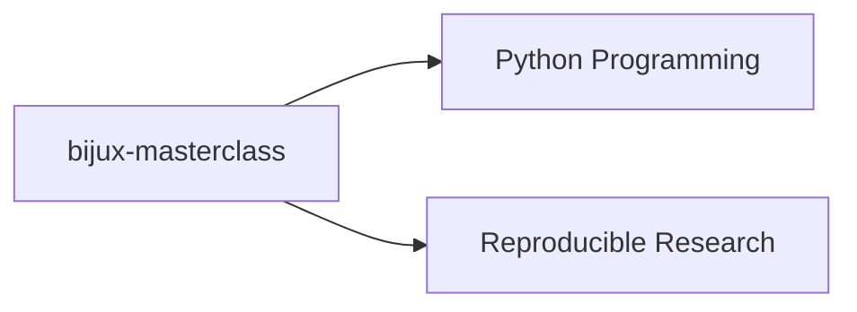

# Learning

## Learning In The Repository Family

The learning branch lives in `bijux-masterclass`, where system
engineering practice is taught through sequenced programs. It belongs in
the same repository family because it turns architecture and workflow
judgment into reusable instruction without separating them from the
systems they come from.

The learning surface is not separate from the rest of the repository
family. It is where runtime judgment, workflow discipline, and design
tradeoffs become teachable without turning into generic motivation.

Learning is easiest to read after the shared foundations are clear:

- [Platform](../01-platform/index.md) explains the family shape
- [Bijux Infrastructure-as-Code](../02-bijux-iac/index.md) explains the control plane
- [Bijux Standards](../03-bijux-std/index.md) explains the shared repository layer
- `bijux-masterclass` turns that same language into teachable programs

## Learning Map

## Program Families

| Program | Who it is for | What it teaches | What artifact proves it | Destination |
| --- | --- | --- | --- | --- |
| Reproducible Research | engineers and researchers who need reliable scientific workflows | workflow systems, automation discipline, build truth, and scientific execution habits | capstone workflow outputs that can be re-run and reviewed | [Program docs](https://bijux.io/bijux-masterclass/reproducible-research/) |
| Python Programming | learners advancing from syntax fluency to design judgment | language depth, runtime judgment, software design tradeoffs, and long-form programming instruction | capstone implementations and runnable exercises that show design decisions in code | [Program docs](https://bijux.io/bijux-masterclass/python-programming/) |

## What You See Quickly

| If you open... | What becomes clear |
| --- | --- |
| reproducible-research capstones | workflow thinking is grounded in executable artifact discipline |
| python-programming program structure | language teaching is being used to explain long-lived software design, not just syntax |
| the relationship to `bijux-masterclass` | the learning surface is treated as a repository-owned product, not detached notes |

## Shared Layers Around Masterclass

- `bijux-masterclass` consumes shared shell behavior and baseline checks from [bijux-std](../03-bijux-std/index.md)
- `bijux-masterclass` is governed in GitHub through [bijux-iac](../02-bijux-iac/index.md)
- `bijux.github.io` routes readers into the learning material, but does not own the learning content or the shared shell
