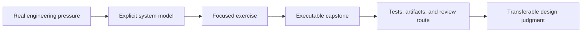

# Learning

Bijux Masterclass teaches engineering judgment through long-form programs,
executable exercises, and capstone systems. The catalog is organized by the
pressure a learner needs to resolve—not by a loose collection of tools or
language features.

<a class="md-button md-button--primary" href="https://bijux.io/bijux-masterclass/">Open The Masterclass Catalog</a>
<a class="md-button" href="reproducible-research/">Choose A Reproducibility Program</a>
<a class="md-button" href="python-programming/">Choose A Python Program</a>
<a class="md-button" href="https://github.com/bijux/bijux-masterclass">View Source</a>

## Choose By System Pressure

| Pressure | Program family | What changes in your judgment | Proof surface |
| --- | --- | --- | --- |
| dependencies lie about rebuilds, workflow state drifts, or publication cannot be reconstructed | [Reproducible Research](reproducible-research/index.md) | model build graphs, workflow contracts, data identity, promotion, and recovery explicitly | Make, Snakemake, and DVC capstones with focused verification routes |
| object boundaries, effects, or runtime hooks make Python systems hard to reason about | [Python Programming](python-programming/index.md) | choose object, functional, and metaprogramming mechanisms by the contract they protect | three evolving Python capstones with tests, proof ladders, and review guides |

## Learning Contract

The capstone corroborates the model; it is not a substitute for explanation.
A course is successful when the learner can predict behavior, identify the
owning boundary, choose proportionate evidence, and explain where a tool should
stop owning the system.

## What The Programs Share

| Principle | How it appears |
| --- | --- |
| truth before convenience | dependency edges, state transitions, effects, and runtime hooks must describe real behavior |
| boundaries before abstraction | a mechanism is introduced only after the responsibility it protects is visible |
| failure as evidence | stale outputs, invalid states, retries, partial publication, and runtime surprises remain inspectable |
| proof proportional to the claim | a small concept uses a focused check; release and recovery claims require stronger evidence |
| capstones as maintained systems | examples include tests, operating routes, artifact contracts, and reviewable change pressure |
| tool-boundary judgment | programs explain when to retain, constrain, migrate, or remove a tool |

## From Platform To Practice

The learning programs use the same concerns visible in the product
repositories:

- Core's graphs, evidence, and replay make workflow truth concrete;
- Canon's package ownership makes custody and failure attribution concrete;
- Atlas makes service, load, rollout, and recovery boundaries concrete;
- scientific repositories make source identity, exclusion, uncertainty, and
  reproducibility concrete.

Masterclass does not define those product contracts. It turns the underlying
engineering questions into reusable instruction and executable practice.

## Read A Program As Evidence

When evaluating a learning claim, inspect four surfaces:

1. the stated pressure and prerequisite knowledge;
2. the system model taught by the module sequence;
3. the capstone behavior that exercises that model;
4. the tests, artifacts, checkpoints, or review guide that make completion
   inspectable.

A table of contents proves coverage. It does not prove that a learner can
apply the idea. The proof route and capstone show whether the program connects
explanation to behavior.

Continue with [Reproducible Research](reproducible-research/index.md) for
workflow and state systems, or [Python Programming](python-programming/index.md)
for language-level design under production pressure.
