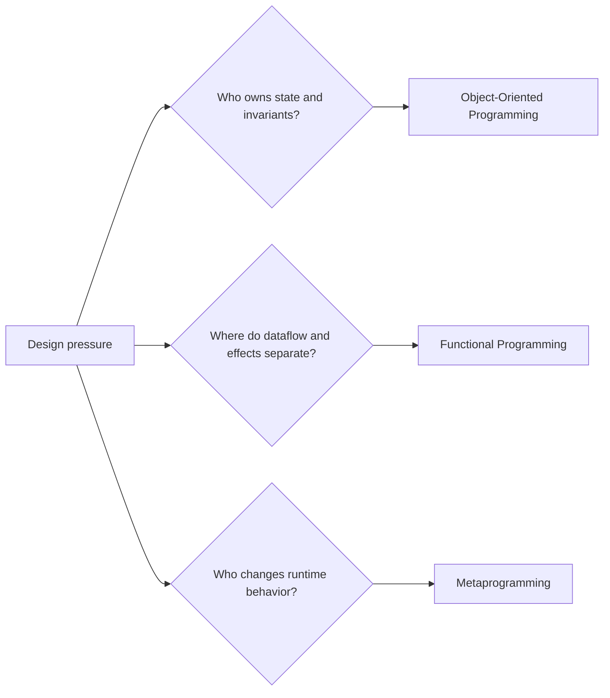
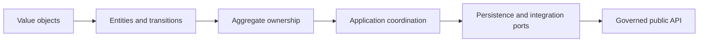
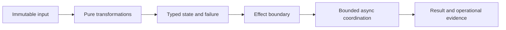

# Python Programming

The Python Programming family teaches design judgment for systems that must
remain understandable under change. Object-oriented, functional, and
metaprogramming techniques are taught as different ways to assign ownership,
control effects, and shape runtime behavior—not as competing styles or syntax
collections.

The programs assume fluency with Python functions, classes, modules, and basic
testing. They are for engineers who need to reason about long-lived APIs,
failure boundaries, extensibility, async work, and dynamic runtime mechanisms.

<a class="md-button md-button--primary" href="https://bijux.io/bijux-masterclass/python-programming/">Open The Family Catalog</a>
<a class="md-button" href="https://bijux.io/bijux-masterclass/python-programming/python-object-oriented-programming/">Object-Oriented Programming</a>
<a class="md-button" href="https://bijux.io/bijux-masterclass/python-programming/python-functional-programming/">Functional Programming</a>
<a class="md-button" href="https://bijux.io/bijux-masterclass/python-programming/python-meta-programming/">Metaprogramming</a>

## Choose By Ownership Problem

| Pressure | Program | Central question | Capstone proof |
| --- | --- | --- | --- |
| state transitions, invariants, aggregates, persistence, and public object APIs are unclear | Object-Oriented Programming | which object owns each rule, lifecycle, and compatibility obligation? | an evolving domain system with explicit entities, values, aggregates, events, storage, and tests |
| hidden mutation, effectful pipelines, failure control, or async coordination make behavior hard to reason about | Functional Programming | which transformations stay pure, and where are effects and resources coordinated? | a data pipeline with typed failures, explicit effects, laziness, async backpressure, and focused laws |
| decorators, descriptors, registration, or class creation make runtime behavior surprising | Metaprogramming | what happens at import, definition, instance, and call time, and is a lower-power mechanism sufficient? | an inspectable plugin runtime with provenance, signature, descriptor, registry, and governance evidence |

## Object-Oriented Programming

Object-oriented design is useful when behavior and state form a durable
responsibility. The course makes value objects, entities, composition,
inheritance, state transitions, aggregates, events, construction, failure,
persistence, and extension points explicit.

The aim is not to maximize class count. It is to make illegal states difficult
to construct and cross-object invariants owned by a clear boundary.

Common failures include classes used as passive containers, inheritance that
violates substitutability, ORM sessions that redefine object behavior, generic
exceptions with no recovery contract, and serialized shapes that bypass domain
invariants.

## Functional Programming

Functional design is useful when dataflow and effects must remain separable.
The course moves through purity, data-first APIs, iterators, streaming,
resilience, explicit domain states, context composition, resource safety,
async backpressure, ecosystem boundaries, and sustained refactoring.

The aim is not to imitate another language. It is to keep ordinary Python code
locally understandable and to move I/O, retries, logging, and resource
lifecycle behind visible contracts.

Common failures include functional vocabulary wrapped around hidden mutation,
lazy work with no clear materialization point, async pipelines without
backpressure, and abstractions that make debugging harder than the behavior
they replace.

## Metaprogramming

Metaprogramming is useful when code must inspect, wrap, validate, register, or
construct other code and objects. The course uses a power ladder:

1. runtime observation and introspection;
2. transparent wrappers and decorators;
3. lower-power class customization;
4. descriptors and attribute ownership;
5. metaclasses and class creation;
6. governance around dynamic execution and global hooks.

Higher power carries a higher proof burden. Signatures, metadata, provenance,
tracebacks, import-time behavior, registry state, and failure semantics must
remain inspectable. Metaclasses are justified only after simpler explicit
mechanisms and descriptors are understood.

## The Tracks Compose Without Collapsing

A real system may use objects for domain ownership, pure functions for
transformation, and decorators for narrow policy. The design remains clear only
when each mechanism owns a different concern.

| Question | Likely owner |
| --- | --- |
| who may change this entity and preserve its invariants? | object or aggregate API |
| how is this input transformed without hidden state? | pure function or pipeline stage |
| where does I/O, retry, or resource lifetime occur? | explicit effect boundary or adapter |
| how is a callable observed or wrapped without changing its apparent contract? | transparent decorator with signature and metadata proof |
| how is attribute behavior owned across instances? | descriptor, when ordinary properties are insufficient |
| how is class creation governed globally? | metaclass only when lower-power mechanisms cannot own the rule |

## Evidence Of Understanding

A program is not complete because its code runs once. The learner should be
able to:

- identify the invariant, effect, or runtime hook under review;
- predict behavior before execution;
- locate the smallest owning boundary;
- explain a lower-power alternative;
- run the focused capstone proof;
- interpret failure without relying on hidden framework behavior;
- state the compatibility and operational cost of the design.

Return to [Learning](../index.md) to compare program families, or inspect
[Bijux Canon](../../04-projects/bijux-canon/index.md) for a production package
system where ownership, typed contracts, composition, and runtime evidence are
kept deliberately separate.
