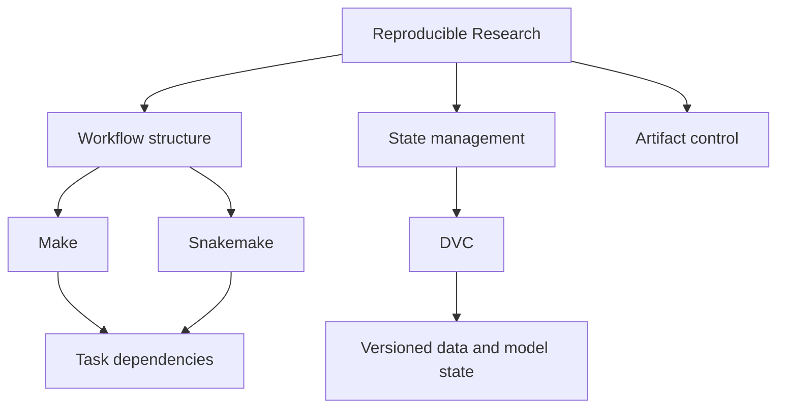

# Reproducible Research

The reproducible research program is the route into workflow discipline,
build systems, automation, and scientific execution habits. It presents
engineering structure through practical research tooling without
reducing the work to tool-specific recipes.

In practical terms, this program addresses familiar failure points:
artifact drift between runs, irreproducible results, unclear execution
state, and broken promotion boundaries between local experiments and
publishable outputs.

The public docs surface for this program follows the shared
documentation shell and standards checks inherited from `bijux-std`.

<a class="md-button md-button--primary" href="https://bijux.io/bijux-masterclass/reproducible-research/">View Family Docs</a>
<a class="md-button" href="https://bijux.io/bijux-masterclass/reproducible-research/deep-dive-make/">View Deep Dive Make</a>
<a class="md-button" href="https://bijux.io/bijux-masterclass/reproducible-research/deep-dive-snakemake/">View Deep Dive Snakemake</a>
<a class="md-button" href="https://bijux.io/bijux-masterclass/reproducible-research/deep-dive-dvc/">View Deep Dive DVC</a>

## Concrete Failure Modes Covered

- stale artifacts: outputs appear current but were built from outdated upstream inputs.
- parameter drift: model or analysis parameters change without a comparable, traceable baseline.
- workflow graph mismatch: declared dependencies do not match real execution needs, causing partial or incorrect rebuilds.

## Family Shape

This family is not just about research tooling. It is about engineering
judgment under workflow pressure: build-graph truth, orchestration and
publish boundaries, dynamic workflow safety, state identity, experiment
discipline, and reproducible execution. The programs are organized by
failure mode and design pressure rather than by tool popularity.

## What Appears Across The Program

| Surface | Why it matters |
| --- | --- |
| Make, Snakemake, and DVC kept in one family | shows that workflow truth, orchestration, and state identity are treated as one systems problem |
| capstone outputs | shows that the claims stay attached to runnable proof surfaces |
| failure-mode framing | shows that the teaching starts from operational risk rather than tool fandom |

## Why Make, Snakemake, And DVC Belong Together

| Tool | Core responsibility | Why it belongs in the same family |
| --- | --- | --- |
| Make | build truth | verifies dependency and rebuild correctness at the build-graph level |
| Snakemake | workflow orchestration | coordinates multi-step data workflows with clear contracts and execution order |
| DVC | state and version control | tracks experiment state, parameters, metrics, and promotion boundaries over time |

## From Notebook Work To Controlled Outputs

## Program Map

## What Lives Here

- workflow and automation thinking arranged as a teachable system
- comfort with build, workflow, and reproducibility tooling used in real technical and scientific environments
- data identity, parameters, metrics, experiments, and recovery treated as engineering concerns
- capstone-backed programs where the claims stay attached to executable capstones
- the ability to teach system models instead of memorizing command syntax

## What This Program Teaches

- state identity design for experiments and reproducible artifact lineage
- workflow truth: choosing orchestration models that match failure and change pressure
- publication boundaries that separate build, review, and release responsibilities
- recovery posture after drift, parameter churn, or runtime evolution

## Where To Begin

| If you want to start with... | Start with |
| --- | --- |
| build-system judgment | [Deep Dive Make](https://bijux.io/bijux-masterclass/reproducible-research/deep-dive-make/) and its emphasis on truthful DAGs, atomic publication, and parallel safety |
| workflow-engineering depth | [Deep Dive Snakemake](https://bijux.io/bijux-masterclass/reproducible-research/deep-dive-snakemake/) and its contract-driven view of workflow design |
| state identity and experiment recovery | [Deep Dive DVC](https://bijux.io/bijux-masterclass/reproducible-research/deep-dive-dvc/) and its focus on params, metrics, promotion discipline, and trustworthy recovery |
| program design clarity | the family page in Masterclass, which routes by system pressure instead of generic topic grouping |

## Capstone Outputs

| Capstone | Direct proof surface | Engineering behavior demonstrated |
| --- | --- | --- |
| Deep Dive Make capstone | [Capstone docs](https://bijux.io/bijux-masterclass/reproducible-research/deep-dive-make/capstone/docs/) | truthful build graphs, deterministic rebuild behavior, and publication-safe build contracts |
| Deep Dive Snakemake capstone | [Capstone docs](https://bijux.io/bijux-masterclass/reproducible-research/deep-dive-snakemake/capstone/docs/) | workflow contract integrity, clear file interfaces, and reviewable execution paths |
| Deep Dive DVC capstone | [Capstone docs](https://bijux.io/bijux-masterclass/reproducible-research/deep-dive-dvc/capstone/docs/) | parameter and metric traceability, experiment recovery, and promotion-boundary discipline |

## When This Page Is Most Useful

- you care about workflow systems, reproducibility, and scientific execution habits
- you want to see engineering discipline carry into research tooling and publication boundaries
- you want to understand when DVC is the right model for experiment state, recovery, and promotion boundaries
- you want to inspect teaching material anchored to executable capstones with direct proof routes

## Why This Matters Outside Research

- CI/CD: deterministic workflows and clear build boundaries reduce release ambiguity
- data pipelines: state and artifact discipline improve traceability under evolving inputs
- ML workflows: parameter/metric handling patterns map directly to experiment governance
- platform reliability: failure-mode-first workflow design supports stable operational behavior

Reproducibility becomes durable when workflow design starts from
real failure modes rather than tool preference. The material focuses on
engineering judgment about state, artifacts, and change control so work
remains inspectable, repeatable, and operationally reliable over time.
