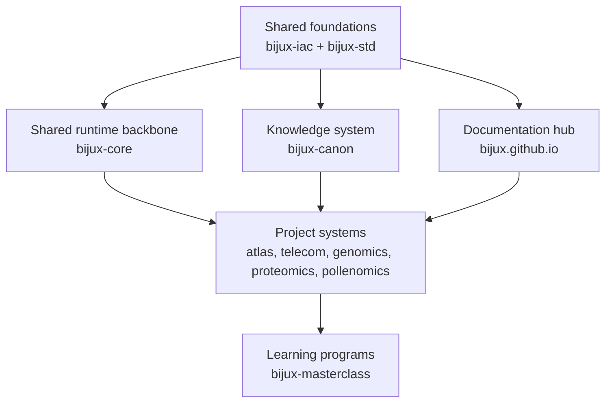
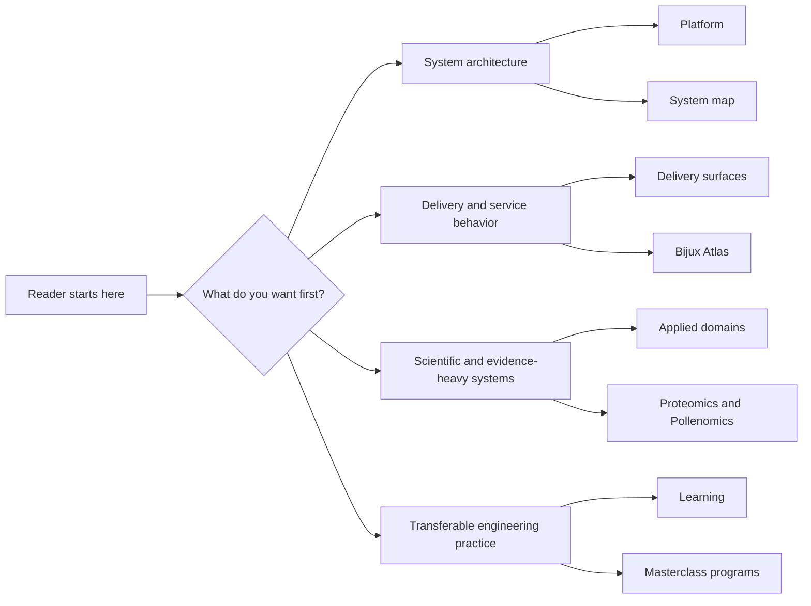

# Bijux

<section class="bijux-hero">
  
platform systems, delivery interfaces, scientific software, and technical programs

  <h1 class="bijux-hero__title">Bijux is a public system family built as distinct repositories with visible control points.</h1>
  
<code>bijux.io</code> is the public hub for the current Bijux repository family. It introduces the shared foundations, the project backbone, the domain systems, and the learning programs in one connected surface.

  

    platform architecture
    control-plane design
    data-service design
    bioinformatics software
    documentation as delivery
    teaching through systems
  

</section>

<strong>This hub helps you find the right part of the family first.</strong>
From there, the project pages, docs sites, and repositories carry the
detail.

## What Bijux Is

Bijux is a repository family for platform engineering, data and service
delivery, scientific software, and technical education.

The public surface is organized so ownership stays legible:

- one branch explains the platform structure of the family
- one repository owns the live GitHub control plane
- one repository owns the shared standards layer
- one repository owns the public documentation hub
- one repository owns the shared runtime backbone used across projects
- other repositories own knowledge, delivery, domain, and learning work

That keeps the system legible because responsibility changes hands in
named places instead of disappearing behind one monorepo or one
presentation site.

| Term | Meaning in this site |
| --- | --- |
| ownership boundaries | Repository-level responsibilities that prevent hidden coupling and drift. |
| delivery surfaces | User-visible outputs such as docs, APIs, reports, and release pathways that must be engineered, not improvised. |

## At A Glance

| Layer | Owned in | What becomes visible |
| --- | --- | --- |
| control plane | [Bijux Infrastructure-as-Code](02-bijux-iac/index.md) | GitHub governance applied as code |
| shared standards | [Bijux standard layer](03-bijux-std/index.md) | shared docs shell, shared checks, shared repo contracts |
| documentation hub | [Platform overview](01-platform/index.md) and this site | cross-repository orientation and route design |
| shared runtime backbone | [Bijux Core](04-projects/bijux-core/index.md) | CLI, DAG, evidence, and release discipline used across projects |
| project systems | [Projects](04-projects/index.md) | knowledge, APIs, datasets, packages, and domain systems |
| learning surface | [Learning catalog](05-learning/index.md) | technical programs built from the same engineering language |

## Core Ideas In This System

- Separate repositories by operating responsibility so boundaries remain stable as systems grow.
- Treat documentation, contracts, and release behavior as owned delivery outputs.
- Make the control plane, standards layer, hub, and project layers visible as different kinds of work.
- Keep the same engineering language across platform, domain, and learning surfaces.

## How It Is Organized

The site is organized around repository ownership first, then around
reading routes. The shared foundations sit at the bottom, the hub
routes into the family, `bijux-core` provides the shared runtime
backbone, and learning turns the same engineering language into
reusable programs.

Shared documentation shell behavior and cross-repository standards
checks are defined in [Bijux standard layer](03-bijux-std/index.md),
while live GitHub policy is owned in
[Bijux Infrastructure-as-Code](02-bijux-iac/index.md).

### Reading Approach

Start with the family shape, then continue into the branch that matches
your interest.

| Start here for... | Open this first | What you will find |
| --- | --- | --- |
| how the repositories fit together | [Platform overview](01-platform/index.md) -> [System map](01-platform/system-map/index.md) | the split across shared foundations, runtime, knowledge, delivery, and domain work |
| how GitHub governance is applied across the family | [Bijux Infrastructure-as-Code](02-bijux-iac/index.md) | the live control plane and the review model behind the repositories |
| how shared behavior stays aligned across repositories | [Bijux standard layer](03-bijux-std/index.md) | shared docs shell, shared make behavior, and standards promotion |
| how delivery appears in public | [Delivery surfaces](01-platform/delivery-surfaces/index.md) -> [Bijux Atlas](04-projects/bijux-atlas/index.md) | documentation, published destinations, and operated service surfaces |
| how the work behaves under domain pressure | [Applied domains](01-platform/applied-domains/index.md) -> [Bijux Proteomics](04-projects/bijux-proteomics/index.md) -> [Bijux Pollenomics](04-projects/bijux-pollenomics/index.md) | scientific and evidence-heavy product systems |
| how the same technical style carries into teaching | [Learning catalog](05-learning/index.md) | course books and programs built around the same technical language |

## Reading Paths

This section offers a short first pass through the part of the work you
care about most.

<strong>New here?</strong> Start with
<a href="index.md">Home</a> -> <a href="01-platform/index.md">Platform</a> ->
<a href="02-bijux-iac/index.md">Bijux Infrastructure-as-Code</a> ->
<a href="03-bijux-std/index.md">Bijux Standards</a>. This is the shortest route into the shared foundations.

The map below summarizes the main route families at a glance.

Choose a route below by intent or by time.

### By Intent

| If you want to inspect... | Start here | Then continue into |
| --- | --- | --- |
| system design and repository split | [Platform overview](01-platform/index.md) | [System map](01-platform/system-map/index.md) |
| control plane design and repository governance | [Bijux Infrastructure-as-Code](02-bijux-iac/index.md) | [Platform overview](01-platform/index.md), [System map](01-platform/system-map/index.md) |
| shared standards and cross-repository continuity | [Bijux standard layer](03-bijux-std/index.md) | [Documentation Network](01-platform/documentation-network/index.md) |
| delivery and service interfaces | [Delivery surfaces](01-platform/delivery-surfaces/index.md) | [Bijux Atlas](04-projects/bijux-atlas/index.md) |
| domain-heavy product work | [Applied domains](01-platform/applied-domains/index.md) | [Bijux Proteomics](04-projects/bijux-proteomics/index.md), [Bijux Pollenomics](04-projects/bijux-pollenomics/index.md) |
| technical teaching built from the same system language | [Learning catalog](05-learning/index.md) | [Reproducible Research](05-learning/reproducible-research/index.md), [Python Programming](05-learning/python-programming/index.md) |

### By Time

| If you have... | Read this route |
| --- | --- |
| 10 minutes | [Home](index.md) -> [Platform](01-platform/index.md) -> [Projects](04-projects/index.md) |
| 20 minutes | [Platform](01-platform/index.md) -> [Bijux Infrastructure-as-Code](02-bijux-iac/index.md) -> [Bijux standard layer](03-bijux-std/index.md) |
| 30 minutes | [Platform](01-platform/index.md) -> [Bijux Infrastructure-as-Code](02-bijux-iac/index.md) -> [Bijux standard layer](03-bijux-std/index.md) -> [Bijux Core](04-projects/bijux-core/index.md) -> [Bijux Atlas](04-projects/bijux-atlas/index.md) |

  <article class="bijux-showcase-card">
    
architecture route

    <h2>Start with the system split</h2>
    
Open Platform and the System Map first, then Core and Canon, to see how runtime, knowledge, and governance divide cleanly.

    
<a href="#reading-paths">See reading paths</a>

  </article>
  <article class="bijux-showcase-card">
    
delivery route

    <h2>Start with delivery surfaces</h2>
    
Open Delivery Surfaces and then Atlas for the fastest route into service contracts, APIs, datasets, and publication.

    
<a href="#reading-paths">See reading paths</a>

  </article>
  <article class="bijux-showcase-card">
    
domain route

    <h2>Start where the work gets harder</h2>
    
Open Applied Domains, then Proteomics and Pollenomics, to see the same engineering posture under scientific constraints.

    
<a href="#reading-paths">See reading paths</a>

  </article>

<a class="md-button md-button--primary" href="04-projects/">Browse the repositories</a>
<a class="md-button" href="01-platform/">Read the platform branch</a>
<a class="md-button" href="02-bijux-iac/">Open the control plane</a>
<a class="md-button" href="03-bijux-std/">Open the standards layer</a>
<a class="md-button" href="#reading-paths">Choose a reading path</a>

## Repository Family

| Repository | Role in the system family | Public entry point |
| --- | --- | --- |
| `bijux-core` | execution and governance backbone | CLI, DAG, evidence, and release surfaces |
| `bijux-canon` | knowledge-system stack | ingest, indexing, reasoning, orchestration, and controlled runtime behavior |
| `bijux-atlas` | data and service delivery surface | APIs, datasets, reporting, and docs-aware operations |
| `bijux-proteomics` | scientific product system | proteomics-oriented packages and runtime surfaces |
| `bijux-pollenomics` | evidence mapping product system | Nordic atlas outputs, tracked data, and report publication |
| `bijux-masterclass` | public learning surface | course books and long-form technical programs |
| `bijux-std` | shared standards layer | shared docs shell, shared checks, and shared make modules |
