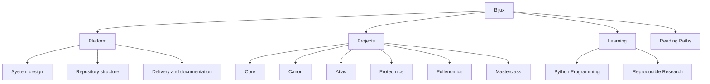

# Bijux

<section class="bijux-hero">
  
runtime systems, data delivery, scientific products, and technical education

  <h1 class="bijux-hero__title">Architecture, delivery, and domain work made inspectable.</h1>
  
<code>bijux.io</code> is the documentation hub for the current Bijux repository family: execution and governance systems, knowledge and data services, applied bioinformatics products, and technical programs. It is arranged so readers can move from orientation into repository handbooks, published destinations, and source surfaces without losing ownership boundaries.

  

    platform architecture
    runtime governance
    data-service design
    bioinformatics software
    documentation as delivery
    teaching through systems
  

</section>

<strong>This hub helps you locate the owning repository first.</strong>
Once you find the right branch, you can continue into the documentation
and source surfaces that carry the implementation detail.

## What Bijux Is

Bijux is a repository family for runtime systems, governed knowledge/data
systems, scientific software, and technical learning surfaces, organized around
clear boundaries and inspectable delivery.

It is designed so architecture, delivery, and domain work can evolve together
without merging responsibilities into a single opaque codebase.

| Term | Meaning in this site |
| --- | --- |
| runtime governance | The execution rules, controls, and operational constraints that keep system behavior predictable. |
| delivery surfaces | User-visible outputs such as docs, APIs, reports, and release pathways that must be engineered, not improvised. |
| ownership boundaries | Explicit repository-level responsibilities that prevent hidden coupling and drift. |
| inspectable | Structured so an external reader can open docs and source directly and verify how claims map to implementation. |

## Core Ideas In This System

- Keep runtime behavior deterministic with explicit controls and reviewable execution paths.
- Treat documentation, contracts, and release behavior as owned delivery outputs.
- Separate repositories by operating responsibility so boundaries remain stable as systems grow.
- Apply the same architecture language across platform, domain, and learning surfaces.
- Keep explanation close to implementation so readers can verify design decisions directly.

## Representative Engineering Themes

- platform systems and runtime control-plane design
- governed knowledge and data-service architecture
- scientific software delivery under evidence and traceability pressure
- architecture documentation, reviewability, and long-lived maintenance posture
- technical education that codifies engineering judgment instead of summarizing tools

## How It Is Organized

## Reading Approach

This page offers a starting point based on your interest. From there,
you can move into the owning repository and spend time with the actual
surfaces that matter for your review.

Bijux is intended to be read as one coherent body of engineering work,
not as isolated projects. Platform structure, repository boundaries,
delivery surfaces, domain systems, and technical education are presented
together so readers can inspect design discipline directly and evaluate
the work by its architectural clarity rather than summary claims.

| Start here for... | Open this first | What you will find |
| --- | --- | --- |
| how the repositories fit together | [Platform overview](platform/index.md) -> [System map](platform/system-map.md) | the split across runtime, knowledge, delivery, and domain work |
| how delivery shows up publicly | [Delivery surfaces](platform/delivery-surfaces.md) -> [Bijux Atlas](projects/bijux-atlas.md) | documentation, published destinations, and operated service surfaces |
| how the work behaves under domain pressure | [Applied domains](platform/applied-domains.md) -> [Bijux Proteomics](projects/bijux-proteomics.md) -> [Bijux Pollenomics](projects/bijux-pollenomics.md) | scientific and evidence-heavy product systems |
| how the technical style carries into teaching | [Learning catalog](learning/index.md) | course books and programs built around the same technical language |

## How To Read This Site

Use one of these route types based on your immediate goal:

- Architecture route: start at [Platform overview](platform/index.md), then [System map](platform/system-map.md), then [bijux-core](projects/bijux-core.md) and [bijux-canon](projects/bijux-canon.md).
- Delivery route: start at [Delivery surfaces](platform/delivery-surfaces.md), then [bijux-atlas](projects/bijux-atlas.md), then public docs and published endpoints.
- Domain route: start at [Applied domains](platform/applied-domains.md), then [bijux-proteomics](projects/bijux-proteomics.md) and [bijux-pollenomics](projects/bijux-pollenomics.md).

## Where To Start

  <article class="bijux-showcase-card">
    
for architecture-first readers

    <h2>Start with the system split</h2>
    
You can begin with the system map, then Core and Canon, to review boundaries, runtime structure, and repository ownership.

    
<a href="reading-paths.md">See reading paths</a>

  </article>
  <article class="bijux-showcase-card">
    
for delivery-focused readers

    <h2>Start with delivery surfaces</h2>
    
You can start with Delivery Surfaces, then Atlas, for service design, operational visibility, documentation quality, and published destinations.

    
<a href="reading-paths.md">See reading paths</a>

  </article>
  <article class="bijux-showcase-card">
    
for domain and teaching readers

    <h2>Start where the work gets harder</h2>
    
You can open Applied Domains, then Proteomics, Pollenomics, and Learning, to see the same structure under scientific context and public teaching.

    
<a href="reading-paths.md">See reading paths</a>

  </article>

<a class="md-button md-button--primary" href="projects/">Browse the repositories</a>
<a class="md-button" href="platform/">Read the platform branch</a>
<a class="md-button" href="reading-paths/">Choose a reading path</a>

## Repository Family

| Repository | Role in the system family | Public entry point |
| --- | --- | --- |
| `bijux-core` | execution and governance backbone | CLI, DAG, evidence, and release surfaces |
| `bijux-canon` | governed knowledge-system stack | ingest, indexing, reasoning, orchestration, and controlled runtime behavior |
| `bijux-atlas` | data and service delivery surface | APIs, datasets, reporting, and docs-aware operations |
| `bijux-proteomics` | scientific product system | proteomics-oriented packages and runtime surfaces |
| `bijux-pollenomics` | evidence mapping product system | Nordic atlas outputs, tracked data, and report publication |
| `bijux-masterclass` | public learning surface | course books and long-form technical programs |
