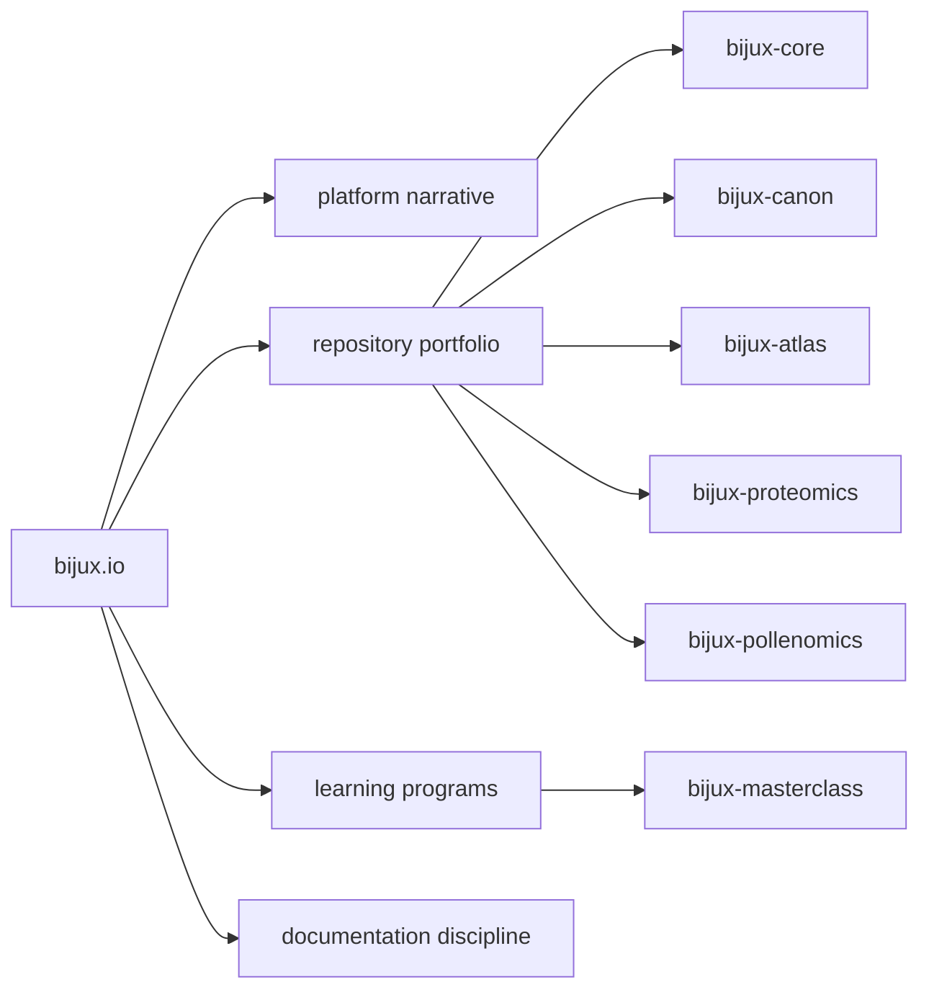

# Bijux

`bijux.io` is the public surface of a deliberately connected body of
work: governed runtime systems, documentation infrastructure, data
delivery platforms, applied bioinformatics products, and technical
education that is built with the same engineering discipline as the
software itself.

<strong>Start here when you want to understand the shape of the work before opening a single repository.</strong>
The point of this hub is not to summarize everything into one page. The
point is to make the structure legible enough that a careful reader can
see how platform thinking, delivery discipline, domain products, and
teaching practice reinforce each other across the Bijux ecosystem.

  
<h3>Systems With Boundaries</h3>
The repositories are split by responsibility on purpose. Runtime, knowledge systems, delivery surfaces, and domain applications are separated clearly enough that ownership can stay visible under change.

  
<h3>Operationally Serious</h3>
The public work is not presented as loose experiments. It is documented through contracts, release flows, evidence artifacts, navigation discipline, and repositories that are built to stand up to inspection.

  
<h3>Domain-Aware</h3>
The platform work does not stop at generic infrastructure. It carries into proteomics, pollenomics, evidence mapping, data products, and learning programs where technical architecture has to meet real subject matter.

<a class="md-button md-button--primary" href="projects/">Browse the work</a>
<a class="md-button" href="platform/">Open the platform narrative</a>
<a class="md-button" href="learning/">Open the learning surface</a>

## What This Surface Makes Visible

| Area | What a careful reader can see |
| --- | --- |
| Platform engineering | systems are organized by clear ownership, constrained interfaces, and documentation that behaves like part of the product |
| Software engineering | repositories show architectural separation, operational guardrails, release discipline, and maintainable information design |
| Data and service engineering | Atlas, Canon, and Core expose delivery, runtime, evidence, API, and contract thinking as first-class concerns |
| Applied bioinformatics | Proteomics and Pollenomics show how the same engineering posture extends into domain-specific products rather than stopping at infrastructure |

## Navigate By Intent

| If you want to understand... | Open this first |
| --- | --- |
| how the repositories fit together as one engineering system | [Platform overview](platform/index.md) |
| the strongest cross-section of public work | [Project catalog](projects/index.md) |
| how the engineering style carries into teaching | [Learning catalog](learning/index.md) |
| the standards behind the docs shell itself | [Stewardship overview](stewardship/index.md) |

## Public Surface Map

## Main Repositories

| Repository | Role in the system family | Docs |
| --- | --- | --- |
| `bijux-core` | CLI, DAG runtime, repository governance, evidence, and release backbone | [Core docs](https://bijux.io/bijux-core/) |
| `bijux-canon` | governed ingest, retrieval, reasoning, orchestration, and runtime control | [Canon docs](https://bijux.io/bijux-canon/) |
| `bijux-atlas` | data delivery, service interfaces, dataset operations, and docs control-plane behavior | [Atlas docs](https://bijux.io/bijux-atlas/) |
| `bijux-proteomics` | proteomics and discovery-oriented product system | [Proteomics docs](https://bijux.io/bijux-proteomics/) |
| `bijux-pollenomics` | evidence mapping and site-selection product system | [Pollenomics docs](https://bijux.io/bijux-pollenomics/) |
| `bijux-masterclass` | public programs and deep-dive teaching tracks | [Masterclass docs](https://bijux.io/bijux-masterclass/) |

## Reading Rule

Use this page to understand the body of work before choosing a handbook.
Once the owned surface is clear, move into the repository docs and let
the repository prove the details.
