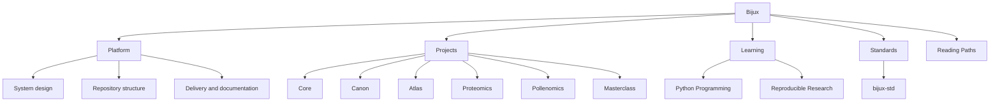
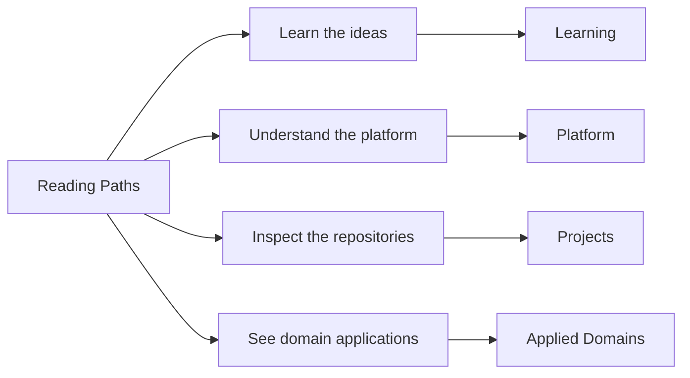

# Bijux

<section class="bijux-hero">
  
platform systems, delivery interfaces, scientific software, and technical programs

  <h1 class="bijux-hero__title">Bijux is a public system family built as distinct repositories with visible control points.</h1>
  
<code>bijux.io</code> is the hub for the current Bijux repository family. It is arranged so a reader can move from system orientation into the exact repository that owns the runtime backbone, the control plane, the shared standards layer, the delivery interfaces, the domain products, or the learning programs.

  

    platform architecture
    control-plane design
    data-service design
    bioinformatics software
    documentation as delivery
    teaching through systems
  

</section>

<strong>This hub helps you locate the owning repository first.</strong>
Once you find the right branch, you can continue into the documentation
and source surfaces that carry the implementation detail.

## What Bijux Is

Bijux is a repository family for platform engineering, data and service
delivery, scientific software, and technical education.

The important point is not just that the work is public. The important point is
that the public surface keeps ownership visible:

- one repository owns the live GitHub control plane
- one repository owns the shared standards layer
- one repository owns the hub
- other repositories own runtime, knowledge, delivery, domain, and learning work

That makes the system easier to inspect because responsibility changes hands in
named places instead of disappearing behind one monorepo or one presentation
site.

| Term | Meaning in this site |
| --- | --- |
| ownership boundaries | Explicit repository-level responsibilities that prevent hidden coupling and drift. |
| delivery surfaces | User-visible outputs such as docs, APIs, reports, and release pathways that must be engineered, not improvised. |

## At A Glance

| Layer | Owned in | What becomes visible |
| --- | --- | --- |
| control plane | [Bijux Infrastructure-as-Code](01-platform/bijux-iac/index.md) | GitHub governance applied as code |
| shared standards | [Bijux standard layer](01-platform/bijux-std/index.md) | shared docs shell, shared checks, shared repo contracts |
| public hub | [Platform overview](01-platform/index.md) and this site | cross-repository orientation and route design |
| runtime and services | [Projects](02-projects/index.md) | runtime behavior, APIs, datasets, packages, and domain systems |
| learning surface | [Learning catalog](03-learning/index.md) | technical programs built from the same engineering language |

## Core Ideas In This System

- Separate repositories by operating responsibility so boundaries remain stable as systems grow.
- Treat documentation, contracts, and release behavior as owned delivery outputs.
- Make the control plane, standards layer, and product layers visible as different kinds of work.
- Keep the same engineering language across platform, domain, and learning surfaces.

## How It Is Organized

The site is organized around repository ownership, then around navigation paths
for architecture, delivery, and domain-focused reading.
Shared documentation shell behavior and cross-repository standards checks are
defined in [Bijux standard layer](01-platform/bijux-std/index.md), while live
GitHub policy is owned in [Bijux Infrastructure-as-Code](01-platform/bijux-iac/index.md).

### Reading Approach

This page offers a starting point based on your interest. From there,
you can move into the owning repository and spend time with the actual
surfaces that matter for your review.

Read the platform and repository split first, then choose a route by review
goal so implementation evidence stays connected to system intent.

| Start here for... | Open this first | What you will find |
| --- | --- | --- |
| how the repositories fit together | [Platform overview](01-platform/index.md) -> [System map](01-platform/system-map/index.md) | the split across runtime, knowledge, delivery, and domain work |
| how delivery shows up publicly | [Delivery surfaces](01-platform/delivery-surfaces/index.md) -> [Bijux Atlas](02-projects/bijux-atlas/index.md) | documentation, published destinations, and operated service surfaces |
| how the work behaves under domain pressure | [Applied domains](01-platform/applied-domains/index.md) -> [Bijux Proteomics](02-projects/bijux-proteomics/index.md) -> [Bijux Pollenomics](02-projects/bijux-pollenomics/index.md) | scientific and evidence-heavy product systems |
| how the technical style carries into teaching | [Learning catalog](03-learning/index.md) | course books and programs built around the same technical language |

## Reading Paths

This section helps you choose a short path that matches the part of the
work you care about first.

<strong>New here?</strong> Start with
<a href="index.md">Home</a> -> <a href="01-platform/index.md">Platform</a> ->
<a href="01-platform/system-map/index.md">System Map</a>. This is the canonical first
route for new readers.

The map below summarizes the main route families at a glance.

Choose a route below by intent or by time.

### By Intent

| If you want to inspect... | Start here | Then continue into |
| --- | --- | --- |
| system design and repository split | [Platform overview](01-platform/index.md) | [System map](01-platform/system-map/index.md), [Repository matrix](01-platform/repository-matrix/index.md) |
| control plane and shared standards | [Bijux Infrastructure-as-Code](01-platform/bijux-iac/index.md) | [Bijux standard layer](01-platform/bijux-std/index.md), [Shell Architecture](01-platform/shell-architecture/index.md) |
| delivery and service interfaces | [Delivery surfaces](01-platform/delivery-surfaces/index.md) | [Bijux Atlas](02-projects/bijux-atlas/index.md) |
| domain-heavy product work | [Applied domains](01-platform/applied-domains/index.md) | [Bijux Proteomics](02-projects/bijux-proteomics/index.md), [Bijux Pollenomics](02-projects/bijux-pollenomics/index.md) |
| technical teaching built from the same system language | [Learning catalog](03-learning/index.md) | [Reproducible Research](03-learning/reproducible-research/index.md), [Python Programming](03-learning/python-programming/index.md) |

### By Time

| If you have... | Read this route |
| --- | --- |
| 10 minutes | [Home](index.md) -> [Work qualities](01-platform/work-qualities/index.md) -> [Projects](02-projects/index.md) |
| 20 minutes | [System map](01-platform/system-map/index.md) -> [Repository matrix](01-platform/repository-matrix/index.md) -> one project page that matches your interest |
| 30 minutes | [Platform](01-platform/index.md) -> [System map](01-platform/system-map/index.md) -> [Delivery surfaces](01-platform/delivery-surfaces/index.md) -> [Bijux Atlas](02-projects/bijux-atlas/index.md) -> [Applied domains](01-platform/applied-domains/index.md) |

  <article class="bijux-showcase-card">
    
architecture route

    <h2>Start with the system split</h2>
    
You can begin with the system map, then Core and Canon, to review boundaries, runtime structure, and repository ownership.

    
<a href="#reading-paths">See reading paths</a>

  </article>
  <article class="bijux-showcase-card">
    
delivery route

    <h2>Start with delivery surfaces</h2>
    
You can start with Delivery Surfaces, then Atlas, for service design, operational visibility, documentation quality, and published destinations.

    
<a href="#reading-paths">See reading paths</a>

  </article>
  <article class="bijux-showcase-card">
    
domain route

    <h2>Start where the work gets harder</h2>
    
You can open Applied Domains, then Proteomics, Pollenomics, and Learning, to see the same structure under scientific context and public teaching.

    
<a href="#reading-paths">See reading paths</a>

  </article>

<a class="md-button md-button--primary" href="02-projects/">Browse the repositories</a>
<a class="md-button" href="01-platform/">Read the platform branch</a>
<a class="md-button" href="#reading-paths">Choose a reading path</a>

## Repository Family

| Repository | Role in the system family | Public entry point |
| --- | --- | --- |
| `bijux-core` | execution and governance backbone | CLI, DAG, evidence, and release surfaces |
| `bijux-canon` | governed knowledge-system stack | ingest, indexing, reasoning, orchestration, and controlled runtime behavior |
| `bijux-atlas` | data and service delivery surface | APIs, datasets, reporting, and docs-aware operations |
| `bijux-proteomics` | scientific product system | proteomics-oriented packages and runtime surfaces |
| `bijux-pollenomics` | evidence mapping product system | Nordic atlas outputs, tracked data, and report publication |
| `bijux-masterclass` | public learning surface | course books and long-form technical programs |
| `bijux-std` | shared standards layer | shared docs shell, shared checks, and shared make modules |
