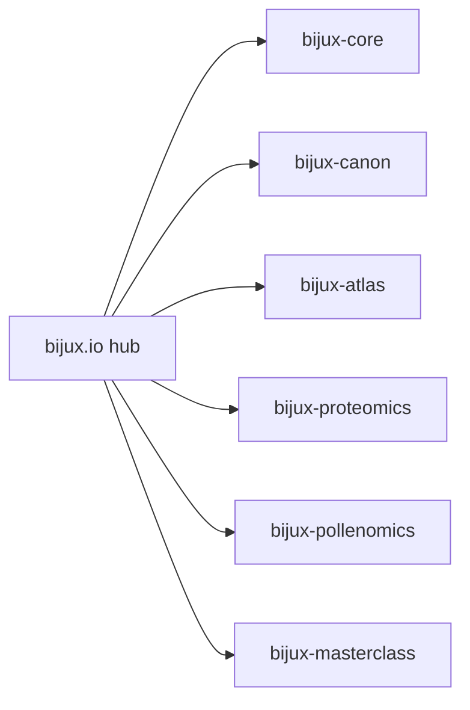

# Bijux

`bijux.io` is the public hub for the Bijux documentation network. The
goal is simple: let readers move between the platform story, product
handbooks, and learning paths without having to re-learn the navigation
system in every repository.

<strong>Use the hub to choose the right site, then stay inside the same navigation shell.</strong>
The top strip moves between repositories. The site tabs explain the
current hub area. The detail strip narrows to the active section. That
same pattern now starts here instead of only inside project sites.

  
<h3>Platform Story</h3>
Open the platform pages when you need the cross-repository picture: how the public surfaces fit together, which handbook to open first, and how the documentation network is shaped.

  
<h3>Project Handbooks</h3>
Open the project pages when you already know the repository you need and want the shortest path into its docs, code, and release surface.

  
<h3>Learning Paths</h3>
Open the learning pages for the public masterclass tracks and course-level routes into reproducible research and Python programming.

<a class="md-button md-button--primary" href="projects/">Browse the project handbooks</a>
<a class="md-button" href="platform/">Open the platform overview</a>
<a class="md-button" href="learning/">Open the learning catalog</a>

## How the Public Surface Fits Together

## Start Here

| Surface | Open It When | Destination |
| --- | --- | --- |
| Platform | you need cross-repository orientation before opening a specific handbook | [Platform overview](platform/index.md) |
| Projects | you want the fastest route into one repository’s docs and code | [Project catalog](projects/index.md) |
| Learning | you want public course material and program-level entry points | [Learning catalog](learning/index.md) |
| Stewardship | you want the rules behind the shared docs shell and content discipline | [Stewardship overview](stewardship/index.md) |

## Main Repositories

| Repository | Role | Docs |
| --- | --- | --- |
| `bijux-core` | CLI, DAG runtime, and governance backbone | [Core docs](https://bijux.io/bijux-core/) |
| `bijux-canon` | governed ingest, retrieval, reasoning, and runtime system | [Canon docs](https://bijux.io/bijux-canon/) |
| `bijux-atlas` | data delivery, server, API, and documentation control plane | [Atlas docs](https://bijux.io/bijux-atlas/) |
| `bijux-proteomics` | proteomics and discovery software platform | [Proteomics docs](https://bijux.io/bijux-proteomics/) |
| `bijux-pollenomics` | evidence mapping and site selection product surface | [Pollenomics docs](https://bijux.io/bijux-pollenomics/) |
| `bijux-masterclass` | public learning programs and deep-dive courses | [Masterclass docs](https://bijux.io/bijux-masterclass/) |

## Decision Rule

Use this hub when the first question is “which handbook owns this?”
Move into the repository docs as soon as ownership is clear.
