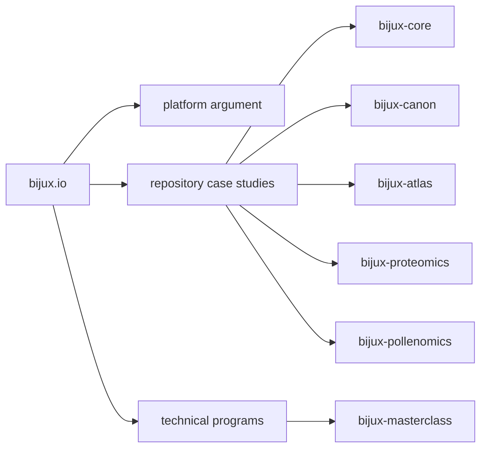

# Bijux

<section class="bijux-hero">
  
runtime systems, data delivery, scientific products, and technical education

  <h1 class="bijux-hero__title">Architecture, delivery, and domain work made inspectable.</h1>
  
<code>bijux.io</code> is a public map of the Bijux body of work: execution and governance systems, knowledge and data services, applied bioinformatics products, and learning programs built from the same engineering discipline. The point is not to compress everything into one slogan. The point is to help serious readers inspect boundaries, delivery posture, and technical judgment through the work itself.

  

    platform architecture
    runtime governance
    data-service design
    bioinformatics software
    documentation as delivery
    teaching through systems
  

</section>

<strong>A strong portfolio should not ask for trust before inspection.</strong>
This hub is strongest when it helps readers move quickly from a public
argument into repository structure, published documentation, delivery
surfaces, and domain-specific systems that hold up under closer
inspection.

  
<h3>Boundaries That Survive Change</h3>
Core, Canon, Atlas, and the domain repositories are split by real responsibility. Runtime control, knowledge workflows, delivery surfaces, and scientific products are separate enough that ownership stays legible when the system grows.

  
<h3>Delivery, Not Portfolio Theater</h3>
The public story routes into documentation systems, repository handbooks, published destinations, and operational surfaces. The material is meant to be checked, not merely read.

  
<h3>Domain Pressure, Not Generic Demos</h3>
The engineering posture carries into proteomics, pollenomics, evidence mapping, and technical education. That matters because architecture is easier to claim in the abstract than under subject-matter constraints.

  
<h3>Explainable Technical Depth</h3>
The same body of work is also teachable. When systems thinking can travel from implementation into clear learning programs without flattening the structure, that is a meaningful engineering signal on its own.

<a class="md-button md-button--primary" href="projects/">Browse the repositories</a>
<a class="md-button" href="platform/">Inspect the platform story</a>
<a class="md-button" href="reading-paths/">Choose a reading path</a>

## What A Careful Reader Can Prove Quickly

| If the question is... | Open this first | Why it matters |
| --- | --- |
| are the repositories split by real responsibility or just naming | [Platform overview](platform/index.md) -> [System map](platform/system-map.md) | a coherent split across runtime, knowledge, delivery, and domain work is one of the strongest signals in the portfolio |
| is there delivery and operational seriousness behind the presentation | [Delivery signals](platform/delivery-signals.md) -> [Bijux Atlas](projects/bijux-atlas.md) | a credible public surface should route into maintained systems, not brochure copy |
| does the work extend beyond generic infrastructure | [Applied domains](platform/applied-domains.md) -> [Bijux Proteomics](projects/bijux-proteomics.md) -> [Bijux Pollenomics](projects/bijux-pollenomics.md) | domain-heavy systems show whether the engineering posture survives real subject-matter pressure |
| can the technical thinking be explained as clearly as it is built | [Learning catalog](learning/index.md) -> [Bijux Masterclass](projects/bijux-masterclass.md) | teaching depth is a strong signal that the underlying systems are understood rather than assembled mechanically |

## What This Surface Is Arguing

- the repositories form a system family instead of a loose namespace
- architecture is visible through boundaries, not claimed through titles
- delivery discipline shows up in documentation, navigation, and published destinations
- the work remains structured when it moves into scientific and educational contexts

## Start By Evaluation Mode

  <article class="bijux-showcase-card">
    
for architecture-first readers

    <h2>Start with the system split</h2>
    
Open the system map, then Core and Canon, if you want to evaluate architecture, boundary setting, and runtime judgment before anything else.

    
<a href="reading-paths.md">Open the reading paths</a>

  </article>
  <article class="bijux-showcase-card">
    
for delivery-focused readers

    <h2>Start with delivery surfaces</h2>
    
Open Delivery Signals, then Atlas, if you care most about service design, operational visibility, documentation quality, and proof paths.

    
<a href="reading-paths.md">Open the reading paths</a>

  </article>
  <article class="bijux-showcase-card">
    
for domain and teaching readers

    <h2>Start where the work gets harder</h2>
    
Open Applied Domains, then Proteomics, Pollenomics, and Masterclass, if you want to see how engineering structure survives scientific context and public explanation.

    
<a href="reading-paths.md">Open the reading paths</a>

  </article>

## Portfolio Map

## Repository Family

| Repository | Role in the portfolio | Strongest public signal |
| --- | --- | --- |
| `bijux-core` | execution and governance backbone | runtime control, DAG behavior, evidence, and release posture |
| `bijux-canon` | governed knowledge-system stack | ingest, indexing, reasoning, orchestration, and controlled runtime boundaries |
| `bijux-atlas` | data and service delivery surface | APIs, datasets, operational reporting, and docs-aware delivery behavior |
| `bijux-proteomics` | scientific product system | proteomics-oriented engineering under real domain pressure |
| `bijux-pollenomics` | evidence mapping product system | archaeology-facing context, site-selection framing, and unusual domain boundaries |
| `bijux-masterclass` | public learning surface | the ability to explain architecture, language depth, and workflow rigor clearly |

## Reading Rule

Use this page to choose where to inspect first. Once the strongest route
is clear, move into the repository handbooks and let the public systems
prove the depth.
