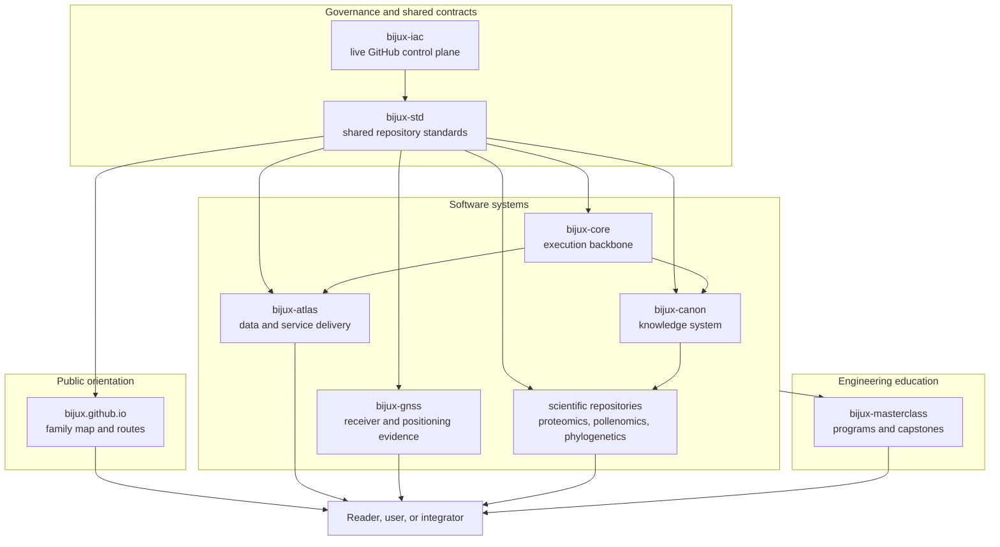
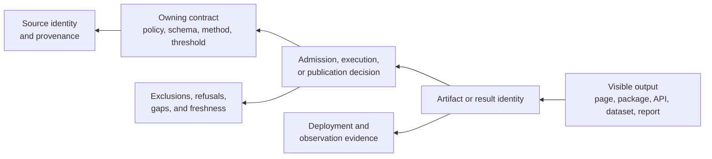
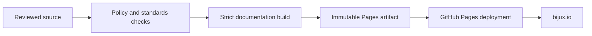

# Bijux

<section class="bijux-hero">
  
governed software, scientific systems, and engineering education

  <h1 class="bijux-hero__title">Bijux builds systems whose authority, evidence, and delivery boundaries remain visible.</h1>
  

    This hub connects family governance, runtime and knowledge foundations,
    delivered products, and learning programs.
  

</section>

Bijux is a family of independently owned repositories. The separation is
deliberate: GitHub governance, shared standards, runtime execution, knowledge
processing, service delivery, scientific interpretation, and teaching do not
share the same change authority.

The repositories still form one system. They use common documentation and
quality contracts, link to the evidence behind public claims, and preserve a
recognizable route from source to delivered output.

## Choose Your Route

| Your question | Begin with | You will learn |
| --- | --- | --- |
| How is the repository family governed? | [Bijux Infrastructure-as-Code](02-bijux-iac/index.md) | where live GitHub policy is declared, reviewed, and applied |
| Which behavior is shared across repositories? | [Bijux Standards](03-bijux-std/index.md) | how common files, checks, and documentation behavior are promoted and verified |
| How do all repositories fit together? | [System Map](01-platform/system-map/index.md) | which repository owns each authority and where dependencies cross boundaries |
| How are outputs published? | [Delivery Surfaces](01-platform/delivery-surfaces/index.md) | how sites, packages, datasets, APIs, and evidence reach users |
| How is operational readiness demonstrated? | [Operational Assurance](01-platform/operational-assurance/index.md) | how load, observation, recovery, and release evidence qualify a bounded surface |
| Where are security boundaries enforced? | [Security Model](01-platform/security-model/index.md) | how repository, runtime, service, data, and publication controls differ |
| Which product should I inspect? | [Projects](04-projects/index.md) | the question, inputs, outputs, and proof surface for each project |
| Where is the engineering taught? | [Learning](05-learning/index.md) | programs grounded in runnable workflows and design judgment |

## The Family At A Glance

Arrows describe a dependency or delivery relationship, not ownership. For
example, `bijux-std` exports common standards into consumers, but it does not
own their product meaning. The [System Map](01-platform/system-map/index.md)
describes these distinctions in detail.

## What Makes A Public Claim Trustworthy

A repository summary is only an orientation layer. Trust comes from following
the claim to the surface that can prove or constrain it.

| Claim | Evidence to seek | Owning surface |
| --- | --- | --- |
| a repository is governed | declared policy, required checks, and an applied control path | `bijux-iac` and repository policy workflows |
| shared behavior is aligned | a source manifest, synchronized consumer files, and drift checks | `bijux-std` |
| a command or workflow is deterministic | contracts, execution semantics, and replayable evidence | `bijux-core` |
| knowledge processing is controlled | explicit ingest, index, reason, orchestration, and runtime boundaries | `bijux-canon` |
| data is delivered as a service | schemas, immutable identity, API behavior, operational evidence, and recovery boundaries | `bijux-atlas` |
| a scientific interpretation is reproducible | curated inputs, lineage, assumptions, generated outputs, and limitations | scientific repositories |
| a delivered system is operationally qualified | workload definition, observed behavior, recovery evidence, and explicit omissions | owning product and operations surfaces |
| a program teaches engineering judgment | runnable exercises, capstones, and observable failure modes | `bijux-masterclass` |

## Investigate A Disputed Output

Begin at the visible output, then move toward the narrowest authority that can
explain it. A green repository check, a deployed page, and a scientifically
accepted claim are different conclusions even when they appear in one delivery
journey.

| If the dispute concerns | First identity to recover | Continue with |
| --- | --- | --- |
| whether a change was admitted correctly | repository, revision, policy context, and approval state | [Infrastructure-as-Code](02-bijux-iac/index.md) |
| whether shared controls are current | consumer pin, capability set, canonical digest, and managed checksum | [Standards](03-bijux-std/index.md) |
| whether the public page is the intended revision | source revision, Pages artifact, deployment, and domain response | [Publication Integrity](01-platform/publication-integrity/index.md) |
| whether a service returned the intended dataset | dataset generation, software and configuration identity, request or scenario | [Atlas](04-projects/bijux-atlas/index.md) |
| whether a GNSS result survived the right population | capture, configuration, stage ledger, reference denominator, and manifest | [GNSS](04-projects/bijux-gnss/index.md) |
| whether a map member is evidence-backed | product member, manifest, curation decision, evidence revision, and source | [Pollenomics](04-projects/bijux-pollenomics/index.md) |
| whether a phylogenetic statement is supported | claim identifier, required observations, checks, verdict, and freshness | [Phylogenetics](04-projects/bijux-phylogenetics/index.md) |

If the chain stops, report the last established boundary and the missing next
record. Do not replace missing identity with a screenshot, a later success, or
a nearby claim.

## Treat Limitations As Evidence

Refusal, exclusion, drift, stale evidence, missing reference output, and
unqualified production state are observable system states. They identify the
boundary beyond which a current claim cannot safely extend.

The project and platform pages preserve these states because they make review
more precise: a reader can distinguish an unavailable capability from an
implemented but unqualified one, a mismatch from a non-comparable result, and
a collected record from an admitted publication member. Trust comes from that
specificity, not from presenting every route as complete.

## Platform Responsibilities

The family uses three different kinds of authority:

- **control authority** decides which changes may enter governed repositories;
- **standard authority** defines which cross-repository files and contracts are
  canonical;
- **product authority** decides what a runtime, API, dataset, scientific model,
  or learning program means.

Keeping those authorities separate prevents a shared template from silently
becoming product policy, or a product repository from redefining family-wide
governance for its own convenience.

## Public Delivery

This hub is published at `bijux.io`. Project documentation is published under
stable paths such as `/bijux-core/`, `/bijux-canon/`, and `/bijux-atlas/`.
Each destination owns its technical depth; the hub supplies cross-repository
orientation and the shared shell supplies familiar navigation behavior.

The publication path is itself governed:

Read [Publication Integrity](01-platform/publication-integrity/index.md) for
the exact boundary between what the pipeline verifies and what remains outside
that proof.

## Repository Catalog

| Repository | Primary responsibility | Public destination |
| --- | --- | --- |
| `bijux-iac` | live GitHub governance for the repository family | [Control-plane overview](02-bijux-iac/index.md) |
| `bijux-std` | shared files, checks, and documentation shell contracts | [Standards overview](03-bijux-std/index.md) |
| `bijux.github.io` | cross-repository orientation and the root public site | this hub |
| `bijux-core` | CLI, DAG, execution evidence, and runtime governance | [Bijux Core](04-projects/bijux-core/index.md) |
| `bijux-canon` | ingest, indexing, retrieval, reasoning, orchestration, and controlled runtime acceptance | [Bijux Canon](04-projects/bijux-canon/index.md) |
| `bijux-atlas` | versioned dataset, API, query, and operational delivery | [Bijux Atlas](04-projects/bijux-atlas/index.md) |
| `bijux-gnss` | GNSS signal, receiver, navigation, positioning, and run evidence | [Bijux GNSS](04-projects/bijux-gnss/index.md) |
| `bijux-proteomics` | evidence-oriented proteomics software and research workflows | [Bijux Proteomics](04-projects/bijux-proteomics/index.md) |
| `bijux-pollenomics` | curated pollen evidence, reproducible analysis, maps, and reports | [Bijux Pollenomics](04-projects/bijux-pollenomics/index.md) |
| `bijux-phylogenetics` | phylogenetics runtime, parity, reproducibility records, and claim-scoped evidence | [Bijux Phylogenetics](04-projects/bijux-phylogenetics/index.md) |
| `bijux-genomics` | governed Rust genomics product with public documentation and packages still planned | no published product route yet |
| `bijux-masterclass` | long-form engineering programs and executable capstones | [Learning](05-learning/index.md) |

<a class="md-button md-button--primary" href="01-platform/">Understand the platform</a>
<a class="md-button" href="04-projects/">Choose a project</a>
<a class="md-button" href="01-platform/publication-integrity/">Inspect publication integrity</a>
<a class="md-button" href="01-platform/operational-assurance/">Inspect operational assurance</a>
<a class="md-button" href="05-learning/">Browse learning programs</a>

