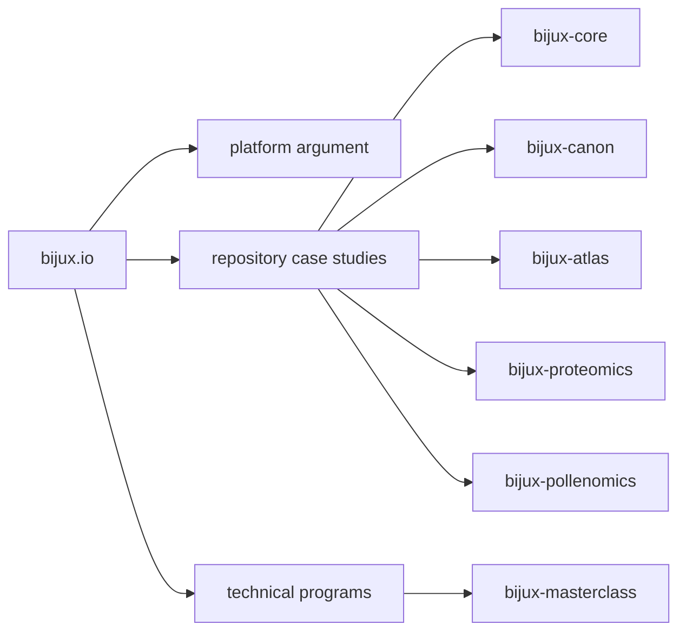

# Bijux

<section class="bijux-hero">
  
runtime systems, data delivery, scientific products, and technical education

  <h1 class="bijux-hero__title">Architecture, delivery, and domain work made inspectable.</h1>
  
<code>bijux.io</code> is the public map of the Bijux body of work: execution and governance systems, knowledge and data services, applied bioinformatics products, and technical programs. It is organized so readers can move from a concise overview into repository handbooks, published destinations, and source surfaces without losing the thread.

  

    platform architecture
    runtime governance
    data-service design
    bioinformatics software
    documentation as delivery
    teaching through systems
  

</section>

<strong>This hub works best as a route into the work, not a substitute for it.</strong>
Use it to understand the repository family, choose the right entry
point, and then move into the documentation and source surfaces that own
the details.

  
<h3>Boundaries That Survive Change</h3>
Core, Canon, Atlas, and the domain repositories are split by real responsibility. Runtime control, knowledge workflows, delivery surfaces, and scientific products are separate enough that ownership stays legible when the system grows.

  
<h3>Public Work With Operating Surfaces</h3>
The site routes into repository handbooks, published docs, source repositories, and maintained destinations. The emphasis is on material that can be opened and checked directly.

  
<h3>Domain Pressure, Not Generic Demos</h3>
The engineering posture carries into proteomics, pollenomics, evidence mapping, and technical education. The same structure has to survive subject-matter constraints, not just generic infrastructure language.

  
<h3>Depth That Travels</h3>
The same body of work also appears as technical programs and course books. That keeps implementation, explanation, and long-term documentation close to one another instead of splitting them into unrelated surfaces.

<a class="md-button md-button--primary" href="projects/">Browse the repositories</a>
<a class="md-button" href="platform/">Inspect the platform story</a>
<a class="md-button" href="reading-paths/">Choose a reading path</a>

## What Lives Here

| If you want to understand... | Open this first | What you will find |
| --- | --- |
| how the repositories fit together | [Platform overview](platform/index.md) -> [System map](platform/system-map.md) | the split across runtime, knowledge, delivery, and domain work |
| how delivery shows up publicly | [Delivery signals](platform/delivery-signals.md) -> [Bijux Atlas](projects/bijux-atlas.md) | documentation, published destinations, and operated service surfaces |
| how the work behaves under domain pressure | [Applied domains](platform/applied-domains.md) -> [Bijux Proteomics](projects/bijux-proteomics.md) -> [Bijux Pollenomics](projects/bijux-pollenomics.md) | scientific and evidence-heavy product systems |
| how the technical style carries into teaching | [Learning catalog](learning/index.md) -> [Bijux Masterclass](projects/bijux-masterclass.md) | course books and programs built around the same technical language |

## Read This Site As

- the repositories form a system family instead of a loose namespace
- architecture is visible through boundaries, not claimed through titles
- delivery discipline shows up in documentation, navigation, and published destinations
- the work remains structured when it moves into scientific and educational contexts

## Where To Start

  <article class="bijux-showcase-card">
    
for architecture-first readers

    <h2>Start with the system split</h2>
    
Open the system map, then Core and Canon, if you want to start with boundaries, runtime structure, and repository ownership.

    
<a href="reading-paths.md">Open the reading paths</a>

  </article>
  <article class="bijux-showcase-card">
    
for delivery-focused readers

    <h2>Start with delivery surfaces</h2>
    
Open Delivery Signals, then Atlas, if you care most about service design, operational visibility, documentation quality, and published destinations.

    
<a href="reading-paths.md">Open the reading paths</a>

  </article>
  <article class="bijux-showcase-card">
    
for domain and teaching readers

    <h2>Start where the work gets harder</h2>
    
Open Applied Domains, then Proteomics, Pollenomics, and Masterclass, if you want to see how the same structure carries into scientific context and public teaching.

    
<a href="reading-paths.md">Open the reading paths</a>

  </article>

## Portfolio Map

## Repository Family

| Repository | Role in the system family | Public entry point |
| --- | --- | --- |
| `bijux-core` | execution and governance backbone | CLI, DAG, evidence, and release surfaces |
| `bijux-canon` | governed knowledge-system stack | ingest, indexing, reasoning, orchestration, and controlled runtime behavior |
| `bijux-atlas` | data and service delivery surface | APIs, datasets, reporting, and docs-aware operations |
| `bijux-proteomics` | scientific product system | proteomics-oriented packages and runtime surfaces |
| `bijux-pollenomics` | evidence mapping product system | Nordic atlas outputs, tracked data, and report publication |
| `bijux-masterclass` | public learning surface | course books and long-form technical programs |

## Reading Rule

Use this page to choose where to inspect first. Once the strongest route
is clear, move into the repository handbooks and let the public systems
prove the depth.
