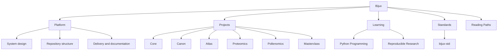
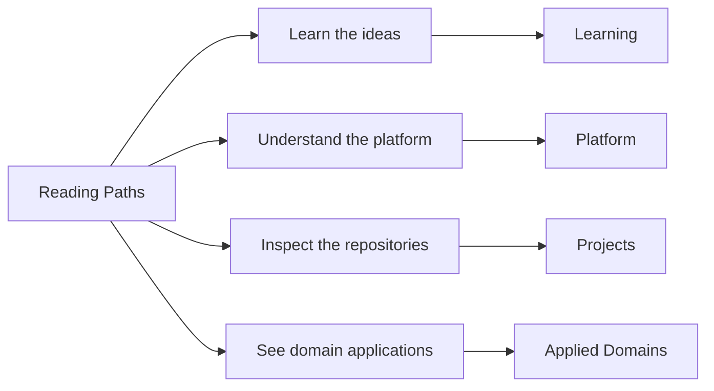

# Bijux

<section class="bijux-hero">
  
runtime systems, data delivery, scientific products, and technical education

  <h1 class="bijux-hero__title">Bijux is a repository family with clear ownership boundaries.</h1>
  
<code>bijux.io</code> is the documentation hub for the current Bijux repository family: execution and governance systems, knowledge and data services, applied bioinformatics products, and technical programs. It is arranged so readers can move from orientation into repository handbooks, published destinations, and source surfaces without losing ownership boundaries.

  

    platform architecture
    runtime governance
    data-service design
    bioinformatics software
    documentation as delivery
    teaching through systems
  

</section>

<strong>This hub helps you locate the owning repository first.</strong>
Once you find the right branch, you can continue into the documentation
and source surfaces that carry the implementation detail.

## What Bijux Is

Bijux is a repository family for runtime systems, governed knowledge/data
systems, scientific software, and technical learning surfaces, organized around
clear boundaries and inspectable delivery.

It is designed so architecture, delivery, and domain work can evolve together
without merging responsibilities into a single opaque codebase.

| Term | Meaning in this site |
| --- | --- |
| ownership boundaries | Explicit repository-level responsibilities that prevent hidden coupling and drift. |
| delivery surfaces | User-visible outputs such as docs, APIs, reports, and release pathways that must be engineered, not improvised. |

## Core Ideas In This System

- Separate repositories by operating responsibility so boundaries remain stable as systems grow.
- Treat documentation, contracts, and release behavior as owned delivery outputs.
- Keep the same engineering language across platform, domain, and learning surfaces.

## How It Is Organized

The site is organized around repository ownership, then around navigation paths
for architecture, delivery, and domain-focused reading.
Shared documentation shell behavior and cross-repository standards checks are
centrally defined in [Bijux standard layer](platform/bijux-std/index.md).

### Reading Approach

This page offers a starting point based on your interest. From there,
you can move into the owning repository and spend time with the actual
surfaces that matter for your review.

Read the platform and repository split first, then choose a route by review
goal so implementation evidence stays connected to system intent.

| Start here for... | Open this first | What you will find |
| --- | --- | --- |
| how the repositories fit together | [Platform overview](platform/index.md) -> [System map](platform/system-map/index.md) | the split across runtime, knowledge, delivery, and domain work |
| how delivery shows up publicly | [Delivery surfaces](platform/delivery-surfaces/index.md) -> [Bijux Atlas](projects/bijux-atlas/index.md) | documentation, published destinations, and operated service surfaces |
| how the work behaves under domain pressure | [Applied domains](platform/applied-domains/index.md) -> [Bijux Proteomics](projects/bijux-proteomics/index.md) -> [Bijux Pollenomics](projects/bijux-pollenomics/index.md) | scientific and evidence-heavy product systems |
| how the technical style carries into teaching | [Learning catalog](learning/index.md) | course books and programs built around the same technical language |

## Route Starters

Use one of these route types based on your immediate goal:

- Architecture route: start at [Platform overview](platform/index.md), then [System map](platform/system-map/index.md), then [bijux-core](projects/bijux-core/index.md) and [bijux-canon](projects/bijux-canon/index.md).
- Delivery route: start at [Delivery surfaces](platform/delivery-surfaces/index.md), then [bijux-atlas](projects/bijux-atlas/index.md), then public docs and published endpoints.
- Domain route: start at [Applied domains](platform/applied-domains/index.md), then [bijux-proteomics](projects/bijux-proteomics/index.md) and [bijux-pollenomics](projects/bijux-pollenomics/index.md).

## Reading Paths

This section helps you choose a short path that matches the part of the
work you care about first.

<strong>New here?</strong> Start with
<a href="index.md">Home</a> -> <a href="platform/index.md">Platform</a> ->
<a href="platform/system-map/index.md">System Map</a>. This is the canonical first
route for new readers.

The map below summarizes the main route families at a glance.

Choose a route below by question or by time.

### By Time

| If you have... | Read this route |
| --- | --- |
| 10 minutes | [Home](index.md) -> [Work qualities](platform/work-qualities/index.md) -> [Projects](projects/index.md) |
| 20 minutes | [System map](platform/system-map/index.md) -> [Repository matrix](platform/repository-matrix/index.md) -> one project page that matches your interest |
| 30 minutes | [Platform](platform/index.md) -> [System map](platform/system-map/index.md) -> [Delivery surfaces](platform/delivery-surfaces/index.md) -> [Bijux Atlas](projects/bijux-atlas/index.md) -> [Applied domains](platform/applied-domains/index.md) |

### By Question

| Question | Read this sequence |
| --- | --- |
| Big picture | [Home](index.md) -> [Platform](platform/index.md) -> [System map](platform/system-map/index.md) |
| System structure | [Platform](platform/index.md) -> [System map](platform/system-map/index.md) -> [Repository matrix](platform/repository-matrix/index.md) |
| Repository roles | [Projects](projects/index.md) -> [Bijux Core](projects/bijux-core/index.md) -> [Bijux Canon](projects/bijux-canon/index.md) -> [Bijux Atlas](projects/bijux-atlas/index.md) |
| Domain work | [Applied domains](platform/applied-domains/index.md) -> [Bijux Proteomics](projects/bijux-proteomics/index.md) -> [Bijux Pollenomics](projects/bijux-pollenomics/index.md) |
| Learning | [Learning catalog](learning/index.md) -> [Reproducible Research](learning/reproducible-research/index.md) -> [Python Programming](learning/python-programming/index.md) |
| Shared standards and docs shell | [Platform](platform/index.md) -> [Bijux standard layer](platform/bijux-std/index.md) -> [Shell Architecture](platform/shell-architecture/index.md) |

  <article class="bijux-showcase-card">
    
architecture route

    <h2>Start with the system split</h2>
    
You can begin with the system map, then Core and Canon, to review boundaries, runtime structure, and repository ownership.

    
<a href="#reading-paths">See reading paths</a>

  </article>
  <article class="bijux-showcase-card">
    
delivery route

    <h2>Start with delivery surfaces</h2>
    
You can start with Delivery Surfaces, then Atlas, for service design, operational visibility, documentation quality, and published destinations.

    
<a href="#reading-paths">See reading paths</a>

  </article>
  <article class="bijux-showcase-card">
    
domain route

    <h2>Start where the work gets harder</h2>
    
You can open Applied Domains, then Proteomics, Pollenomics, and Learning, to see the same structure under scientific context and public teaching.

    
<a href="#reading-paths">See reading paths</a>

  </article>

<a class="md-button md-button--primary" href="projects/">Browse the repositories</a>
<a class="md-button" href="platform/">Read the platform branch</a>
<a class="md-button" href="#reading-paths">Choose a reading path</a>

## Repository Family

| Repository | Role in the system family | Public entry point |
| --- | --- | --- |
| `bijux-core` | execution and governance backbone | CLI, DAG, evidence, and release surfaces |
| `bijux-canon` | governed knowledge-system stack | ingest, indexing, reasoning, orchestration, and controlled runtime behavior |
| `bijux-atlas` | data and service delivery surface | APIs, datasets, reporting, and docs-aware operations |
| `bijux-proteomics` | scientific product system | proteomics-oriented packages and runtime surfaces |
| `bijux-pollenomics` | evidence mapping product system | Nordic atlas outputs, tracked data, and report publication |
| `bijux-masterclass` | public learning surface | course books and long-form technical programs |
| `bijux-std` | shared standards layer | shared docs shell, shared checks, and shared make modules |
