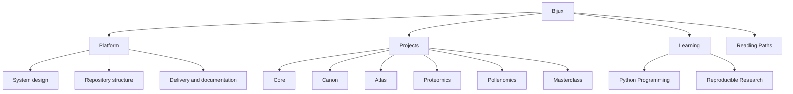

# Bijux

<section class="bijux-hero">
  
runtime systems, data delivery, scientific products, and technical education

  <h1 class="bijux-hero__title">Architecture, delivery, and domain work made inspectable.</h1>
  
<code>bijux.io</code> is the documentation hub for the current Bijux repository family: execution and governance systems, knowledge and data services, applied bioinformatics products, and technical programs. It is arranged so readers can move from orientation into repository handbooks, published destinations, and source surfaces without losing ownership boundaries.

  

    platform architecture
    runtime governance
    data-service design
    bioinformatics software
    documentation as delivery
    teaching through systems
  

</section>

<strong>Use the hub to locate the owning repository first.</strong>
Once the right branch is clear, continue inside the documentation and
source surfaces that hold the detail.

## What This Work Demonstrates

- architecture that stays legible under change instead of collapsing into ad hoc glue
- deterministic execution and runtime governance as first-class design concerns
- delivery surfaces (docs, contracts, release behavior) treated as owned engineering outputs
- domain adaptation in scientific contexts without losing boundary clarity
- documentation used as an operational surface rather than a marketing wrapper

## Representative Engineering Themes

- platform systems and runtime control-plane design
- governed knowledge and data-service architecture
- scientific software delivery under evidence and traceability pressure
- architecture documentation, reviewability, and long-lived maintenance posture
- technical education that codifies engineering judgment instead of summarizing tools

## For Hiring Managers And Technical Reviewers

Use [reading paths](reading-paths.md) and [project pages](projects/index.md) to inspect:

- how ownership boundaries are defined and preserved
- where delivery quality is made verifiable
- how the same technical language survives runtime, delivery, domain, and teaching contexts

  
<h3>Boundaries That Hold</h3>
Core, Canon, Atlas, and the domain repositories are separated by operating responsibility. Runtime control, knowledge workflows, delivery surfaces, and scientific products stay legible when opened side by side.

  
<h3>Public Surfaces You Can Open</h3>
The hub routes into repository handbooks, published docs, and source repositories rather than screenshots or abstract summaries. The useful material is meant to be inspected directly.

  
<h3>Work Under Domain Pressure</h3>
Proteomics, Pollenomics, and Masterclass keep the same engineering language under scientific and teaching pressure. The structure has to hold outside generic platform context.

  
<h3>Explanation Near Implementation</h3>
Technical programs and course books stay close to the repositories. Explanation, implementation, and long-lived documentation reinforce one another instead of drifting apart.

<a class="md-button md-button--primary" href="projects/">Browse the repositories</a>
<a class="md-button" href="platform/">Read the platform branch</a>
<a class="md-button" href="reading-paths/">Choose a reading path</a>

## What Lives Here

| Start here for... | Open this first | What you will find |
| --- | --- | --- |
| how the repositories fit together | [Platform overview](platform/index.md) -> [System map](platform/system-map.md) | the split across runtime, knowledge, delivery, and domain work |
| how delivery shows up publicly | [Delivery surfaces](platform/delivery-surfaces.md) -> [Bijux Atlas](projects/bijux-atlas.md) | documentation, published destinations, and operated service surfaces |
| how the work behaves under domain pressure | [Applied domains](platform/applied-domains.md) -> [Bijux Proteomics](projects/bijux-proteomics.md) -> [Bijux Pollenomics](projects/bijux-pollenomics.md) | scientific and evidence-heavy product systems |
| how the technical style carries into teaching | [Learning catalog](learning/index.md) | course books and programs built around the same technical language |

## Read This Site As

- a documentation network with clear repository ownership
- architecture made visible through boundaries, not titles
- delivery work expressed through docs, routes, and published destinations
- the same engineering language carried into scientific and educational contexts

## Where To Start

  <article class="bijux-showcase-card">
    
for architecture-first readers

    <h2>Start with the system split</h2>
    
Open the system map, then Core and Canon, for boundaries, runtime structure, and repository ownership.

    
<a href="reading-paths.md">Open the reading paths</a>

  </article>
  <article class="bijux-showcase-card">
    
for delivery-focused readers

    <h2>Start with delivery surfaces</h2>
    
Open Delivery Surfaces, then Atlas, for service design, operational visibility, documentation quality, and published destinations.

    
<a href="reading-paths.md">Open the reading paths</a>

  </article>
  <article class="bijux-showcase-card">
    
for domain and teaching readers

    <h2>Start where the work gets harder</h2>
    
Open Applied Domains, then Proteomics, Pollenomics, and Learning, for the same structure under scientific context and public teaching.

    
<a href="reading-paths.md">Open the reading paths</a>

  </article>

## Site Routes

## Repository Family

| Repository | Role in the system family | Public entry point |
| --- | --- | --- |
| `bijux-core` | execution and governance backbone | CLI, DAG, evidence, and release surfaces |
| `bijux-canon` | governed knowledge-system stack | ingest, indexing, reasoning, orchestration, and controlled runtime behavior |
| `bijux-atlas` | data and service delivery surface | APIs, datasets, reporting, and docs-aware operations |
| `bijux-proteomics` | scientific product system | proteomics-oriented packages and runtime surfaces |
| `bijux-pollenomics` | evidence mapping product system | Nordic atlas outputs, tracked data, and report publication |
| `bijux-masterclass` | public learning surface | course books and long-form technical programs |

## Reading Rule

Use this page to choose an entry point. Then move into the owning
repository and stay there long enough to inspect the actual surfaces.

Bijux is intended to be read as one coherent body of engineering work,
not as isolated projects. Platform structure, repository boundaries,
delivery surfaces, domain systems, and technical education are presented
together so readers can inspect design discipline directly and evaluate
the work by its architectural clarity rather than summary claims.
