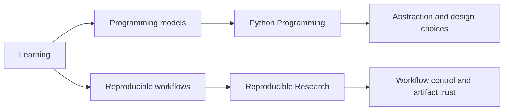

# Learning

The public learning surface lives in `bijux-masterclass`. It keeps the
same systems language teachable, sequenced, and reusable across
long-form programs.

These programs are integrated with the broader system work. They are
another proof surface for how technical judgment is structured, taught, and reused
without losing architectural rigor.

<strong>The learning branch is organized like the rest of the work.</strong>
Programs are grouped by technical pressure, routed through stable entry
pages, and tied to course books and capstones rather than treated as a
collection of detached notes.

## Learning Map

## What This Branch Demonstrates

- decomposition of complex technical material into durable learning paths
- conceptual compression without flattening design tradeoffs
- systems teaching that stays attached to implementation pressure
- documentation discipline that mirrors repository-level engineering standards
- leadership-through-explanation: the same language works in design, delivery, and instruction

## Why Masterclass Belongs In The Same System Family

- it translates architecture, workflows, and system design into structured long-form programs
- it keeps boundary discipline and systems reasoning visible in instruction, not only in repositories
- it proves that technical communication here is an engineering capability, not a side activity

## Program Families

| Program | Focus | Destination |
| --- | --- | --- |
| Reproducible Research | workflow systems, automation discipline, build truth, and scientific execution habits | [Program docs](https://bijux.io/bijux-masterclass/reproducible-research/) |
| Python Programming | language depth, runtime judgment, software design tradeoffs, and long-form programming instruction | [Program docs](https://bijux.io/bijux-masterclass/python-programming/) |

## What You Will Find Here

- programs organized by design pressure instead of generic topic buckets
- course books and capstones that stay close to runnable systems
- a documentation structure that matches the same editorial discipline as the repository docs
- another route into how the repository family explains its own systems

## Fast Routes

| If you want to inspect... | Start here |
| --- | --- |
| workflow and reproducibility judgment | [Reproducible Research](reproducible-research.md) |
| language design and software architecture judgment | [Python Programming](python-programming.md) |
| how the programs fit into the larger repository family | [Published Masterclass docs](https://bijux.io/bijux-masterclass/) |

## Reading Rule

Use the learning pages when you want to see how technical depth is
turned into public programs without losing structure.

The learning branch exists to make difficult technical ideas durable,
legible, and useful under real engineering pressure. These programs are
part of the same system discipline as the repositories, translating
bounded design, clear models, and implementation-adjacent explanation
into material that can be reused, taught, and trusted.
