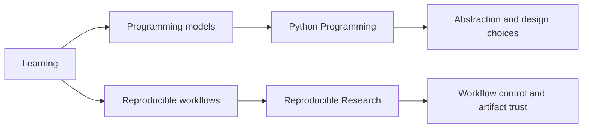

# Learning

The public learning surface lives in `bijux-masterclass`. It keeps the
same systems language teachable, sequenced, and reusable across
long-form programs.

These programs are integrated with the broader system work. They are
another proof surface for how technical judgment is structured, taught, and reused
without losing architectural rigor.

Teaching is part of Bijux because the same engineering judgment is
expressed not only in code, but also in durable explanation and
executable learning material.

<strong>The learning branch is organized like the rest of the work.</strong>
Programs are grouped by technical pressure, routed through stable entry
pages, and tied to course books and capstones rather than treated as a
collection of detached notes.

## Learning Map

## What This Branch Demonstrates

- decomposition of complex technical material into durable learning paths
- conceptual compression without flattening design tradeoffs
- systems teaching that stays attached to implementation pressure
- documentation discipline that mirrors repository-level engineering standards
- explanation as an engineering surface: the same language works in design, delivery, and instruction

## Why Masterclass Belongs In The Same System Family

- it translates architecture, workflows, and system design into structured long-form programs
- it keeps boundary discipline and systems reasoning visible in instruction, not only in repositories
- it treats technical communication as an engineering surface, not a side activity

## Program Families

| Program | Who it is for | What it teaches | What artifact proves it | Destination |
| --- | --- | --- | --- | --- |
| Reproducible Research | engineers and researchers who need reliable scientific workflows | workflow systems, automation discipline, build truth, and scientific execution habits | capstone workflow outputs that can be re-run and reviewed | [Program docs](https://bijux.io/bijux-masterclass/reproducible-research/) |
| Python Programming | learners advancing from syntax fluency to design judgment | language depth, runtime judgment, software design tradeoffs, and long-form programming instruction | capstone implementations and runnable exercises that show design decisions in code | [Program docs](https://bijux.io/bijux-masterclass/python-programming/) |

## Example Learning Artifact Chain

One concrete pattern in this branch is:

course book -> capstone -> runnable artifact -> reviewable output

For example, a learner follows a course chapter, implements the linked
capstone workflow, runs the resulting artifact, and reviews produced
outputs against expected behavior and constraints.

## What You Will Find Here

- programs organized by design pressure instead of generic topic buckets
- course books and capstones that stay close to runnable systems
- a documentation structure that matches the same editorial discipline as the repository docs
- another route into how the repository family explains its own systems

## How Learning Differs From Repository Docs

- audience: learning pages guide learners through concepts and execution steps; repository docs guide contributors and operators through system surfaces.
- pacing: learning pages are sequenced and cumulative; repository docs are reference-first and task-oriented.
- proof surface: learning pages prove understanding through course books, capstones, and runnable exercises; repository docs prove behavior through system docs, code paths, and release artifacts.

## Fast Routes

| If you want to inspect... | Good starting point |
| --- | --- |
| workflow and reproducibility judgment | [Reproducible Research](reproducible-research.md) |
| language design and software architecture judgment | [Python Programming](python-programming.md) |
| how the programs fit into the larger repository family | [Published Masterclass docs](https://bijux.io/bijux-masterclass/) |

## Reading Rule

The learning pages are useful when you want to see how technical depth
becomes public programs without losing structure.

The learning branch exists to make difficult technical ideas durable,
legible, and useful under real engineering pressure. These programs are
part of the same system discipline as the repositories, translating
bounded design, clear models, and implementation-adjacent explanation
into material that can be reused, taught, and trusted.
