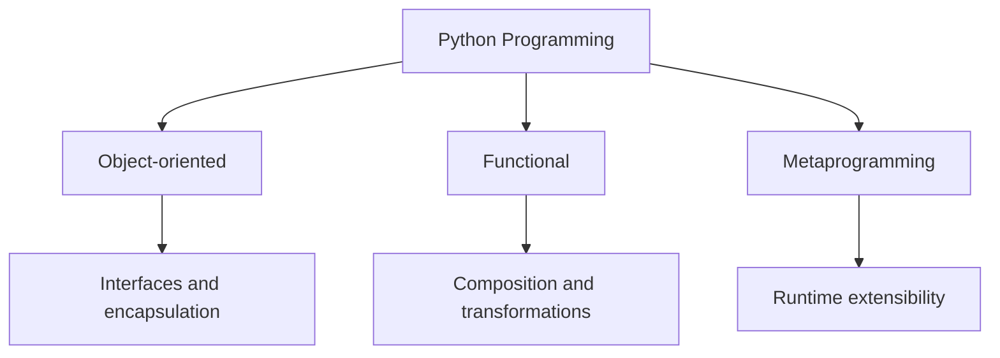

# Python Programming

The Python programming program is the route into language depth through
object-oriented, functional, and metaprogramming tracks. It teaches
abstraction and software design without reducing them to framework
recipes.

<a class="md-button md-button--primary" href="https://bijux.io/bijux-masterclass/python-programming/">Open Family Docs</a>
<a class="md-button" href="https://bijux.io/bijux-masterclass/python-programming/python-object-oriented-programming/">Open Python Object-Oriented Programming</a>
<a class="md-button" href="https://bijux.io/bijux-masterclass/python-programming/python-functional-programming/">Open Python Functional Programming</a>
<a class="md-button" href="https://bijux.io/bijux-masterclass/python-programming/python-meta-programming/">Open Python Metaprogramming</a>

## Family Shape

This family shows depth in Python beyond framework familiarity. The
tracks are organized around real design pressures: ownership and
invariants, purity and effects, runtime inspection and metaprogramming.
That makes the teaching surface more revealing than a generic
"Python course" label.

## Program Map

## What Lives Here

- language-level thinking that goes deeper than framework familiarity
- the ability to explain design tradeoffs, abstractions, and programming styles clearly
- capstone-backed learning paths for object design, functional design, and runtime judgment
- explicit treatment of decorators, descriptors, metaclasses, and runtime customization as first-class design topics
- a teaching surface that stays technical rather than introductory

## Why This Matters In Production Systems

- API boundary decisions become clearer when abstraction models are explicit
- plugin and extension models depend on honest composition and ownership rules
- maintainability improves when OOP and FP tradeoffs are chosen deliberately, not stylistically
- metaprogramming becomes safer when runtime behavior is inspected as a system concern

## Open Here First

| If you want to start with... | Open |
| --- | --- |
| object-design judgment | [Python Object-Oriented Programming](https://bijux.io/bijux-masterclass/python-programming/python-object-oriented-programming/) and its focus on invariants, roles, persistence, and runtime pressure |
| functional design maturity | [Python Functional Programming](https://bijux.io/bijux-masterclass/python-programming/python-functional-programming/) and its emphasis on purity, effects, async coordination, and composable systems |
| runtime and framework honesty | [Python Metaprogramming](https://bijux.io/bijux-masterclass/python-programming/python-meta-programming/) and its focus on introspection, decorators, descriptors, metaclasses, and runtime hooks |

## Best Entry Questions

- you want to assess language depth rather than framework-specific experience
- you care how software design tradeoffs are explained under real maintenance pressure
- you want metaprogramming to be treated as engineering design pressure rather than as a bag of tricks
- you want to inspect teaching material that still feels like engineering work

## How This Thinking Appears In Bijux Repositories

- `bijux-core`: command/runtime boundaries and extension surfaces are shaped by abstraction discipline
- `bijux-canon`: package splits reflect explicit ownership and composition choices
- `bijux-atlas`: delivery and reporting layers emphasize interface clarity over hidden coupling

This program treats Python as a way to study how software structure is
formed by design choices around objects, functions, and metaprogramming.
The value is not syntax coverage alone, but stronger judgment about
abstraction, extensibility, and maintainability in long-lived systems.
