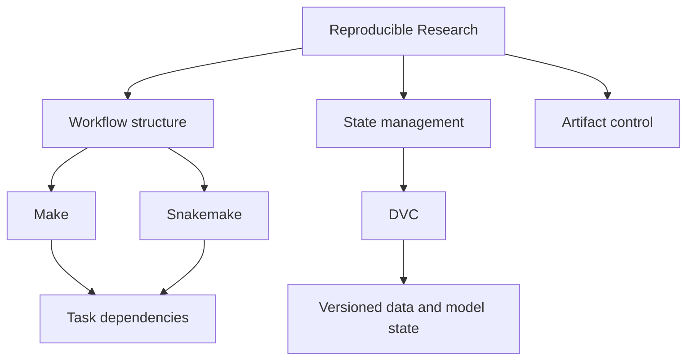

# Reproducible Research

The reproducible research program is the route into workflow discipline,
build systems, automation, and scientific execution habits. It presents
engineering structure through practical research tooling without
reducing the work to tool-specific recipes.

<a class="md-button md-button--primary" href="https://bijux.io/bijux-masterclass/reproducible-research/">Open Family Docs</a>
<a class="md-button" href="https://bijux.io/bijux-masterclass/reproducible-research/deep-dive-make/">Open Deep Dive Make</a>
<a class="md-button" href="https://bijux.io/bijux-masterclass/reproducible-research/deep-dive-snakemake/">Open Deep Dive Snakemake</a>
<a class="md-button" href="https://bijux.io/bijux-masterclass/reproducible-research/deep-dive-dvc/">Open Deep Dive DVC</a>

## Family Shape

This family is not just about research tooling. It is about engineering
judgment under workflow pressure: build-graph truth, orchestration and
publish boundaries, dynamic workflow safety, state identity, experiment
discipline, and reproducible execution. The programs are organized by
failure mode and design pressure rather than by tool popularity.

## Program Map

## What Lives Here

- workflow and automation thinking arranged as a teachable system
- comfort with build, workflow, and reproducibility tooling used in real technical and scientific environments
- explicit treatment of data identity, parameters, metrics, experiments, and recovery as engineering concerns
- capstone-backed programs where the claims stay attached to executable capstones
- the ability to teach system models instead of memorizing command syntax

## Engineering Judgment Demonstrated Here

- state identity design for experiments and reproducible artifact lineage
- workflow truth: choosing orchestration models that match failure and change pressure
- publication boundaries that separate build, review, and release responsibilities
- recovery posture after drift, parameter churn, or runtime evolution

## Open Here First

| If you want to start with... | Open |
| --- | --- |
| build-system judgment | [Deep Dive Make](https://bijux.io/bijux-masterclass/reproducible-research/deep-dive-make/) and its emphasis on truthful DAGs, atomic publication, and parallel safety |
| workflow-engineering depth | [Deep Dive Snakemake](https://bijux.io/bijux-masterclass/reproducible-research/deep-dive-snakemake/) and its contract-driven view of workflow design |
| state identity and experiment recovery | [Deep Dive DVC](https://bijux.io/bijux-masterclass/reproducible-research/deep-dive-dvc/) and its focus on params, metrics, promotion discipline, and trustworthy recovery |
| program design clarity | the family page in Masterclass, which routes by system pressure instead of generic topic grouping |

## Best Entry Questions

- you care about workflow systems, reproducibility, and scientific execution habits
- you want to see engineering discipline carry into research tooling and publication boundaries
- you want to understand when DVC is the right model for experiment state, recovery, and promotion boundaries
- you want to inspect teaching material that is anchored to executable capstones

## Why This Matters Outside Research

- CI/CD: deterministic workflows and explicit build boundaries reduce release ambiguity
- data pipelines: state and artifact discipline improve traceability under evolving inputs
- ML workflows: parameter/metric handling patterns map directly to experiment governance
- platform reliability: failure-mode-first workflow design supports stable operational behavior

Reproducibility becomes durable only when workflow design starts from
the real failure mode, not from tool preference. This branch focuses on
engineering judgment about state, artifacts, and change control so work
remains inspectable, repeatable, and operationally reliable over time.
