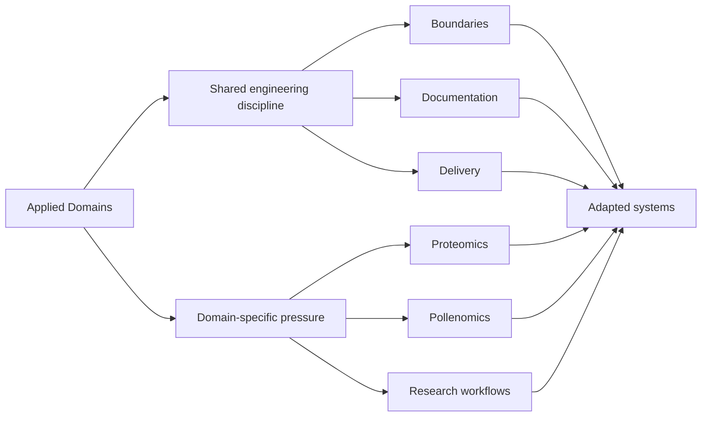

# Applied Domains

The public Bijux surface is not only about platform mechanics. The same
engineering discipline is carried into domains where the data model,
user expectations, and decision context are harder than generic
infrastructure alone. This is where abstraction gets tested by real
subject matter.

## Domain Map

## Domain Reach

| Domain | What shows up here |
| --- | --- |
| Platform engineering | runtime control, repository governance, documentation systems, and operationally inspectable structures |
| Data service architecture | delivery surfaces, API and dataset thinking, repository-level reporting, and bounded service responsibilities |
| Bioinformatics and scientific computing | products shaped around proteomics, pollenomics, evidence mapping, and scientific workflows rather than abstract examples |
| Technical education | the ability to translate deep technical systems into reusable learning programs without flattening the underlying rigor |

## Why This Branch Is Here

Breadth alone is not useful. The important point is that the work moves between
infrastructure, data systems, scientific products, and teaching without
losing architectural clarity.

## What Remains Invariant Across Domains

- bounded ownership instead of monolithic responsibility
- inspectable interfaces and explicit operational contracts
- reproducibility and evidence discipline as non-optional quality criteria
- documentation aligned to system boundaries, not detached summaries

## What Changes Under Domain Pressure

- schema and vocabulary depth (scientific, evidence, or educational context)
- traceability burden for data, interpretation, and review pathways
- validation posture required by domain-specific failure modes
- user interpretation surfaces where technical clarity must survive specialist context

## Domain-Driven Repositories

  
<h3>Bijux Proteomics</h3>
A domain product surface for proteomics and discovery work, where engineering structure has to remain clear while serving laboratory and scientific context.

  
<h3>Bijux Pollenomics</h3>
An evidence-mapping and site-selection surface where technical architecture supports archaeology, eDNA, aDNA, and pollenomics narratives without collapsing into generic geodata language.

  
<h3>Bijux Masterclass</h3>
A learning surface where systems discipline is turned into technical programs that still respect architecture, workflow rigor, and operational detail.

## Questions Worth Asking

- whether the platform posture survives real scientific vocabulary and decision context
- whether uncommon domain models are handled through structure instead of jargon
- whether engineering clarity still holds when the audience shifts from builders to researchers and learners

## Concrete Domain Pressures To Inspect

- schema pressure: where domain semantics force stronger model boundaries
- evidence pressure: where claims require traceable inputs and artifact lineage
- scientific reviewability: where reproducibility and interpretation must remain inspectable

## Reading Rule

Use the platform pages to understand the engineering posture. Use the
domain repositories to see how that posture survives outside a purely
generic platform setting.

Applied domains matter here because they force engineering decisions to
answer to evidence constraints, domain semantics, and consequences of
error. What carries across those contexts is disciplined system design:
clear boundaries, honest scope, and inspectable outputs that remain
useful even when the subject matter is specialized.
