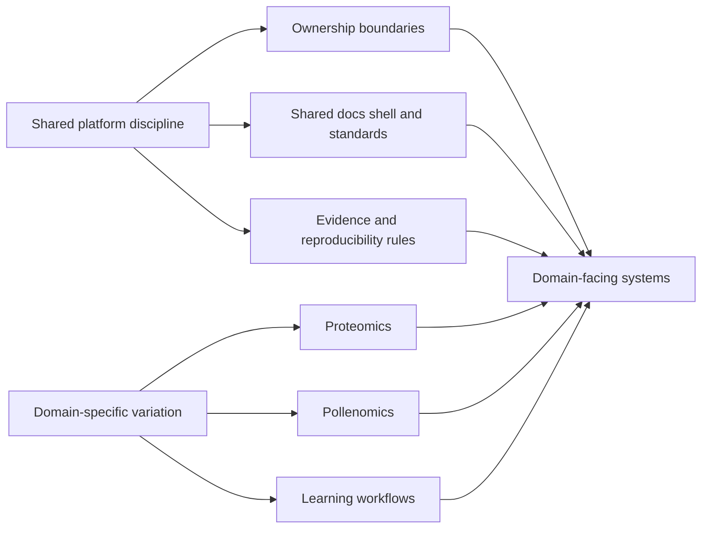

# Applied Domains

Applied domains show one engineering discipline under different domain
pressures. Domain repositories vary by data semantics and interpretation
needs, but they still inherit a shared documentation shell and standards
layer from `bijux-std`.

## Domain Map

## Domain Reach

| Domain | What shows up here |
| --- | --- |
| Proteomics | scientific product surfaces where laboratory context and evidence constraints shape package and runtime decisions |
| Pollenomics | evidence-mapping outputs where archaeology, eDNA, aDNA, and regional interpretation needs shape model and publication choices |
| Reproducible research workflows | learning-linked workflow systems where artifact lineage and re-runnability are part of the deliverable |

## Why This Branch Is Here

Breadth alone is not useful. The important point is that the work moves between
infrastructure, data systems, scientific products, and teaching without
losing architectural clarity.

## What Remains Invariant Across Domains

- bounded ownership instead of monolithic responsibility
- inspectable interfaces and explicit operational contracts
- reproducibility and evidence discipline as non-optional quality criteria
- documentation aligned to system boundaries, not detached summaries

## What Domain Pressure Changes

- schema complexity: domain entities, relationships, and constraints become deeper and less forgiving than generic data models.
- evidence burden: claims must be tied to traceable inputs, transformations, and review paths.
- interpretation burden: outputs must stay understandable to specialists who use them for real decisions.
- publication burden: delivery surfaces must preserve context, caveats, and reproducibility in public-facing outputs.

## Domain-Driven Repositories

  
<h3>Bijux Proteomics</h3>
A domain product surface for proteomics and discovery work, where engineering structure has to remain clear while serving laboratory and scientific context.

  
<h3>Bijux Pollenomics</h3>
An evidence-mapping and site-selection surface where technical architecture supports archaeology, eDNA, aDNA, and pollenomics narratives without collapsing into generic geodata language.

  
<h3>Reproducible Research</h3>
A learning workflow surface where methods, artifacts, and review steps are taught and executed with explicit reproducibility constraints.

## Domain Pressure Comparison

| Surface | How pressure shows up |
| --- | --- |
| Proteomics | higher schema complexity for biological entities, stronger evidence lineage requirements, and high error cost in interpretation decisions |
| Pollenomics | heavier interpretation burden across archaeology, eDNA, aDNA, and regional narratives, plus publication pressure for evidence-backed reports |
| Learning (Reproducible Research) | explicit pacing and proof requirements so learners can run workflows, inspect artifacts, and validate reproducibility claims |

## Questions Worth Asking

- whether the platform posture survives real scientific vocabulary and decision context
- whether specialized scientific data is modeled with explicit structure instead of implicit assumptions
- whether interpretation requirements are documented clearly enough for researchers and reviewers
- whether error consequences are handled through validation, traceability, and reviewable publication outputs

## Reading Rule

The platform pages help readers understand the engineering posture. The
domain repositories then show how that posture survives outside a purely
generic platform setting.

Applied domains matter here because they force engineering decisions to
answer to evidence constraints, specialized data semantics, and real
error consequences. What carries across those contexts is disciplined
system design: clear boundaries, honest scope, and inspectable outputs.
