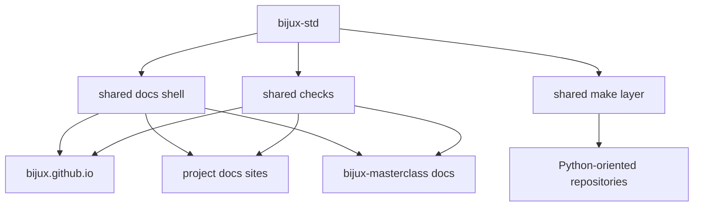

# Bijux Standard

`bijux-std` is the shared standards repository for the Bijux system
family.

It defines the parts of the ecosystem that are meant to stay aligned
across multiple repositories and sites: the shared documentation shell,
the shared Python-oriented make layer, and the shared compliance and
sync checks used in CI.

It is not a product repository.
It is not a domain repository.
It is not a learning-content repository.

It is the shared standards layer that keeps the public system coherent.

## Why It Exists

The Bijux repositories are intentionally split by responsibility.

That split only stays clean if the shared layer is explicit.

Without a standards repository, shell behavior, make logic, and
cross-repository checks drift quietly over time. `bijux-std` prevents
that by giving the system one canonical place where shared standards
are defined, synchronized, and verified.

## What It Owns

`bijux-std` owns the cross-repository standards layer.

That includes:

- shared documentation shell assets
- shared Python-oriented make modules
- shared compliance and update checks
- canonical manifests used to verify shared directory integrity

## What It Does Not Own

`bijux-std` does **not** own:

- runtime logic from `bijux-core`
- knowledge-system architecture from `bijux-canon`
- delivery products from `bijux-atlas`
- domain software from `bijux-proteomics` or `bijux-pollenomics`
- course content from `bijux-masterclass`

Those remain owned by the repositories that implement them.

## How It Fits The Architecture

`bijux-std` is a shared standards source, not a substitute for
repository ownership.

## Shared Vs Local

| Layer | Owned by |
| --- | --- |
| shared docs shell and compliance contract | `bijux-std` |
| repository docs meaning and page content | consuming repository |
| domain implementation and runtime logic | consuming repository |

## Consumption Model

Consuming repositories vendor or sync the shared standards layer from
`bijux-std`, then verify alignment in CI.

Typical flow:

1. update canonical shared standards in `bijux-std`
2. sync the shared layer into consuming repositories
3. run checks to confirm local copies still match the standard
4. fail CI when drift appears

## What Readers Should Notice

When the shared layer is working correctly:

- navigation behavior stays coherent across Bijux docs sites
- shell behavior remains predictable across repositories
- repositories keep local ownership without fragmenting the public system

## Reading Rule

Read this page when you need to understand why multiple Bijux
repositories can stay structurally consistent without becoming one
monolithic repository.
