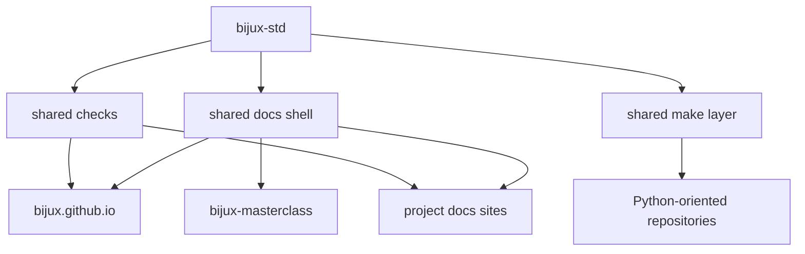

# Bijux Standard

`bijux-std` is the shared standards repository for the Bijux system
family.

It defines the parts of the ecosystem that are meant to stay aligned
across multiple repositories and sites: the shared documentation shell,
the shared Python-oriented make layer, and the shared compliance and
sync checks used in CI.

It is not a product repository.
It is not a domain repository.
It is not a learning-content repository.

It is the shared standards layer that keeps the public system coherent.

## Why It Exists

The Bijux repositories are intentionally split by responsibility.

That split only stays clean if the shared layer is explicit.

Without a standards repository, shell behavior, make logic, and
cross-repository checks drift quietly over time. `bijux-std` prevents
that by giving the system one canonical place where shared standards
are defined, synchronized, and verified.

## What It Owns

`bijux-std` owns the cross-repository standards layer.

That includes:

- shared documentation shell assets
- shared Python-oriented make modules
- shared compliance and update checks
- canonical manifests used to verify shared directory integrity

## What It Does Not Own

`bijux-std` does **not** own:

- runtime logic from `bijux-core`
- knowledge-system architecture from `bijux-canon`
- delivery products from `bijux-atlas`
- domain software from `bijux-proteomics` or `bijux-pollenomics`
- course content from `bijux-masterclass`

Those remain owned by the repositories that implement them.

## How It Fits The Architecture

In plain language:

- the repositories keep their own responsibilities
- `bijux-std` keeps the shared layer consistent across them
- the docs surfaces and CI checks stay aligned without collapsing
  everything into one repository

## Shared Vs Local

| Layer | Owned by |
| --- | --- |
| shared docs shell and compliance contract | `bijux-std` |
| repository docs meaning and page content | the consuming repository |
| domain logic, runtime logic, and product behavior | the consuming repository |

This separation matters.

It gives Bijux continuity across sites and repositories without erasing
local ownership.

## Consumption Model

The normal flow is simple:

1. shared standards are updated in `bijux-std`
2. consuming repositories synchronize the shared layer locally
3. checks verify that local copies still match the standard
4. each repository publishes its own docs and keeps ownership of its own content

## What Readers Should Notice

Readers should not need to think about `bijux-std` every time they move
across Bijux.

That is the point.

If the shared layer is working well:

- navigation stays coherent
- shell behavior remains predictable
- documentation presentation stays consistent
- repositories remain locally owned without fragmenting the public system

## Where To Go Next

- [Documentation Network](documentation-network.md)
- [Shell Architecture](shell-architecture.md)
- [Repository Matrix](repository-matrix.md)

## In One Sentence

`bijux-std` is the shared standards layer that keeps the Bijux
ecosystem consistent across documentation, automation, and CI-verifiable
repository behavior.
