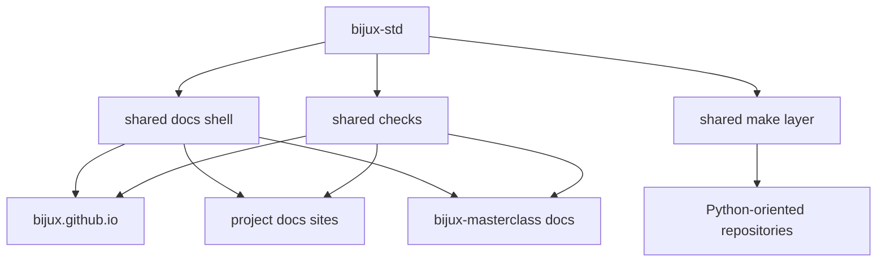

# Bijux Standard Layer

`bijux-std` is the shared standards repository for the Bijux system
family.

It defines the cross-repository standards layer that should stay
aligned across Bijux repositories and public docs surfaces.

## Why It Exists

Bijux repositories are intentionally split by responsibility.

That split remains coherent only if the shared layer is also explicit.
Without a standards source, shared shell behavior, shared checks, and
shared automation drift quietly over time.

`bijux-std` exists to keep those shared expectations defined once and
managed deliberately.

## What It Owns

`bijux-std` owns the parts of the ecosystem meant to remain shared
across multiple repositories:

- shared documentation shell assets
- shared compliance and sync checks
- shared Python-oriented make modules
- canonical manifests used to verify shared directory integrity

## What It Does Not Own

`bijux-std` does not own:

- runtime implementation from `bijux-core`
- knowledge-system implementation from `bijux-canon`
- delivery products from `bijux-atlas`
- domain implementation from `bijux-proteomics` and `bijux-pollenomics`
- learning content from `bijux-masterclass`

It owns shared standards, not repository-specific product or domain
logic.

## How It Fits The Architecture

`bijux-std` is a shared standards source, not a substitute for
repository ownership.

## Shared Vs Local

| Layer | Owned by |
| --- | --- |
| shared docs shell and compliance contract | `bijux-std` |
| repository docs meaning and page content | consuming repository |
| domain implementation and runtime logic | consuming repository |

## Consumption Model

Consuming repositories vendor or sync the shared standards layer from
`bijux-std`, then verify alignment in CI.

Typical flow:

1. update canonical shared standards in `bijux-std`
2. sync the shared layer into consuming repositories
3. run checks to confirm local copies still match the standard
4. fail CI when drift appears

## What Readers Should Notice

When the shared layer is working correctly:

- navigation behavior stays coherent across Bijux docs sites
- shell behavior remains predictable across repositories
- repositories keep local ownership without fragmenting the public system

## Reading Rule

Read this page when you need to understand why multiple Bijux
repositories can stay structurally consistent without becoming one
monolithic repository.
