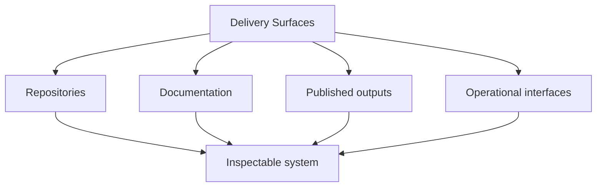

# Delivery Surfaces

A delivery surface is any public, inspectable output through which the
system is used, verified, or reviewed.

## What Counts As Delivery In Bijux

- public documentation that shows ownership, operating routes, and system boundaries
- published software and artifacts that can be traced back to explicit build and release routines
- service and runtime interfaces that are reviewable outside local developer context
- release and operational evidence that shows how quality checks are run, not only claimed

## Delivery Map

## Delivery Classes

| Class | Ownership source | What it includes | What to inspect first |
| --- | --- | --- | --- |
| Documentation | shared standards in `bijux-std`, consumed by repository docs | repository handbooks, docs navigation, and public explanatory routes | whether ownership, boundaries, and operating procedures are explicit and consistent across sites |
| Published software | repository-owned delivery responsibilities | packages, generated artifacts, and versioned release outputs | whether build and release paths are reproducible and reviewable |
| Service interfaces | repository-owned service and runtime boundaries | APIs, runtime interfaces, and user-facing data endpoints | whether interface contracts and behavior expectations are documented clearly |
| Release and ops evidence | repository checks aligned by shared quality standards | CI checks, validation routines, and promotion workflows | whether quality claims are backed by observable checks and traceable evidence |

## Why This Matters Beyond Ops

Delivery is how architecture becomes visible in public. Even if you are
reviewing design rather than operations, delivery surfaces show whether
the stated architecture can be used, verified, and trusted outside the
original implementation team.

## Where Delivery Shows Up

| Surface | What to inspect | Why it is useful |
| --- | --- | --- |
| Contract discipline | repository docs, generated artifacts, schema surfaces, and explicit handbook ownership | serious systems make their interfaces and operating rules visible |
| Release posture | release workflows, published docs, versioned repositories, and visible distribution surfaces | public work should show how it is built, checked, and published |
| Operational thinking | runtime handbooks, validation commands, docs checks, and repository automation | delivery quality is easier to trust when routine checks are part of the workflow |
| Information design | shared docs chrome, stable navigation, scoped handbooks, and repository-specific documentation systems | documentation quality is part of delivery quality, not a separate editorial concern |

## Main Routes

  
<h3>Core</h3>
Inspect the CLI, DAG, evidence, and release handbooks to see how repository-wide runtime and governance concerns are modeled explicitly rather than hidden in scripts and convention.

  
<h3>Canon</h3>
Inspect the package split across ingest, indexing, reasoning, orchestration, and controlled runtime behavior to see how knowledge-system boundaries are expressed directly in the docs and repository structure.

  
<h3>Atlas</h3>
Inspect the delivery and reporting surfaces to see how APIs, datasets, docs checks, and operational workflows are treated as maintained product surfaces instead of side utilities.

## Proof Anchors To Inspect

### Fast Checks

- open one repository handbook and verify that ownership and operating boundaries are explicit
- open [Public surface](public-surface.md) and confirm published destinations map to maintained repositories

### Medium Checks

- inspect package and release workflow docs to confirm publication boundaries are documented
- inspect contract or schema references to verify compatibility promises are explicit

### Deep Checks

- follow a release or validation path end to end and confirm checks are reproducible
- compare docs claims against automation entry points to verify delivery behavior is not only narrative

## What To Check

What matters most is not any single badge, workflow, or diagram. It is
the consistency between the public story and the public files. If a
page claims systems thinking, the repositories should show bounded
systems. If it claims delivery discipline, the docs and release
surfaces should withstand basic scrutiny.

## Fast Routes

| If you want to start with... | Open |
| --- | --- |
| public delivery and service posture | [Bijux Atlas](../projects/bijux-atlas.md) |
| runtime governance and repository discipline | [Bijux Core](../projects/bijux-core.md) |
| governed knowledge-system delivery | [Bijux Canon](../projects/bijux-canon.md) |
| stable published destinations | [Public surface](public-surface.md) |

## Open This Page When

- you want direct routes into the strongest delivery-oriented material
- you care more about concrete surfaces than summary alone
- you want to understand why the public docs are treated as part of delivery rather than an afterthought

Delivery is where architecture stops being intention and becomes
something others can inspect and rely on. Public docs, contracts,
release behavior, and published artifacts are treated here as system
components, because they are where boundary clarity and engineering
rigor are tested under real use and real change.
