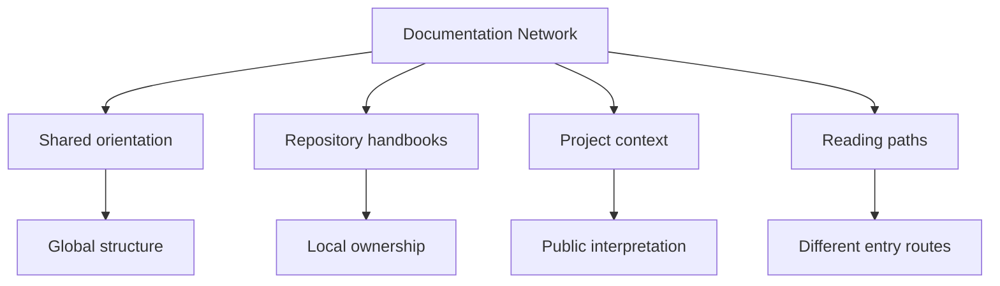

# Documentation Network

This network exists so readers can move across Bijux repositories
without losing orientation. It is documentation architecture, not only
menu behavior.

`bijux-std` is the canonical source for the shared documentation shell
and shared documentation standards used across the family.

<strong>Documentation is a shared communication layer.</strong>
The shared shell keeps orientation and explanation behavior stable across
repositories while each repository keeps local ownership of its content.

## Network Map

## Documentation Architecture Roles

| Role | Primary owner | What it does |
| --- | --- | --- |
| standards source | `bijux-std` | defines shared shell behavior, navigation contract, and checks used by docs consumers |
| hub | `bijux.github.io` | provides cross-repository orientation and entry routes into repository and learning docs |
| repository docs | each destination repository or site | owns local technical content, domain vocabulary, and implementation detail |

## Why Shared Chrome Exists

Without a shared shell, the root site becomes a brochure and each repo
becomes an island. With a shared shell, the root site is a real starting
point and every handbook feels like part of the same documentation
product.

## What Stays Shared Vs What Stays Local

- shared: top-level navigation patterns, shell structure, and orientation routes that let readers move across repositories consistently.
- local: repository-specific docs content, domain vocabulary, and implementation detail owned by the destination handbook.
- shared and local together: shared chrome provides stable movement; local ownership provides technical depth without flattening repository boundaries.

## Why This Matters

- it reduces documentation drift across related repositories
- it preserves ownership boundaries while keeping navigation coherent
- it shortens onboarding by keeping route patterns predictable
- it speeds review because repository intent and destination paths are explicit
- it supports operational continuity when repository surfaces evolve

## Example Reader Walkthrough

One reliable route is:

1. start at [Home](../index.md) to orient around the repository family.
2. open a destination from [Projects](../projects/index.md), such as [Bijux Atlas](../projects/bijux-atlas.md).
3. move into the repository docs branch using the same site navigation structure.
4. return to the platform branch through [Platform](index.md) to continue system-level reading.

## Reader Path

1. When the owning repository is not obvious yet, the hub offers the
   fastest orientation point.
2. From there, readers can move into the handbook that owns the
   concern.
3. The same chrome stays in place while moving deeper into that site.

## Maintenance Rule

If the hub describes a repository, the destination repository should
still expose the same top-strip navigation and stable public URL.

The documentation network is designed to preserve shared orientation
without collapsing local ownership into one vague center. That balance
keeps context, navigation, and implementation aligned, allowing
documentation to function as engineering infrastructure instead of
decorative summary.
