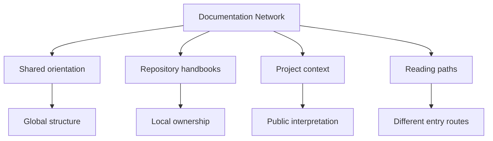

# Documentation Network

The documentation network works only if every site behaves like part of
the same system family. Readers should be able to jump between repos and
keep the same mental model for where they are and what to do next.

<strong>Documentation here is part of the system's control surface.</strong>
The shared shell keeps navigation and reader expectations stable across
repositories. That consistency is one way engineering quality becomes
visible to readers.

## Network Map

## Shared Navigation Contract

- the hub strip moves between repositories
- the site tabs move between the major handbook branches in the current site
- the detail strip narrows to the active branch within the current site
- the left navigation stays scoped to the active branch instead of showing the whole tree at once

## Why Shared Chrome Exists

Without a shared shell, the root site becomes a brochure and each repo
becomes an island. With a shared shell, the root site is a real starting
point and every handbook feels like part of the same documentation
product.

## Why This Matters

- it reduces documentation drift across related repositories
- it preserves ownership boundaries while keeping navigation coherent
- it shortens onboarding by keeping route patterns predictable
- it speeds review because repository intent and destination paths are explicit
- it supports operational continuity when repository surfaces evolve

## Reader Path

1. Start at the hub when the owned repository is not obvious yet.
2. Move into the repository handbook that owns the concern.
3. Stay inside the same chrome while moving deeper into that site.

## Maintenance Rule

If the hub describes a repository, the destination repository should
still expose the same top-strip navigation and stable public URL.

The documentation network is designed to preserve shared orientation
without collapsing local ownership into one vague center. That balance
keeps context, navigation, and implementation aligned, allowing
documentation to function as engineering infrastructure instead of
decorative summary.
