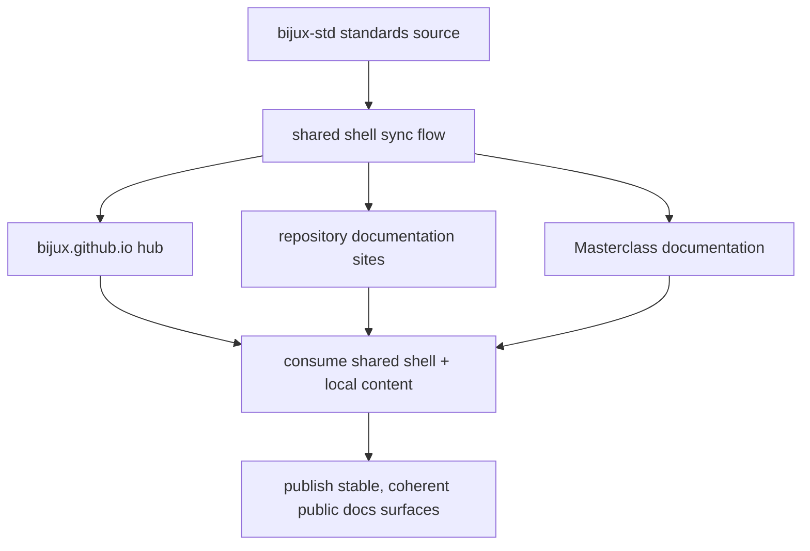

# Documentation Network

This network exists so readers can move across Bijux repositories
without losing orientation. It is documentation architecture, not only
menu behavior.

`bijux-std` is the canonical source for the shared documentation shell
and shared documentation standards used across the family.

<strong>Documentation is a shared communication layer.</strong>
The shared shell keeps orientation and explanation behavior stable across
repositories while each repository keeps local ownership of its content.

## Source Flow

## Documentation Architecture Roles

| Role | Primary owner | What it does |
| --- | --- | --- |
| standards source | `bijux-std` | defines shared shell behavior, navigation contract, and checks used by docs consumers |
| hub | `bijux.github.io` | provides cross-repository orientation and entry routes into repository and learning docs |
| repository docs | each destination repository or site | owns local technical content, domain vocabulary, and implementation detail |

## What Stays Shared Vs What Stays Local

- shared: top-level navigation patterns, shell structure, and orientation routes that let readers move across repositories consistently.
- local: repository-specific docs content, domain vocabulary, and implementation detail owned by the destination handbook.
- shared and local together: shared chrome provides stable movement; local ownership provides technical depth without flattening repository boundaries.

## Reader Benefit

- it reduces documentation drift across related repositories
- it preserves ownership boundaries while keeping navigation coherent
- it shortens onboarding by keeping route patterns predictable
- it supports operational continuity when repository surfaces evolve

## Example Reader Walkthrough

1. start at [Home](../../index.md) for orientation.
2. open [Projects](../../projects/index.md) and choose a repository page such as [Bijux Atlas](../../projects/bijux-atlas/index.md).
3. move into the destination docs site; shared shell behavior stays familiar while content becomes local.
4. return through [Platform](../index.md) when you need system-level context.

## Maintenance Rule

If the hub describes a repository, the destination should preserve the
same shared shell behavior and stable public URL structure.
