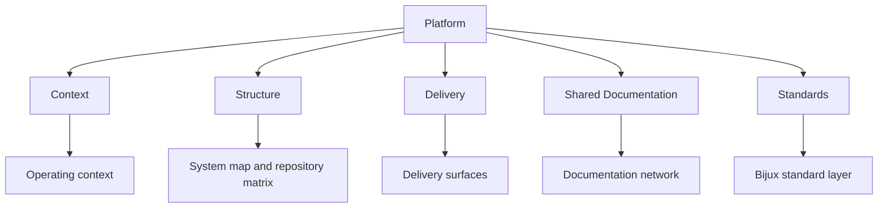

# Platform

Platform is the branch that defines the shared structure and reasoning
behind the Bijux repository family.
It explains why repositories are split this way and how they stay
aligned through shared standards.

The public Bijux surface is intentionally split by responsibility. This
section explains why the repository family is structured the way it is
and how that structure holds together in public.

<strong>Focus on responsibility before repository count.</strong>
The key question is not how many repositories exist, but why responsibilities are split the way they are.
Runtime governance, knowledge workflows, delivery surfaces, domain
products, and learning programs each have their own home, but the same
engineering language is visible across all of them.

## Platform Map

## Canonical Platform Axes

- context: the operating reasons and constraints behind the repository family.
- structure: how responsibilities are split and mapped across repositories.
- delivery: how architecture becomes public through release and operational surfaces.
- shared standards and documentation: how readers keep orientation while moving across repositories.

## What Belongs Here

- the route between repositories
- the principles that make the split coherent
- the stable public surface that readers can navigate today

## What Does Not Belong Here

- package-level implementation details
- repository-specific maintainer rules
- course-level teaching detail that already lives in masterclass

## Why This Branch Exists

- explain why runtime authority, knowledge architecture, delivery responsibilities, and domain work are split into separate repositories
- keep repository boundaries stable while allowing domain-specific evolution
- make public documentation useful for inspection and review, not only orientation
- show where evidence for structure and delivery decisions can be checked directly

## Where To Inspect Evidence

- repository ownership and split intent: [Repository matrix](repository-matrix.md)
- layer boundaries and responsibility flow: [System map](system-map.md)
- delivery and publication posture: [Delivery surfaces](delivery-surfaces.md)
- recurring standards that remain stable across repositories: [Work qualities](work-qualities.md)

## Principles

| Principle | What it changes in public |
| --- | --- |
| boundaries before breadth | clear ownership is easier to inspect than a vague super-repository |
| delivery as part of design | documentation, release posture, and public routes should reinforce the architecture rather than decorate it |
| domain pressure belongs in the system | the engineering posture should survive scientific and evidence-heavy contexts, not stop at generic tooling |
| explainability matters | systems that can be taught, sequenced, and documented clearly are usually better understood and easier to operate |

## System Shape

  
<h3>Core</h3>
The execution and governance backbone for command surfaces, DAG behavior, evidence, and repository discipline.

  
<h3>Canon</h3>
The governed knowledge-system stack for ingest, indexing, reasoning, orchestration, and controlled runtime behavior.

  
<h3>Atlas</h3>
The delivery and control-plane surface for APIs, datasets, docs-aware checks, and operational reporting.

  
<h3>Bijux Standard Layer</h3>
The shared standards source for documentation shell continuity, cross-repository checks, and shared make behavior.

  
<h3>Products And Programs</h3>
Proteomics, Pollenomics, and Masterclass show how the same system language survives domain products and technical education instead of remaining trapped in platform internals.

## System Reading Order

| Read this first when you need to understand... | Open |
| --- | --- |
| where shared standards are defined and verified across repositories | [Bijux standard layer](bijux-std.md) |
| which qualities recur across the public work | [Work qualities](work-qualities.md) |
| the layered structure of the whole public system family | [System map](system-map.md) |
| the repository split at a glance | [Repository matrix](repository-matrix.md) |
| where delivery work shows up most clearly across the repositories | [Delivery surfaces](delivery-surfaces.md) |
| how the engineering extends into domain-heavy product work | [Applied domains](applied-domains.md) |
| the broader operating context behind the current repository family | [Operating context](operating-context.md) |
| why the docs shell is shared instead of duplicated carelessly | [Documentation network](documentation-network.md) |
| which public destinations exist today | [Public surface](public-surface.md) |
