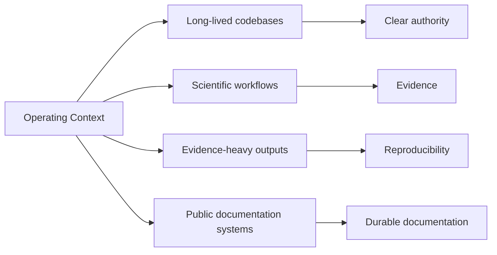

# Operating Context

This repository family brings together three related kinds of public
work: platform engineering, applied project work, and technical
education.

The split is intentional. Each part of the repository family answers a
different question for the reader:

- **Platform** shows system structure, runtime concerns, and operational design.
- **Projects** show how that structure is applied in domain-specific settings.
- **Learning** explains methods, trade-offs, and workflow decisions that appear across both.

This split is also the top-level public information architecture for
Bijux. It is the main navigation model readers should use before
opening any individual repository surface.

The work published here is shaped by environments where software has to
stay inspectable under change. That includes service and data systems,
evidence-heavy workflows, and scientific or technical contexts where
reproducibility, clear boundaries, and explicit contracts matter.

Four concrete context types shape this design:

- long-lived codebases
- scientific workflows
- evidence-heavy outputs
- public documentation systems

This is why the repositories tend to look the way they do.
Responsibilities are separated at the repository level. Documentation is
part of delivery, not a side artifact. Domain-specific work is
presented with enough engineering structure to make the system legible
to someone outside the project.

## Context Map

## Contexts Where This Style Matters

| Context | Pressure | Why structure matters here |
| --- | --- | --- |
| long-lived codebases | continuous change across years of maintenance | explicit boundaries reduce accidental coupling and make ownership transitions safer |
| scientific workflows | reproducibility and method transparency under revision | traceable workflows and clear contracts keep results reviewable over time |
| evidence-heavy outputs | high burden of proof for claims and interpretations | artifact lineage and bounded publication routes reduce ambiguity during review |
| public documentation systems | readers must navigate across repositories without losing context | shared navigation with local ownership keeps orientation stable while preserving depth |

## What Readers Should Expect

| Pattern | What it means in practice |
| --- | --- |
| clear repository boundaries | repositories are split by responsibility so system edges stay visible |
| documentation as part of delivery | the public docs are part of the surface readers use, not just internal notes |
| domain work with visible structure | applied and scientific work is presented in a way that keeps the system readable |
| learning material tied to real practice | teaching content explains working methods and decisions instead of generic tutorials |

## How To Read The Repository Family

- many readers begin in **Platform** for architectural and operational
  foundations
- **Projects** then show how those ideas are applied in specific domains
- **Learning** helps connect recurring patterns, trade-offs, and
  workflows behind both

## What This Page Should Make Clear

- repository boundaries are intentional and operationally useful
- documentation structure supports maintenance and cross-repository continuity
- domain pressure does not collapse the architecture model into ad hoc changes

Operating context matters because software quality is defined by the
change pressure, evidence burden, and long-lived responsibility a system
must absorb. The repository family is shaped around that reality, which
is why bounded authority, reproducibility, and documentation discipline
are treated as baseline engineering requirements rather than optional
extras.

After this page, a reader should know why the repository family is
split this way before opening any individual repository.
