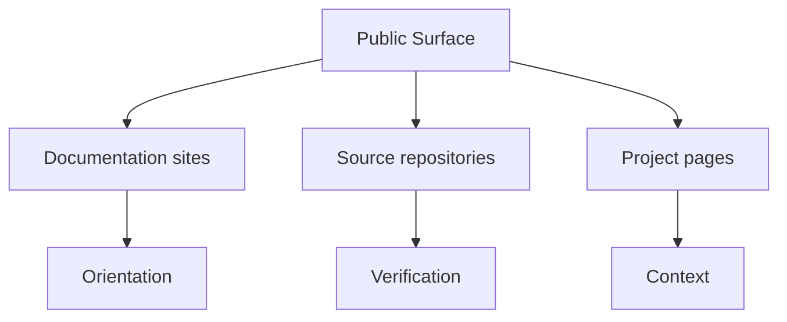

# Public Surface

The public Bijux surface is the set of destinations that readers can
open directly from `bijux.io` today. The goal is to make the hub
behave like a maintained documentation network, not a static landing
page.

## Surface Map

## Curated Public Destinations

| Surface | Purpose | Audience | What to inspect first | What this surface proves |
| --- | --- | --- | --- | --- |
| [bijux.github.io](https://github.com/bijux/bijux.github.io) | shared documentation hub and cross-repository shell | mixed reviewers and first-time readers | `docs/` structure, shell assets, navigation contracts | docs are treated as a maintained system surface, not static marketing |
| [bijux-core docs](https://bijux.io/bijux-core/) and [source](https://github.com/bijux/bijux-core) | runtime backbone and repository governance | platform and tooling engineers | CLI and DAG surfaces, governance docs, release rules | execution authority and repository discipline are explicit |
| [bijux-canon docs](https://bijux.io/bijux-canon/) and [source](https://github.com/bijux/bijux-canon) | governed knowledge-system architecture | platform, AI, and data-system reviewers | ingest/index/reason/orchestrate split and package boundaries | knowledge workflows are decomposed into accountable interfaces |
| [bijux-atlas docs](https://bijux.io/bijux-atlas/) and [source](https://github.com/bijux/bijux-atlas) | data and service delivery surfaces | data platform and service teams | API contracts, dataset publication, operational checks | delivery is treated as product architecture, not post-processing |
| [bijux-proteomics docs](https://bijux.io/bijux-proteomics/) and [source](https://github.com/bijux/bijux-proteomics) | proteomics-oriented scientific system delivery | scientific software and bioinformatics readers | domain workflows with reproducibility and boundary clarity | domain-heavy constraints can be handled without architecture drift |
| [bijux-pollenomics docs](https://bijux.io/bijux-pollenomics/) and [source](https://github.com/bijux/bijux-pollenomics) | evidence mapping and site-selection system design | interdisciplinary and evidence-heavy teams | evidence surfaces, domain framing, operational structure | uncommon domain pressure can still preserve system rigor |
| [bijux-masterclass docs](https://bijux.io/bijux-masterclass/) and [source](https://github.com/bijux/bijux-masterclass) | technical education programs tied to real system practice | learners, mentors, and technical leads | program sequence and deep-dive structure | architectural depth can be translated into reusable instruction |

## What Reviewers Can Conclude From This Page

- the repository family is coherent rather than a random list of projects
- each destination has a distinct role in runtime, knowledge, delivery, domain, or learning layers
- the public surface supports both high-level routing and deeper technical inspection

## How To Use This Page

- documentation links are a good starting point for a guided tour of a
  repository
- source links help when readers want to inspect structure, files, and
  history directly
- the hub helps when the question is clear but the owning repository is
  not yet obvious

## Stability Expectation

The links above should stay stable enough that the hub can be treated as
an index, not a marketing page snapshot.

The public surface is designed to make the work reviewable from
multiple angles: documentation for orientation, repositories for
verification, and project pages for context. That combination matters
because credibility comes from consistent inspection outcomes, not from
visibility alone.
