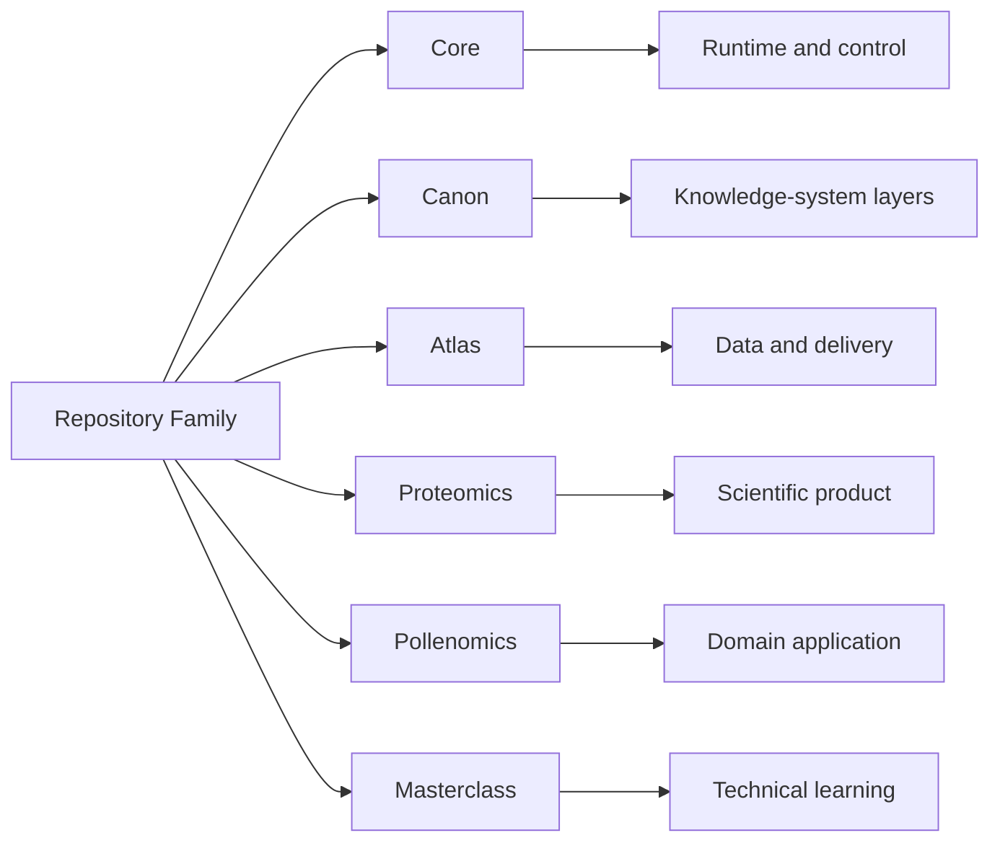

# Repository Matrix

This matrix is the shortest route to understanding how the public Bijux
repositories differ by responsibility, inspection angle, and recurring
work quality.

Repository separation here is a design tool for controlling ownership
and change, not an organizational preference.

## Matrix Map

## What This Split Demonstrates

- bounded responsibility that keeps ownership clear across the family
- interface clarity between runtime, knowledge, delivery, domain, and learning surfaces
- maintainability through repository-level separation instead of ad hoc modules
- reviewability because each repository exposes a distinct inspection angle

## Common Mistakes This Split Avoids

- monolithic ownership where unrelated concerns are forced into one codebase
- documentation drift caused by unclear repository intent
- policy and runtime semantics being mixed into the same layer
- delivery concerns being hidden behind implementation details

## System Family At A Glance

| Repository | Primary responsibility | What it owns publicly | Inspection angle | Start here |
| --- | --- | --- | --- | --- |
| `bijux-core` | runtime authority | CLI surfaces, DAG runtime, evidence artifacts, release rules | execution behavior and governance discipline | [Project page](../projects/bijux-core.md) |
| `bijux-canon` | knowledge-system orchestration | ingest/index/reason/orchestrate package boundaries | governed knowledge workflows with explicit interfaces | [Project page](../projects/bijux-canon.md) |
| `bijux-atlas` | public delivery interfaces | APIs, datasets, reporting, docs-aware operational routes | service delivery architecture and publication posture | [Project page](../projects/bijux-atlas.md) |
| `bijux-proteomics` | proteomics product workflows | proteomics domain workflows and reproducible product routes | scientific software under laboratory and domain constraints | [Project page](../projects/bijux-proteomics.md) |
| `bijux-pollenomics` | evidence-mapping product workflows | archaeology/eDNA/aDNA evidence surfaces and site-selection outputs | evidence-heavy domain modeling with reviewable outputs | [Project page](../projects/bijux-pollenomics.md) |
| `bijux-masterclass` | technical learning programs | sequenced programs, deep dives, and runnable learning materials | engineering explanation tied to executable instruction | [Learning catalog](../learning/index.md) |

## How The Repositories Work Together

| Layer | Repositories | Why the split stays useful |
| --- | --- | --- |
| backbone | `bijux-core` | execution, evidence, and governance stay visible instead of disappearing into scripts and convention |
| knowledge and service architecture | `bijux-canon`, `bijux-atlas` | knowledge workflows and delivery surfaces can evolve independently without losing system coherence |
| domain products | `bijux-proteomics`, `bijux-pollenomics` | domain systems inherit platform discipline instead of becoming isolated one-off projects |
| learning surface | `bijux-masterclass` | the same engineering language becomes teachable, reusable, and public-facing |

## Quick Routes

| If you are starting from... | Open these repositories first |
| --- | --- |
| platform engineering and runtime design | `bijux-core` -> `bijux-canon` |
| data services and public delivery | `bijux-atlas` -> `bijux-canon` |
| bioinformatics and scientific software | `bijux-proteomics` -> `bijux-pollenomics` |
| technical communication and teaching | `bijux-masterclass` -> `bijux-core` |

## Reading Rule

The matrix helps readers choose the right repository quickly. Repository
pages and handbook sites become the next step when orientation turns
into closer inspection.

The repository matrix is meant to show that the split across the Bijux
family is deliberate, with each repository carrying a distinct
responsibility, delivery surface, and architectural role. Read together,
the matrix makes clear that growth and evaluation happen against stable
ownership boundaries rather than accidental overlap.
