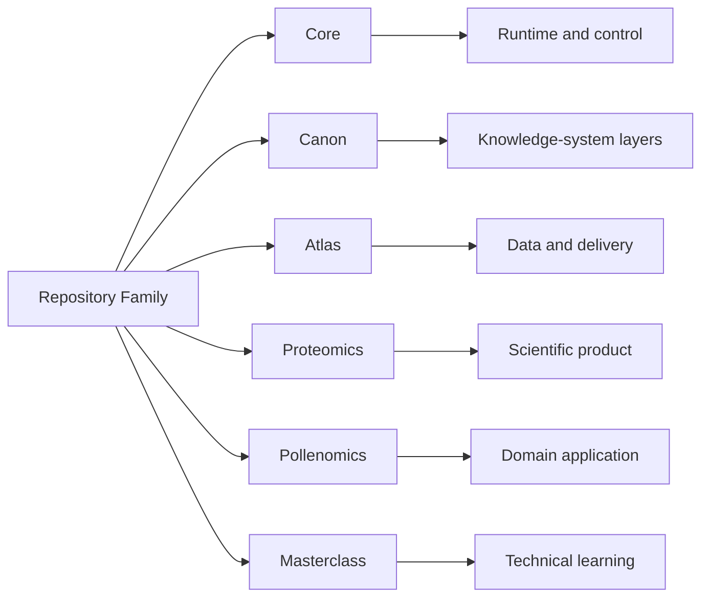

# Repository Matrix

This matrix is the shortest route to understanding how the public Bijux
repositories differ by responsibility, inspection angle, and recurring
work quality.

Repository separation here is a design tool for controlling ownership
and change, not an organizational preference.

## Matrix Map

## How To Read This Matrix

- read each row as a single ownership boundary, not as a feature list
- use the primary responsibility column to decide the first repository to open
- use the inspection angle column to decide what evidence to inspect next

## Why These Repositories Are Separate

- `bijux-core` owns runtime authority so execution behavior and governance remain explicit
- `bijux-canon` owns knowledge-system orchestration so ingest/index/reason/orchestrate concerns do not collapse into one layer
- `bijux-atlas` owns public delivery interfaces so APIs, datasets, and reporting routes remain maintainable
- `bijux-proteomics` and `bijux-pollenomics` own domain workflows so scientific pressure is handled without rewriting platform ownership
- `bijux-masterclass` owns learning programs so explanation and teaching evolve without diluting repository implementation boundaries

## System Family At A Glance

| Repository | Repository type | Primary responsibility | What it owns publicly | Consumes shared standards | Start here |
| --- | --- | --- | --- | --- | --- |
| `bijux-std` | standards source | own shared standards, documentation shell contracts, and cross-repository quality checks | shared contracts, quality gates, and documentation shell source used by the family | no; this repository is the standards source | [Repository page](../projects/bijux-std.md) |
| `bijux-core` | platform runtime repository | own runtime authority and release discipline | CLI surfaces, DAG runtime, evidence artifacts, release rules | yes | [Project page](../projects/bijux-core.md) |
| `bijux-canon` | governed knowledge repository | own knowledge-system orchestration boundaries | ingest/index/reason/orchestrate package boundaries | yes | [Project page](../projects/bijux-canon.md) |
| `bijux-atlas` | delivery repository | own public delivery interfaces and contracts | APIs, datasets, reporting, docs-aware operational routes | yes | [Project page](../projects/bijux-atlas.md) |
| `bijux-proteomics` | scientific application repository | own proteomics product workflows | proteomics domain workflows and reproducible product routes | yes | [Project page](../projects/bijux-proteomics.md) |
| `bijux-pollenomics` | scientific application repository | own evidence-mapping product workflows | archaeology/eDNA/aDNA evidence surfaces and site-selection outputs | yes | [Project page](../projects/bijux-pollenomics.md) |
| `bijux-masterclass` | learning and teaching repository | own structured technical learning programs | sequenced programs, deep dives, and runnable learning materials | yes | [Learning catalog](../learning/index.md) |

## How The Repositories Work Together

| Layer | Repositories | Why the split stays useful |
| --- | --- | --- |
| backbone | `bijux-core` | execution, evidence, and governance stay visible instead of disappearing into scripts and convention |
| knowledge and service architecture | `bijux-canon`, `bijux-atlas` | knowledge workflows and delivery surfaces can evolve independently without losing system coherence |
| domain products | `bijux-proteomics`, `bijux-pollenomics` | domain systems inherit platform discipline instead of becoming isolated one-off projects |
| learning surface | `bijux-masterclass` | the same engineering language becomes teachable, reusable, and public-facing |

## Routes

For route-first navigation, use [Reading Paths](../reading-paths.md).
This matrix stays focused on repository ownership and responsibility
boundaries.

## Reading Rule

The matrix helps readers choose the right repository quickly. Repository
pages and handbook sites become the next step when orientation turns
into closer inspection.

The repository matrix is meant to show that the split across the Bijux
family is deliberate, with each repository carrying a distinct
responsibility, delivery surface, and architectural role. Read together,
the matrix makes clear that growth and evaluation happen against stable
ownership boundaries rather than accidental overlap.
