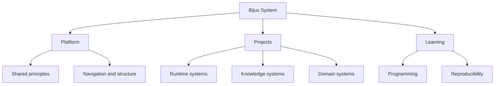

# System Map

The Bijux public surface is easier to understand as a layered system
than as a list of repositories. The map helps because it shows where
responsibility changes hands and where different kinds of engineering
judgment are expected.
This map is meant to make system responsibility legible before
implementation detail.

## Layered View

## What Each Layer Owns

| Layer | What it owns | Why it stays separate |
| --- | --- | --- |
| Shared discipline | contracts, release evidence, documentation shell, navigation rules, and operating habits | the repositories are connected by repeatable engineering behavior rather than branding alone |
| Core | command surfaces, runtime control, DAG execution, artifacts, and governance | execution authority and repository discipline stay visible instead of being scattered across scripts |
| Canon | ingest, indexing, reasoning, orchestration, agents, and controlled runtime behavior | knowledge-system concerns are split into accountable parts instead of being merged into one opaque AI layer |
| Atlas | APIs, datasets, service delivery, reporting, and docs-aware validation | data-service and delivery concerns are treated as maintained product surfaces |
| Domain products | proteomics, pollenomics, evidence mapping, and field-oriented product framing | the platform posture survives subject-matter pressure and uncommon abstractions |
| Learning | programs, deep dives, and reusable teaching structure | the same technical language becomes explainable and teachable without being diluted |

## Why The Split Holds Up

This page does not need to claim sophistication directly. That quality
becomes visible when the split remains coherent across runtime,
delivery, domain, and learning surfaces without collapsing into one
vague repository or one oversized story. The map holds up when each
layer has a stable job and the boundaries still make sense after
readers open the repository pages.

## Why The Split Matters

- easier review because each layer has a clear job and inspection route
- easier evolution because changes stay local to the owning layer
- less accidental coupling between runtime, delivery, and domain concerns
- clearer operational truth when responsibilities are explicit in public

## Boundary Questions To Ask

- does each repository own a distinct problem instead of a renamed slice of the same problem
- does the delivery surface stay separate from the runtime and knowledge internals
- do the domain systems inherit the platform posture without being forced into generic abstractions
- can a reader move across layers and still keep a consistent mental model

## Open This Page When

- you want the shortest explanation of how the repository family fits together
- you need to decide whether to open Core, Canon, Atlas, or a domain product first
- you want to understand the repository family as an engineering system, not a list of projects

The system map exists to make the landscape legible before readers dive
into local detail. It shows how platform guides, project repositories,
and learning surfaces belong to one designed system where relationships
are explicit, responsibilities are visible, and complexity is managed
through structure rather than implication.
