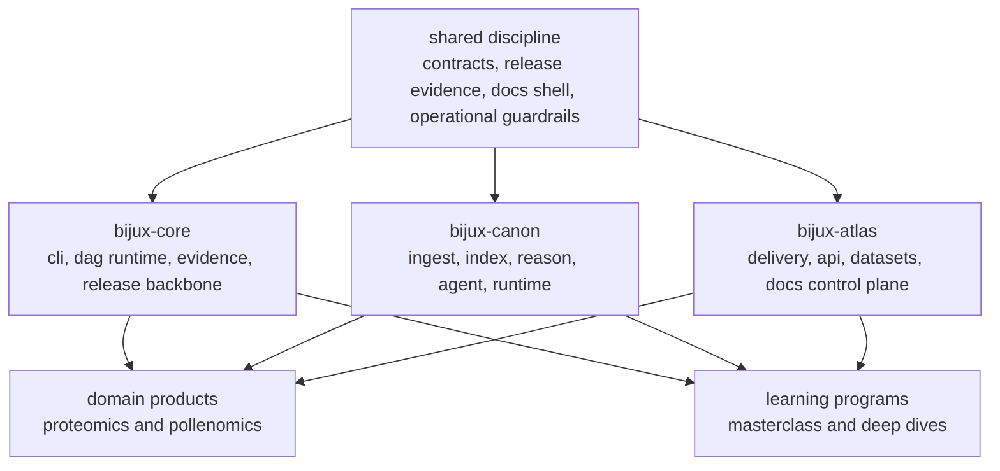

# System Map

The Bijux public surface is easier to understand as a layered system
than as a list of repositories.

## Layered View

## What Each Layer Signals

| Layer | Why it matters |
| --- | --- |
| Shared discipline | The repositories are tied together by repeatable engineering habits rather than a visual brand alone. |
| Core | The execution and governance backbone shows command, runtime, DAG, artifact, and release thinking. |
| Canon | The knowledge-system layer shows how ingest, retrieval, reasoning, orchestration, and governed execution are separated cleanly. |
| Atlas | The delivery surface shows service and operational thinking around APIs, datasets, reporting, and docs operations. |
| Domain products | The portfolio extends into real subject-matter systems instead of stopping at general infrastructure. |
| Learning | The same architecture and discipline are expressed as teachable programs, which is a different kind of systems clarity. |

## Why The Split Is Persuasive

Readers do not need a page claiming sophistication directly. They can
infer it when the split remains coherent across runtime, delivery,
domain, and learning surfaces without collapsing into one vague
repository or one oversized story.

## Use This Page When

- you want the shortest explanation of how the public surfaces fit together
- you need to decide whether to open Core, Canon, Atlas, or a domain product first
- you want to understand the portfolio as an engineering system, not a list of projects
